# SmartFLN AI Engine

AI Powered QR Enabled Assessment System

## Purpose

This document defines the SmartFLN AI Engine. It explains how the system uses computer vision, OpenCV-style image processing, QR reading, template matching, OCR, handwriting recognition, MCQ detection, matching-question detection, spell checking, answer evaluation, confidence scoring, and teacher review routing.

This is an AI and computer vision design document only. It does not contain implementation code.

## AI Engine Mission

The AI Engine must convert imperfect mobile phone photos of paper assessments into reliable, auditable, question-wise academic evidence.

The engine is responsible for:

- detecting the paper
- improving image quality
- reading QR metadata
- correcting perspective
- aligning the page to a known template
- extracting answer regions
- recognizing answer content
- detecting question-specific response patterns
- scoring answers where safe
- calculating confidence at every stage
- routing doubtful answers to teacher review
- producing explainable evidence for every mark

## Design Principles

### Conservative Automation

The system should auto-score only when identity, image quality, crop quality, recognition, and scoring confidence are all sufficient.

### Teacher as Final Authority

AI suggestions are recommendations. Teachers resolve uncertain, ambiguous, unsupported, or low-confidence answers.

### Evidence First

Every AI decision must be traceable to:

- original scan
- processed page
- answer crop
- recognition output
- scoring rule
- confidence breakdown
- model or algorithm version

### Question-Type Awareness

Different question types require different methods. MCQ, matching, numeric answers, spelling, short text, drawing, and rubric questions must not be treated as one generic OCR problem.

### Stage-Level Confidence

Every pipeline stage produces its own confidence score and diagnostic flags. A later high-confidence stage cannot override a critical failure in an earlier stage.

### Reproducibility

The same input artifact, template version, preprocessing version, model version, and scoring rule should reproduce the same result.

### Continuous Improvement

Teacher-reviewed answers become a controlled feedback source for model evaluation and future training, subject to privacy and consent rules.

## AI Engine Scope

### In Scope

- mobile scan quality analysis
- document boundary detection
- image enhancement
- shadow reduction
- perspective correction
- page rotation and deskew
- QR detection and decoding
- template matching and page alignment
- answer region extraction
- printed OCR where needed
- handwritten digit recognition
- constrained handwritten word recognition
- MCQ mark detection
- matching-line detection
- blank answer detection
- spelling answer normalization
- confidence scoring
- automatic scoring for supported question types
- teacher review routing
- model monitoring and improvement

### Out of Scope for Initial MVP

- fully automatic long-form essay grading
- fully automatic drawing assessment
- unconstrained multilingual handwriting recognition
- automatic scoring of complex mathematical working
- automatic grading without teacher review for low-confidence answers
- real-time on-device full handwriting recognition

## High-Level AI Architecture

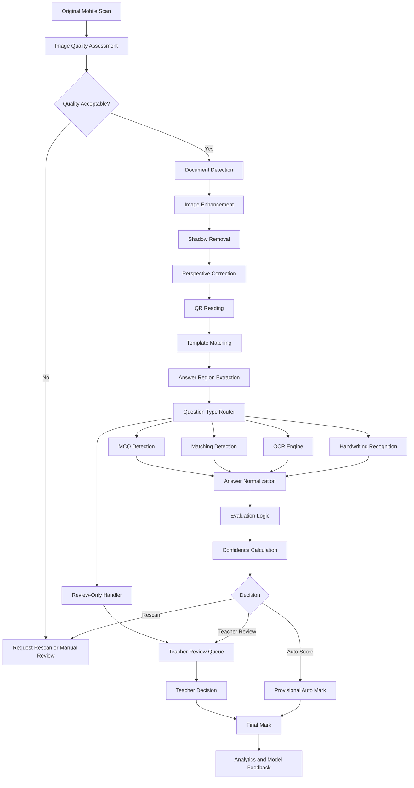

## AI Engine Processing Lifecycle

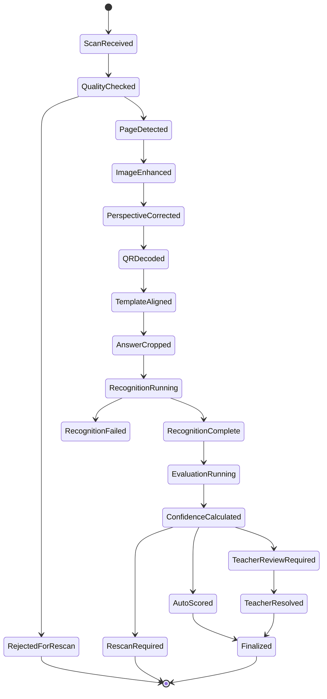

## Computer Vision Pipeline

### Pipeline Objective

The computer vision pipeline converts raw classroom images into reliable, normalized, template-aligned page images and answer crops.

### Pipeline Stages

| Stage | Input | Output | Failure Handling |
| --- | --- | --- | --- |
| Image validation | Uploaded file | Valid image metadata | Reject corrupted file |
| Quality assessment | Original image | Quality score and flags | Rescan if severe |
| Document detection | Original image | Paper boundary | Fallback detection or rescan |
| Image enhancement | Page image | Enhanced image | Continue with diagnostic flags |
| Shadow removal | Enhanced image | Illumination-normalized image | Continue or flag low confidence |
| Perspective correction | Paper boundary | Rectified page | Rescan if unreliable |
| Rotation and deskew | Rectified page | Upright page | Fallback using QR/anchors |
| QR reading | Upright page | Page metadata | Fallback identity workflow |
| Template matching | Upright page and template | Alignment transform | Manual resolution if low confidence |
| Answer extraction | Aligned page | Answer crops | Review or rescan if crop invalid |

### Computer Vision Sequence

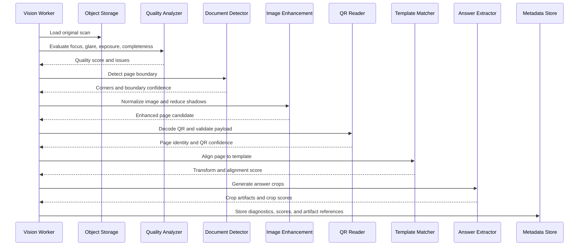

## OpenCV Pipeline

### Role of OpenCV

OpenCV is the recommended foundation for deterministic image processing tasks because it is fast, explainable, mature, and well suited for geometric document processing.

OpenCV should be used for:

- image decoding and resizing
- color space conversion
- blur detection
- thresholding
- edge detection
- contour detection
- document boundary estimation
- perspective transforms
- deskewing
- morphology operations
- line detection
- connected component analysis
- template matching
- mark detection
- answer crop extraction

### OpenCV Processing Flow

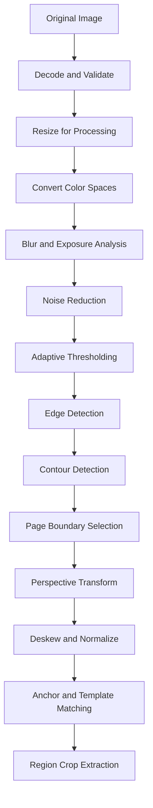

### OpenCV Stage Details

#### Image Decode and Validation

Checks:

- file is readable
- file type is supported
- image dimensions meet minimum requirements
- image is not empty or corrupted
- metadata is captured where available

Outputs:

- decoded image
- image dimensions
- color channels
- file checksum
- validation status

#### Resizing Strategy

The system may use multiple resolutions:

- low resolution for quick quality and boundary detection
- medium resolution for QR and template matching
- high resolution for OCR and handwriting recognition

The original scan should remain unchanged in storage.

#### Color Space Conversion

Useful color representations:

- RGB or BGR for raw processing
- grayscale for edge detection and OCR preparation
- HSV for detecting colored marks if used
- LAB or YCrCb for illumination correction

#### Noise Reduction

Noise reduction should preserve handwriting strokes. Aggressive smoothing can erase pencil marks or thin handwriting.

Acceptable techniques:

- mild denoising
- bilateral filtering where edge preservation is needed
- median filtering for salt-and-pepper noise
- morphology only when tuned per question type

#### Edge and Contour Detection

Used for:

- page boundary detection
- answer box detection fallback
- bubble outline detection
- matching-line detection
- detecting stray marks

#### Morphological Operations

Used carefully for:

- closing broken line segments
- removing small noise
- detecting filled bubbles
- separating connected components

Risks:

- can merge nearby handwriting strokes
- can erase faint pencil marks
- can change answer appearance if over-applied

## Image Enhancement

### Objective

Improve the scanned page so that QR reading, template matching, OCR, and mark detection are more reliable.

### Enhancement Tasks

- brightness normalization
- contrast enhancement
- local illumination correction
- noise reduction
- background whitening
- ink/stroke preservation
- glare detection
- compression artifact mitigation

### Enhancement Flow

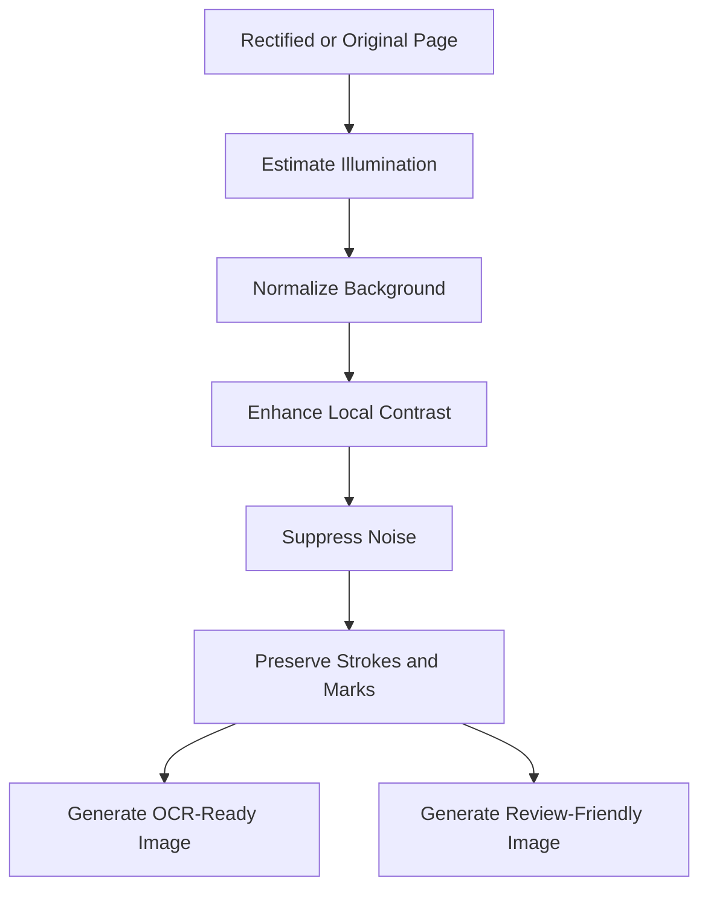

### Multiple Output Images

The pipeline should generate different image variants for different uses.

| Variant | Purpose |
| --- | --- |
| Original | Audit and reprocessing |
| Review-friendly | Teacher review display |
| OCR-ready grayscale | Text recognition |
| Binary/thresholded | Mark and line detection |
| Low-resolution diagnostic | Fast dashboards and debugging |

### Image Enhancement Quality Checks

Enhancement should not destroy evidence. The system should compare enhanced outputs against the original and flag cases where:

- strokes become too thin
- pencil marks disappear
- background becomes over-thresholded
- text regions lose detail
- compression artifacts become stronger

## Shadow Removal

### Objective

Reduce uneven lighting, shadows from hands or phones, and desk background effects while preserving handwriting and printed marks.

### Shadow Types

| Shadow Type | Common Cause | Risk |
| --- | --- | --- |
| Edge shadow | Phone or room light angle | Page boundary confusion |
| Hand shadow | Teacher holding paper | OCR degradation |
| Fold shadow | Folded paper | False line detection |
| Desk bleed | Dark background | Boundary detection failure |
| Glare | Glossy paper or strong light | Lost answer content |

### Shadow Removal Strategy

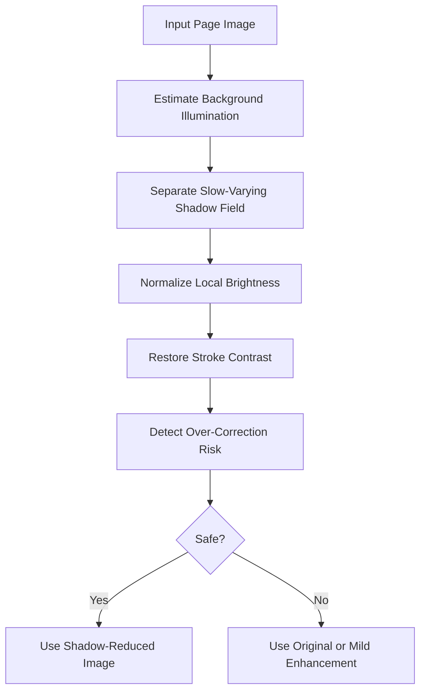

### Shadow Removal Requirements

- Must preserve pencil strokes.
- Must preserve faint tick marks.
- Must not remove matching lines.
- Must not distort QR code.
- Must store whether shadow correction was applied.
- Must contribute to the confidence score.

### Failure Handling

If shadow removal cannot produce a reliable image:

- try mild enhancement
- lower recognition confidence
- route affected answer crops to teacher review
- request rescan for severe cases

## Perspective Correction

### Objective

Convert a skewed mobile photo into a top-down rectangular page image aligned to the printed paper.

### Perspective Correction Inputs

- detected page corners
- page boundary contour
- QR location
- printed anchors
- expected page aspect ratio
- template metadata

### Perspective Correction Flow

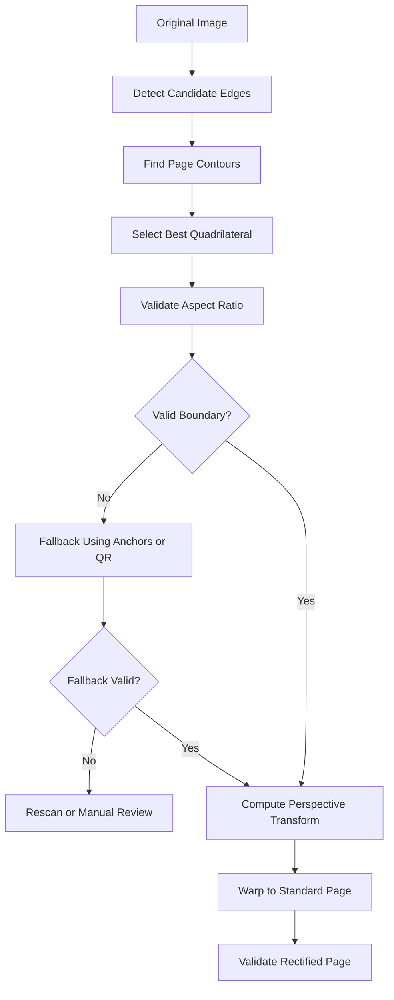

### Boundary Selection Signals

- contour size relative to image
- four-corner geometry
- aspect ratio
- page whiteness or background separation
- presence of QR code inside boundary
- presence of expected anchors
- minimal cut-off margin

### Perspective Correction Outputs

- rectified page image
- corner coordinates
- perspective transform matrix
- page boundary confidence
- aspect ratio error
- diagnostic flags

### Failure Cases

| Failure | Handling |
| --- | --- |
| Missing page corner | Rescan if severe |
| Paper overlaps another sheet | Ask rescan or manual review |
| Page too angled | Try correction, lower confidence |
| QR outside detected boundary | Re-evaluate boundary |
| Aspect ratio mismatch | Try template-assisted fallback |
| Folded page | Process but flag affected areas |

## Template Matching

### Objective

Align a rectified page to the exact assessment template so that answer regions can be cropped accurately.

### Template Matching Inputs

- rectified page image
- template version
- page number
- expected QR region
- anchor positions
- printed reference marks
- answer region coordinates
- page dimensions

### Template Matching Flow

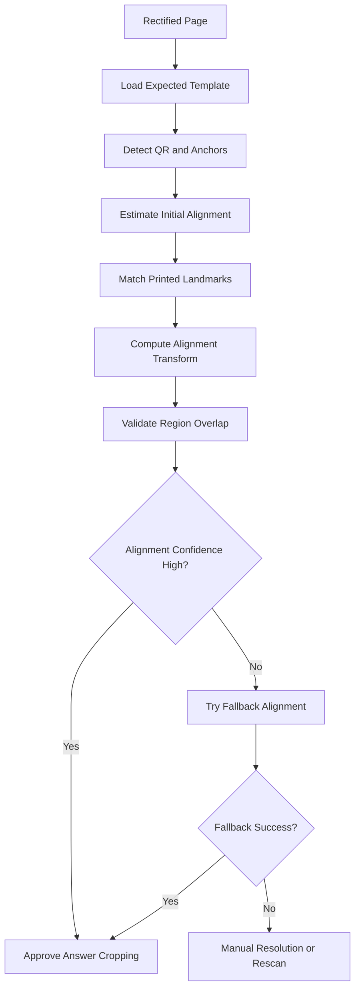

### Template Matching Methods

The system may combine:

- QR position matching
- anchor marker matching
- page border matching
- printed text block location
- answer box geometry
- feature matching
- correlation-based template matching
- alignment transform estimation

### Template Matching Confidence Signals

- anchor detection count
- anchor position error
- QR region offset
- page scale error
- rotation error
- answer region fit
- printed landmark match score
- template version consistency

### Template Matching Failure Handling

| Failure | Handling |
| --- | --- |
| Wrong template version | Use QR metadata or manual resolution |
| Printer scaled page | Estimate scale transform, flag lower confidence |
| Page cropped | Rescan if answer regions affected |
| Anchor missing | Use QR and text landmarks |
| Low alignment score | Do not auto-score affected crops |

## QR Reading

### Objective

Read QR metadata from each scanned page to identify tenant, school, assessment, paper, student, page, and template version.

### QR Reading Flow

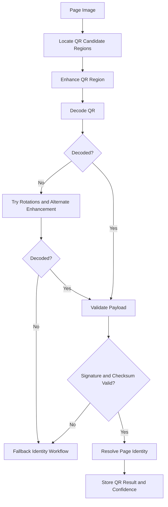

### QR Payload Requirements

The QR payload should contain or reference:

- payload schema version
- tenant id or tenant code
- school id or school code
- assessment id
- paper instance id
- page number
- template version id
- student id or anonymous paper code
- checksum
- signature

### QR Reading Confidence

Confidence should consider:

- decode success
- payload signature validity
- checksum validity
- QR location consistency
- QR size and damage score
- match against selected assessment context
- match against expected template

### QR Fallback Logic

If QR fails:

1. Use teacher-selected assessment context.
2. Detect page template through anchors.
3. Compare page layout with known templates.
4. Use scan batch ordering if safe.
5. Use printed student label if available.
6. Ask teacher to manually resolve identity.

### QR Security Rules

- Do not store plain sensitive student information in QR where avoidable.
- Use signed or checksummed payloads.
- Reject tampered payloads.
- Audit manual identity resolutions.

## Answer Extraction

### Objective

Crop every expected answer region from the aligned page and produce image artifacts suitable for recognition and teacher review.

### Extraction Flow

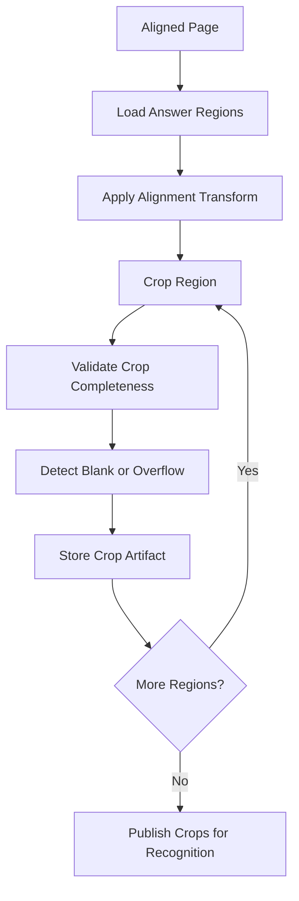

### Crop Quality Signals

- region inside page bounds
- expected area present
- crop sharpness
- crop brightness
- excessive shadow
- answer overflow
- printed guide line visibility
- alignment error around crop

### Extraction Outputs

- answer crop image
- crop coordinates
- region metadata
- crop quality score
- blank likelihood
- overflow likelihood
- diagnostic flags

## OCR Engine

### OCR Engine Objective

Convert image regions into text or structured symbols when the question type requires text recognition.

SmartFLN should separate:

- printed OCR
- handwritten text recognition
- handwritten digit recognition
- mark detection
- matching detection

Generic OCR alone is not sufficient for SmartFLN because young student handwriting is variable and question context matters.

### OCR Engine Architecture

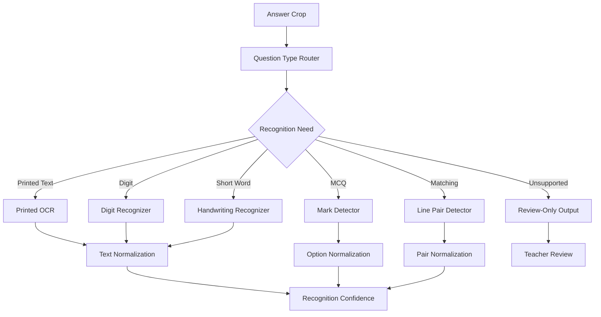

### Printed OCR

Used for:

- template verification
- printed labels
- fallback student identity if printed
- verifying page content

Printed OCR should not be the primary method for evaluating handwritten answers.

### OCR Preprocessing

Possible preprocessing variants:

- grayscale
- adaptive thresholding
- local contrast enhancement
- line removal if needed
- region padding
- deskew at crop level
- noise reduction

The system should choose preprocessing based on question type.

### OCR Output Requirements

- recognized text
- normalized text
- confidence score
- candidate alternatives
- recognition strategy
- preprocessing version
- model or OCR engine version
- review recommendation

## Handwriting Recognition

### Objective

Recognize young children's handwritten answers for constrained, assessment-aware question types.

### Recognition Scope by Phase

| Phase | Supported HTR Scope |
| --- | --- |
| MVP | digits, single-character answers, constrained numbers |
| Version 1 | short words from known vocabulary |
| Version 2 | short phrases and spelling answers |
| Version 3 | multilingual constrained handwriting |
| Future | broader open response assistance, still teacher-reviewed when uncertain |

### HTR Architecture

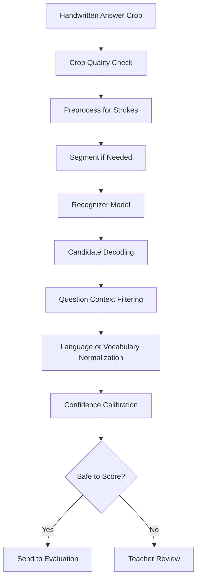

### Handwriting Challenges for Classes 1-5

- inconsistent letter shapes
- mixed uppercase and lowercase
- mirrored letters or digits
- uneven spacing
- answers written outside boxes
- erasures and overwriting
- faint pencil strokes
- spelling mistakes
- local language variation
- incomplete answers

### HTR Model Types

Near-term:

- digit classifiers
- small CNN/CRNN models
- sequence recognition for constrained words
- lexicon-assisted decoding

Mid-term:

- transformer-based OCR/HTR models
- vision-language models for constrained answer interpretation
- multilingual handwriting models

Long-term:

- student-age-aware handwriting models
- curriculum-aware answer recognition
- active learning from teacher corrections

### HTR Confidence Signals

- model probability
- gap between top candidate and second candidate
- crop quality score
- stroke clarity
- segmentation quality
- vocabulary match
- question context match
- historical model reliability for the question type

### HTR Safety Rules

- Do not auto-score unconstrained handwriting in early versions.
- If top candidates are close, route to teacher review.
- If recognition contradicts visual blank detection, route to review.
- If answer crop is poor, do not trust recognition.
- Store candidates so teacher can choose quickly.

## MCQ Detection

### Objective

Detect selected options in multiple-choice questions from marks such as filled bubbles, ticks, circles, crosses, or underlines depending on the template.

### MCQ Detection Flow

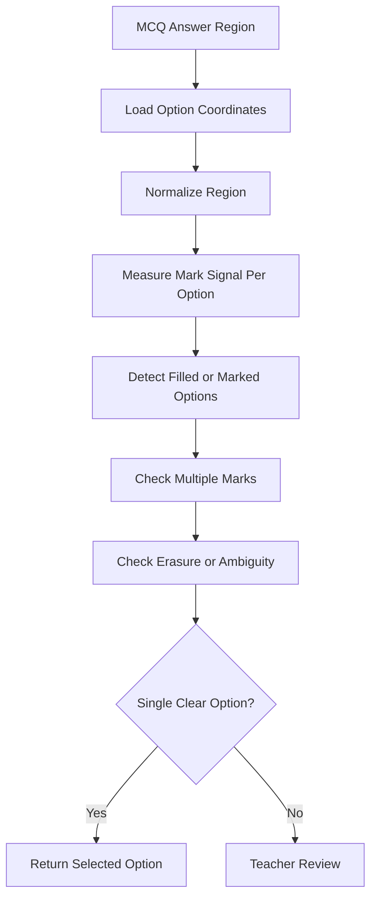

### MCQ Signals

- darkness or ink density inside option area
- stroke count
- connected components
- fill ratio
- mark shape
- difference from unmarked options
- proximity to option center
- erasure indicators
- multiple marked options

### MCQ Confidence

High confidence requires:

- one option has a clearly stronger mark signal
- other options are below threshold
- crop and alignment are reliable
- no severe shadow or blur
- option coordinates match template

### MCQ Failure Cases

| Failure | Action |
| --- | --- |
| Multiple options marked | Teacher review |
| Faint mark | Teacher review or low confidence |
| Erased option plus new option | Teacher review |
| Mark outside option region | Teacher review |
| Misaligned crop | Rescan or review |
| Blank response | Score blank if blank confidence is high |

## Matching Detection

### Objective

Detect connections drawn by students between left-side and right-side items, then score pairings.

### Matching Detection Flow

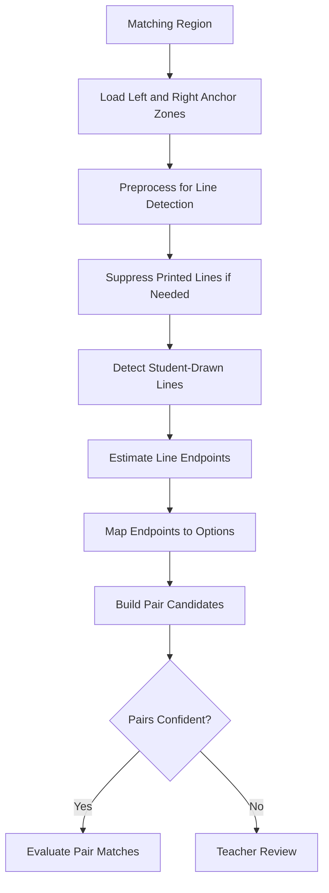

### Detection Techniques

Possible deterministic techniques:

- thresholding for dark strokes
- line segment detection
- Hough-style line detection
- contour analysis
- skeletonization
- endpoint detection
- connected component analysis
- anchor-zone intersection

Possible model-assisted techniques:

- line segmentation model
- endpoint detection model
- graph-based pair prediction

### Matching Confidence Signals

- number of detected lines matches expected answer count
- endpoints fall inside valid option zones
- line continuity
- crossing line ambiguity
- printed line removal success
- stroke darkness
- overlap with handwriting or other marks

### Matching Failure Cases

| Failure | Action |
| --- | --- |
| Crossed lines with unclear endpoints | Teacher review |
| Multiple lines to same option | Teacher review or partial scoring policy |
| Broken faint line | Teacher review |
| Line overlaps printed content | Teacher review |
| Student uses letters instead of lines | Route to alternate recognition or review |
| Region cropped poorly | Rescan or review |

## Spell Checking

### Objective

Normalize and evaluate spelling-based answers while respecting educational intent.

In foundational learning, spelling errors may be the assessed skill itself. Therefore spell checking must be configured per question, not applied blindly.

### Spell Checking Modes

| Mode | Use Case | Behavior |
| --- | --- | --- |
| Exact | Spelling test | Only exact accepted values score |
| Normalized exact | Case or punctuation irrelevant | Normalize before comparison |
| Phonetic tolerant | Early literacy where sound matters | Accept configured phonetic variants |
| Edit-distance tolerant | Non-spelling concept question | Allow small spelling errors |
| Teacher review assisted | Ambiguous answers | Suggest likely match but require review |

### Spell Checking Flow

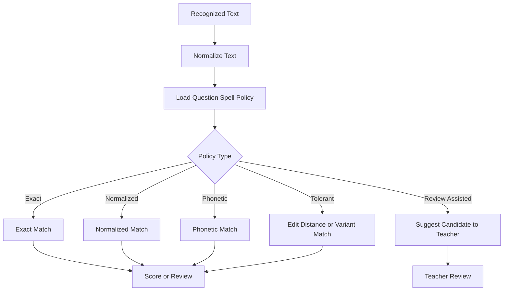

### Spell Checking Rules

- Use question-level policy.
- Preserve original student answer.
- Store normalized answer separately.
- Never auto-correct silently.
- If spelling is the assessed concept, do not use tolerant matching unless configured.
- If OCR confidence is low, route to teacher review even if spell match seems plausible.

## Evaluation Logic

### Objective

Convert recognized answers into marks using deterministic answer keys, scoring rules, rubrics, and confidence policies.

### Evaluation Architecture

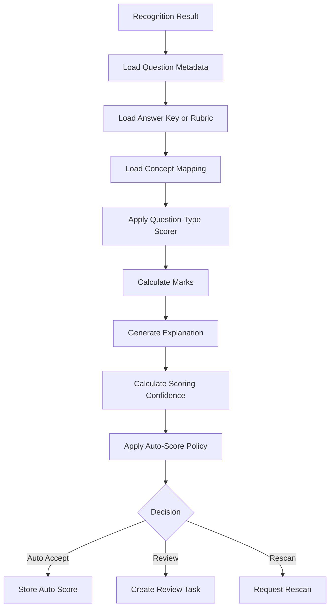

### Evaluation by Question Type

| Question Type | Evaluation Method | Auto-Score Eligibility |
| --- | --- | --- |
| MCQ | Compare selected option to answer key | High |
| True/False | Compare selected value | High |
| Numeric | Exact or tolerance comparison | Medium to high |
| Short word | Exact, variant, or spell policy | Medium |
| Spelling | Exact or configured spell policy | Medium |
| Matching | Compare detected pairs | Medium |
| Fill in blank | HTR plus configured answer variants | Medium |
| Drawing | Rubric or teacher review | Low |
| Long text | Assisted review | Low |

### Evaluation Outputs

- suggested marks
- max marks
- answer status
- scoring source
- scoring strategy
- scoring confidence
- explanation
- review recommendation
- concept mapping
- scoring rule version

### Evaluation Safety Rules

- Do not score if student identity is unresolved.
- Do not score if question metadata is missing.
- Do not auto-score if crop confidence is below threshold.
- Do not auto-score unsupported question types.
- Do not final-score if required teacher review is pending.
- Keep final teacher marks separate from raw AI suggestion.

## Confidence Score

### Objective

Produce a trustworthy decision by combining stage-level confidence signals.

### Confidence Layers

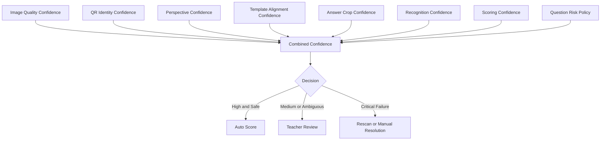

### Confidence Categories

| Category | Meaning | Action |
| --- | --- | --- |
| Very high | All critical signals strong | Auto-score if question type allows |
| High | Signals strong with minor issues | Auto-score for low-risk types |
| Medium | Some uncertainty | Teacher review |
| Low | Recognition or crop unreliable | Teacher review or rescan |
| Invalid | Critical identity or image failure | Manual resolution or rescan |

### Stage Confidence Examples

| Stage | Signals |
| --- | --- |
| Image quality | blur, glare, resolution, exposure, page completeness |
| QR | decode success, signature, location, context consistency |
| Perspective | corner confidence, aspect ratio, warp distortion |
| Template | anchor match score, alignment error, region overlap |
| Crop | completeness, sharpness, shadow, overflow |
| Recognition | model probability, candidate gap, vocabulary fit |
| Scoring | rule match, answer ambiguity, mark impact |

### Confidence Policy

Confidence policy should be configurable by:

- tenant
- grade
- subject
- question type
- assessment type
- scoring risk
- model version
- pilot versus production mode

### Confidence Decision Matrix

| Image | Identity | Crop | Recognition | Scoring | Decision |
| --- | --- | --- | --- | --- | --- |
| High | High | High | High | High | Auto-score |
| High | High | High | Medium | High | Review |
| High | Low | High | High | High | Manual identity resolution |
| Low | High | High | High | High | Rescan or review |
| High | High | Low | High | High | Review or rescan |
| High | High | High | Low | Medium | Review |
| Medium | High | Medium | Medium | Medium | Review |

### Confidence Calibration

The engine must measure whether confidence is meaningful. A 95% confidence prediction should be correct approximately 95% of the time within the evaluated segment.

Calibration should be tracked by:

- question type
- grade
- language
- school
- device class
- scan quality band
- model version
- template version

## Teacher Review Logic

### Objective

Route uncertain or high-risk answers to teachers with enough evidence to make fast, fair decisions.

### Review Routing Flow

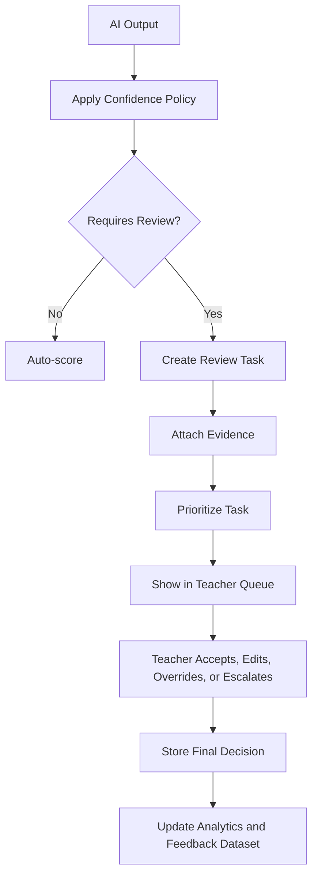

### Review Triggers

- low image quality
- QR identity uncertainty
- weak template alignment
- poor answer crop
- blank/answer contradiction
- low recognition confidence
- multiple recognition candidates
- ambiguous MCQ mark
- unclear matching line endpoints
- unsupported question type
- high mark impact
- new or untrusted model version
- teacher policy requires review

### Review Evidence Package

Each review task should include:

- student and assessment context
- question number
- concept
- answer crop
- full page preview if needed
- recognized answer
- candidate alternatives
- expected answer
- suggested mark
- confidence breakdown
- reason for review
- model and scoring versions

### Teacher Decision Types

| Decision | Meaning |
| --- | --- |
| Accept | Teacher accepts AI suggestion |
| Edit answer | Teacher corrects recognized answer |
| Override marks | Teacher sets marks directly |
| Mark blank | Teacher marks response as blank |
| Mark invalid | Teacher marks response invalid |
| Escalate | Teacher sends to coordinator/admin |

### Review Priority Logic

Priority can be based on:

- assessment finalization blocker
- number of students affected
- high mark value
- low confidence
- severe crop issue
- repeated model failure
- teacher workload balancing

## Blank Answer Detection

### Objective

Detect whether an answer region is truly blank, lightly marked, erased, or contains valid student work.

### Blank Detection Signals

- pixel density compared with clean template
- connected components
- stroke-like structures
- difference from background
- line or character presence
- erasure patterns
- expected answer area occupancy

### Blank Detection Rules

- If blank confidence is high, mark as blank if scoring policy allows.
- If blank confidence conflicts with OCR or mark detection, route to review.
- If the answer region has faint marks, route to review.
- Do not treat printed lines or boxes as student answers.

## Answer Normalization

### Objective

Convert recognized output into a consistent form for evaluation while preserving the original.

### Normalization Types

| Type | Example |
| --- | --- |
| Text case | uppercase/lowercase normalization |
| Whitespace | remove extra spaces |
| Punctuation | ignore punctuation when configured |
| Numeric | convert handwritten digit sequence to numeric value |
| Language | normalize known variants where allowed |
| Spelling | apply configured spell policy |
| Option | map tick position to option id |
| Matching | map endpoints to item pairs |

### Normalization Rules

- Preserve raw output.
- Store normalized output separately.
- Apply only question-approved normalization.
- Never hide uncertainty created during normalization.

## Future Transformer Models

### Why Transformers Matter

Transformer-based vision and multimodal models can improve layout understanding, handwriting recognition, and semantic answer evaluation. However, they must be introduced carefully because assessment grading requires fairness, auditability, cost control, and predictable behavior.

### Future Model Categories

| Model Type | Possible Use |
| --- | --- |
| Vision Transformer | Page understanding, answer region detection |
| Document Transformer | Template-free layout recognition |
| OCR Transformer | Printed and handwritten text recognition |
| Sequence Transformer | Handwritten word and phrase recognition |
| Vision-Language Model | Assisted interpretation of complex answers |
| Graph Transformer | Matching-question relationship detection |
| Multilingual Transformer | Local-language handwriting support |

### Future AI Architecture

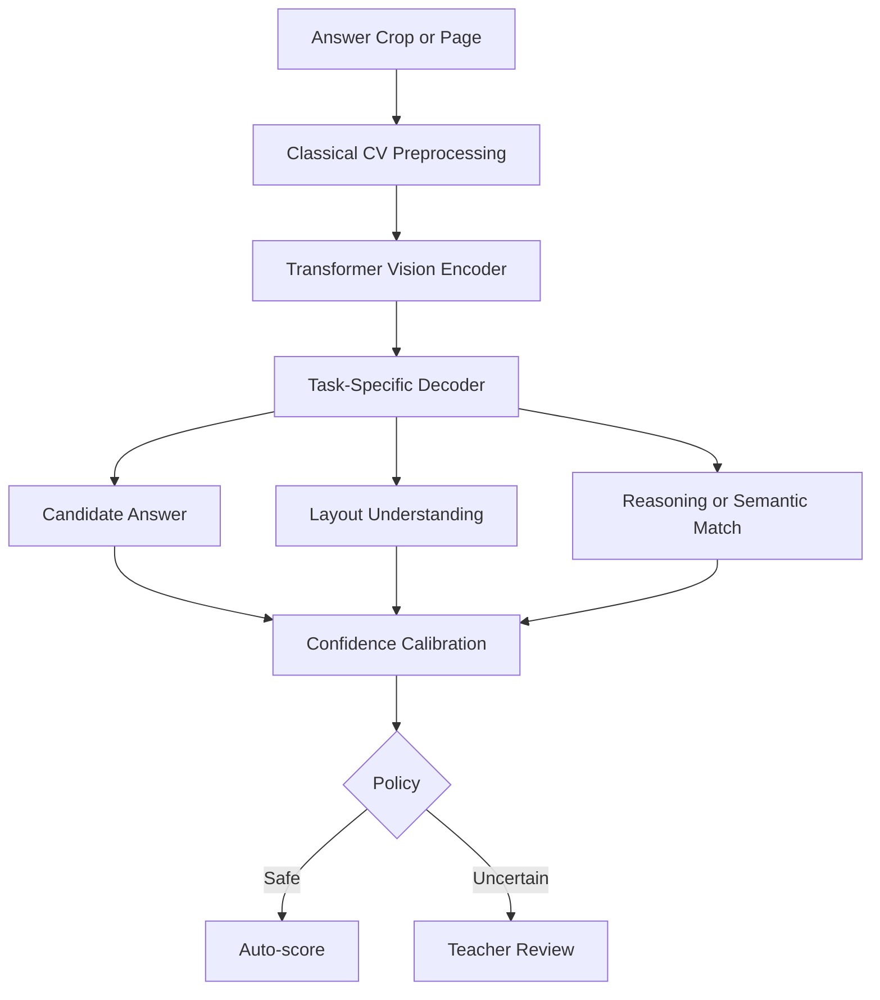

### Transformer Adoption Phases

#### Phase 1: Shadow Evaluation

Transformer models run in parallel but do not affect scoring. Outputs are compared with teacher-reviewed data.

#### Phase 2: Assisted Review

Transformer models suggest likely answers or rubric categories to teachers, but teachers still decide.

#### Phase 3: Limited Auto-Scoring

Transformer models auto-score only constrained, high-confidence question types after rigorous evaluation.

#### Phase 4: Multilingual Expansion

Models support multiple scripts and local languages with region-specific evaluation.

### Transformer Guardrails

- Use shadow mode before production scoring.
- Require per-question-type accuracy validation.
- Require confidence calibration.
- Monitor bias by language, school type, device quality, and grade.
- Keep deterministic scoring where possible.
- Store model version and prompt/configuration where applicable.
- Route uncertain outputs to teacher review.

## Model Monitoring

### Monitoring Metrics

| Metric | Purpose |
| --- | --- |
| Recognition confidence distribution | Detect drift or poor scans |
| Teacher override rate | Measure model disagreement |
| Auto-score acceptance rate | Track automation value |
| Review rate by question type | Identify weak areas |
| False auto-score audit rate | Protect trust |
| OCR latency | Monitor performance |
| Crop failure rate | Detect template or scan issues |
| QR failure rate | Detect print or scanning issues |
| Model accuracy on reviewed data | Validate model behavior |

### Drift Signals

- confidence drops after new template rollout
- override rate increases in one school or device type
- matching detection fails for new paper format
- handwriting model performs worse for one language or grade
- scan quality drops after teacher onboarding change

### Model Rollback

Model rollback is required when:

- teacher override rate spikes
- audit sample accuracy falls below threshold
- latency becomes unacceptable
- model produces unsafe scoring behavior
- data segment performance is unfair or unstable

## AI Data Feedback Loop

### Feedback Flow

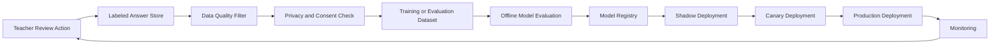

### Feedback Data Requirements

Teacher-reviewed examples should capture:

- original answer crop
- question metadata
- recognized answer
- teacher-corrected answer
- final mark
- reason for override
- scan quality score
- model version
- template version
- language and grade where allowed

### Privacy Rules

- Use reviewed data for training only when permitted.
- Remove unnecessary student identifiers.
- Apply retention rules.
- Keep tenant boundaries.
- Track data consent and usage rights.

## AI Engine Data Contracts

### Page Processing Output

Must include:

- scan page id
- original artifact id
- processed page artifact id
- QR result
- page boundary coordinates
- transform matrix
- template alignment score
- diagnostics
- processing version

### Answer Crop Output

Must include:

- answer crop id
- scan page id
- question id
- answer region id
- crop artifact id
- crop coordinates
- crop quality score
- blank likelihood
- overflow likelihood

### Recognition Output

Must include:

- answer crop id
- question id
- recognition strategy
- raw output
- normalized output
- candidates
- confidence
- model version
- inference timestamp

### Evaluation Output

Must include:

- score result id
- question id
- student id
- suggested marks
- max marks
- scoring strategy
- scoring confidence
- decision
- explanation
- review reason if any

## Failure Handling

### Failure Categories

| Failure | Default Action |
| --- | --- |
| Image unreadable | Rescan |
| Page boundary missing | Rescan or manual review |
| QR unreadable | Fallback identity workflow |
| Template mismatch | Manual resolution |
| Crop invalid | Review or rescan |
| OCR failed | Teacher review |
| HTR low confidence | Teacher review |
| MCQ ambiguous | Teacher review |
| Matching ambiguous | Teacher review |
| Evaluation rule missing | Admin correction |
| Model service unavailable | Retry or review-only fallback |

### Retry Rules

- Retry transient service failures.
- Retry model inference on worker timeout.
- Do not retry indefinitely on bad input images.
- Use alternate preprocessing only when it does not destroy evidence.
- Record all attempts and versions.

## AI Engine Security and Privacy

### Security Requirements

- AI services must access artifacts through authorized service identities.
- Image URLs must be short-lived.
- Raw answer images must not appear in logs.
- Model outputs must not expose data across tenants.
- Training data must be governed by consent and contract.
- Debug artifacts must have short retention.

### Privacy-Safe Logging

Logs may include:

- artifact ids
- confidence scores
- processing status
- model version
- error codes

Logs must not include:

- raw student names unless operationally necessary and protected
- raw handwritten answer text where avoidable
- public image links
- sensitive QR payload contents

## Production Readiness Criteria

### Before MVP Pilot

- QR detection works reliably on printed samples.
- Page boundary detection works on common classroom scans.
- Perspective correction produces usable pages.
- Template matching works on printed paper with minor scale variation.
- MCQ detection is validated.
- Numeric recognition is validated for constrained answers.
- Low-confidence routing works.
- Teacher review evidence is complete.

### Before Multi-School Production

- Confidence calibration is measured by question type.
- Model versions are stored with every result.
- Teacher override rate dashboards exist.
- Reprocessing can be run safely.
- Shadow model evaluation is supported.
- Drift monitoring exists.
- Failure and rescan rates are visible.

### Before Large-Scale Deployment

- AI performance is segmented by school, grade, language, device, and paper template.
- Model rollback is tested.
- GPU/CPU cost is monitored.
- Training data governance is operational.
- Transformer models, if used, have passed shadow and canary evaluation.

## AI Engine Roadmap

### Phase 1: Deterministic Vision and QR

- image quality checks
- QR reading
- page detection
- perspective correction
- template matching
- answer cropping

### Phase 2: Objective Question AI

- MCQ detection
- true/false detection
- blank detection
- deterministic scoring

### Phase 3: Structured Handwriting

- digit recognition
- simple numeric answer scoring
- constrained word recognition
- spell policy engine

### Phase 4: Matching and Semi-Structured Answers

- matching-line detection
- partial scoring
- improved ambiguity detection
- teacher-assisted review

### Phase 5: Transformer-Assisted Recognition

- shadow transformer OCR
- transformer-assisted review suggestions
- multilingual handwriting experiments
- layout-aware model evaluation

### Phase 6: Advanced Learning Intelligence

- misconception clustering
- remediation recommendations
- concept-level mastery prediction
- adaptive assessment support

## Final AI Principle

SmartFLN's AI Engine must be powerful but humble. It should automate what it can prove, explain what it suggests, ask the teacher when uncertain, and protect the trustworthiness of every student's marks.
