# SmartFLN Architecture

AI Powered QR Enabled Assessment System

## Purpose

This document defines the production architecture for SmartFLN. It describes how the system should be structured to support thousands of schools, millions of assessment pages, mobile phone scanning, AI-based answer recognition, confidence-based evaluation, teacher review, analytics, auditability, privacy, and operational reliability.

This is an architecture document only. It does not define implementation code.

## Architecture Goals

- Preserve paper-based assessment while digitizing evaluation and analytics.
- Support browser-based teacher scanning with weak or intermittent connectivity.
- Reliably identify student, assessment, paper, page, and template version using QR and fallback mechanisms.
- Process image-heavy workloads asynchronously and at scale.
- Keep AI inference, deterministic scoring, and teacher review clearly separated.
- Route uncertain answers to human review instead of silently assigning risky marks.
- Maintain auditability from final mark back to original scan, processed image, model version, and reviewer action.
- Support multi-tenant SaaS for schools, NGOs, and government programs.
- Support future private-cloud or on-premise deployments where required.
- Protect student data through encryption, access control, tenant isolation, data minimization, and retention controls.
- Enable observability, disaster recovery, model monitoring, and operational support from the start.

## Core Architecture Principles

### Paper First

The architecture assumes printed assessment papers remain the primary student interface. Digital systems must adapt to paper, not the other way around.

### Teacher Authority

AI suggestions are not final authority when confidence is low. Teachers remain the final decision makers for disputed, ambiguous, or low-confidence answers.

### Event-Driven Processing

Scanning, image processing, recognition, scoring, review, analytics, exports, and notifications are decoupled through events and queues.

### Stage-Level Confidence

Each pipeline stage produces confidence and diagnostic metadata. A low-confidence QR decode, page alignment, answer crop, recognition result, or score can trigger review or reprocessing.

### Immutable Source Artifacts

Original scans, processed page images, answer crops, template versions, scoring versions, and model versions must be retained according to policy so results are reproducible.

### Idempotent Workflows

Uploads, processing jobs, scoring jobs, analytics updates, and notifications must tolerate retries without duplicate marks or corrupted state.

### Multi-Tenant by Design

Schools and organizations are tenants. Every API, database query, storage path, cache key, queue message, and analytics aggregation must respect tenant isolation.

### Progressive Automation

The system should begin with high-confidence automation for QR, page detection, answer cropping, and objective questions. Handwriting automation expands only when measured accuracy supports it.

## Assumptions

- Assessment papers are generated by SmartFLN or imported into SmartFLN with a validated machine-readable template.
- Each page has QR metadata and visual anchors. The QR code is the primary identifier; anchors and context are fallbacks.
- Teachers scan through the SmartFLN React web app using phone or tablet browser camera capabilities where supported.
- Schools may have intermittent connectivity, but mobile devices eventually sync to the cloud.
- AI processing may require CPU and GPU workloads.
- Production deployments require strong privacy, security, audit, and operational controls.
- The platform must support both single-school pilots and large multi-school rollouts.
- Some answer types will remain review-first until there is enough validated data.

## System Context Diagram

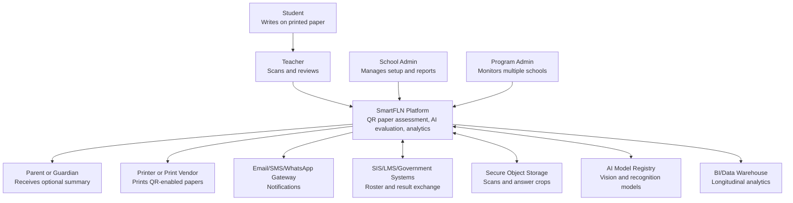

## High-Level System Architecture

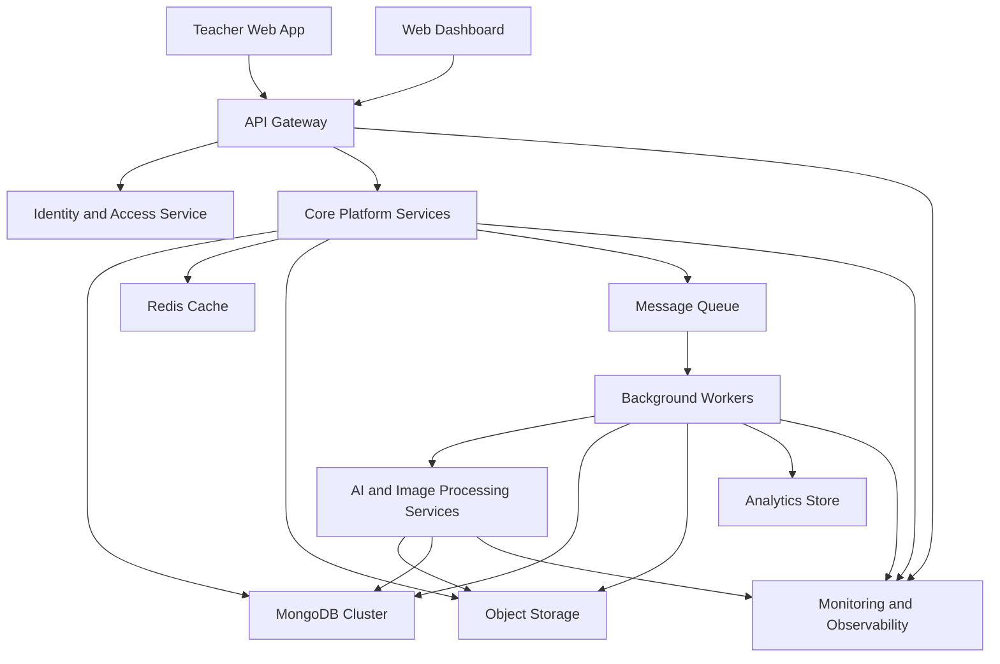

## Component Diagram

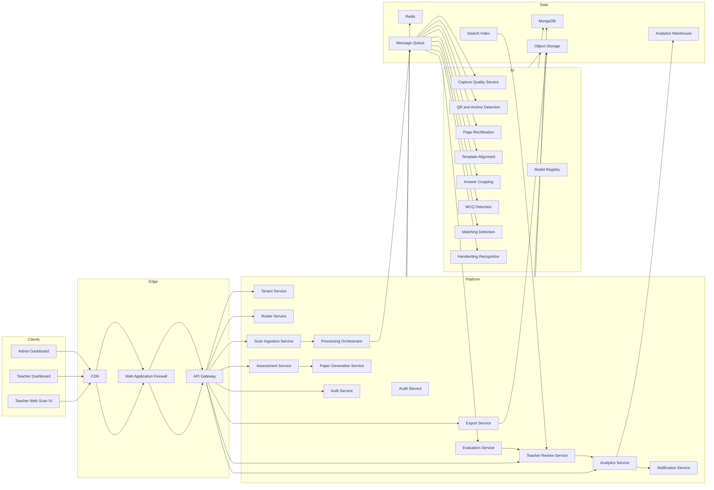

## Deployment Diagram

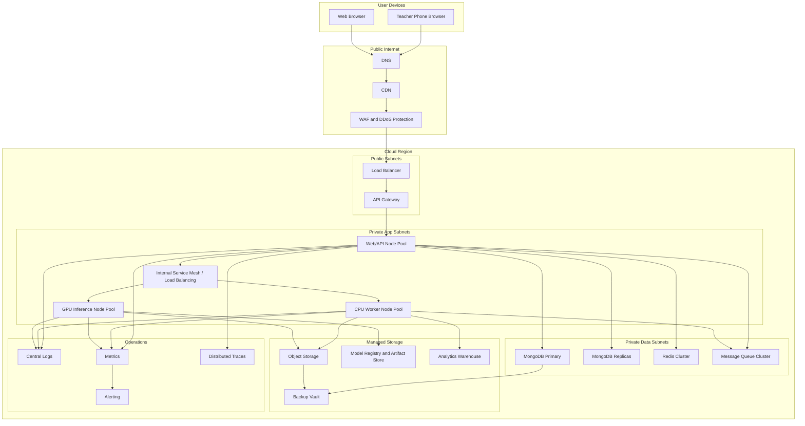

## Microservice Architecture

SmartFLN should use a modular service architecture. During early development, some services may be deployed as a modular monolith to reduce operational overhead, but boundaries must be designed as if each module can become an independent service.

### Service Boundary Principles

- Services own their data and APIs.
- Cross-service communication uses APIs for synchronous user-facing operations and events for asynchronous workflows.
- AI services are isolated from core transactional services.
- Long-running image, model, export, and analytics jobs must not run inside request-response API handlers.
- Each service emits structured logs, metrics, traces, and audit events.
- Services must be idempotent where retries are expected.

### Core Services

| Service | Responsibility | Primary Data |
| --- | --- | --- |
| Identity Service | Authentication integration, sessions, tokens, MFA, password policy | users, sessions, credentials metadata |
| Tenant Service | Organizations, schools, tenant configuration, feature flags | tenants, schools, subscription settings |
| Roster Service | Students, classes, sections, teachers, enrollment | students, classes, sections, enrollments |
| Assessment Service | Assessment authoring, questions, concepts, rubrics, answer keys | assessments, questions, concepts, rubrics |
| Template Service | Page templates, answer regions, anchors, QR schema, versioning | templates, regions, versions |
| Paper Generation Service | Printable PDFs and student-specific paper metadata | generated papers, print batches |
| Scan Ingestion Service | Mobile uploads, deduplication, scan lifecycle | scans, upload sessions, page submissions |
| Processing Orchestrator | Coordinates image and AI pipeline stages | processing jobs, stage status |
| Image Processing Service | Boundary detection, deskew, rectification, normalization | image artifacts, diagnostics |
| QR and Page ID Service | QR decoding, page identity, fallback matching | decoded page metadata |
| Answer Extraction Service | Template alignment and answer crop creation | answer crops, crop metadata |
| Recognition Service | MCQ, matching, handwriting, numeric recognition | recognition results |
| Evaluation Service | Scoring, partial marks, confidence thresholds | scores, scoring explanations |
| Teacher Review Service | Review queue, overrides, finalization | review tasks, reviewer actions |
| Analytics Service | Concept, class, student, school analytics | aggregates, reports |
| Notification Service | Mobile push, email, SMS, messaging gateway integration | notification events |
| Export Service | CSV, Excel, PDF, integration exports | export jobs, output files |
| Audit Service | Immutable event and access audit trail | audit events |
| Model Registry Service | Model version metadata, rollout, evaluation status | model versions, deployments |

### Synchronous API Calls

Use synchronous APIs for:

- login and session refresh
- roster lookup
- assessment setup
- scan upload session creation
- review queue retrieval
- teacher review action submission
- dashboard queries requiring immediate response

### Asynchronous Events

Use asynchronous events for:

- scan uploaded
- QR decoded
- page rectified
- template aligned
- answer crop generated
- recognition completed
- score generated
- review required
- review completed
- assessment finalized
- analytics refreshed
- report export completed

### Microservice Interaction Diagram

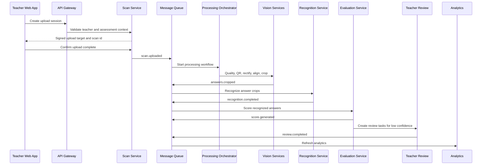

## Database Architecture

### Database Strategy

SmartFLN should use MongoDB as the primary application database because the product requirement is MERN stack.

Use separate logical databases or collections for:

- identity and access
- tenant and school setup
- assessment authoring
- scan processing
- evaluation and review
- analytics aggregates
- audit logs

For early stages, one MongoDB cluster with strict collection boundaries and tenant-scoped indexes is acceptable. At large scale, high-volume collections such as scans, answer crops, recognition results, and audit events may be sharded or moved to dedicated clusters.

### Data Ownership

| Domain | Owner Service | Notes |
| --- | --- | --- |
| Users and roles | Identity Service | Avoid direct writes from other services |
| Tenants and schools | Tenant Service | Used by all services for authorization |
| Students and enrollment | Roster Service | Source of truth for student identity |
| Assessments and templates | Assessment and Template Services | Versioned and immutable after release |
| Scans and pages | Scan Service | References object storage artifacts |
| Processing stages | Processing Orchestrator | Tracks state machine and retries |
| Answer crops | Answer Extraction Service | Stores metadata, not large binary payloads |
| Recognition results | Recognition Service | Includes model version and confidence |
| Scores | Evaluation Service | Includes scoring rule version |
| Review tasks | Teacher Review Service | Human decision layer |
| Analytics | Analytics Service | Derived data, rebuildable |
| Audit events | Audit Service | Append-only |

### Entity Relationship Diagram

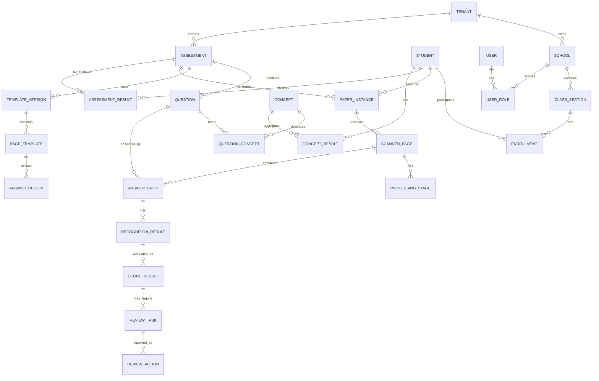

### Core Data Groups

#### Tenant and Access Data

- tenant
- school
- user
- role
- permission
- user role assignment
- feature flag
- subscription or deployment configuration

#### Roster Data

- student
- guardian contact metadata where allowed
- class
- section
- enrollment
- teacher assignment
- academic year

#### Assessment Data

- assessment
- subject
- grade/class
- question
- answer key
- acceptable answer variant
- rubric
- concept
- question-concept mapping
- template version
- answer region coordinates
- paper version

#### Scan and Processing Data

- upload session
- scan batch
- scanned page
- QR decode result
- page alignment result
- processing stage
- processing diagnostic
- answer crop metadata
- artifact pointer

#### AI and Evaluation Data

- recognition result
- recognition confidence
- model version
- scoring rule version
- score result
- review task
- review action
- final mark

#### Analytics Data

- student assessment result
- question result summary
- concept result summary
- class concept aggregate
- school assessment aggregate
- longitudinal student concept profile

#### Audit Data

- user action events
- mark changes
- access logs for sensitive data
- model deployment changes
- assessment template publication
- export creation and download

### Database Scaling

- Partition high-volume tables by tenant, assessment, date, or academic year.
- Use read replicas for dashboards and exports.
- Keep transactional writes on the primary database.
- Use materialized views or derived tables for common analytics.
- Move long-term analytics to a warehouse when usage grows.
- Use connection pooling for all services.
- Use database migrations with forward-compatible rollout.

### Data Consistency Model

Strong consistency required:

- authentication
- authorization
- roster updates
- final marks
- teacher review actions
- assessment publication
- audit logs

Eventual consistency acceptable:

- dashboard aggregates
- analytics summaries
- notification status
- exports
- model performance dashboards

## AI Architecture

### AI System Goals

- Recognize and evaluate supported answer types with measurable confidence.
- Avoid unsafe automation when confidence is low.
- Capture evidence for every AI decision.
- Improve through teacher-reviewed data.
- Support model versioning, evaluation, rollback, and staged rollout.

### AI Pipeline Diagram

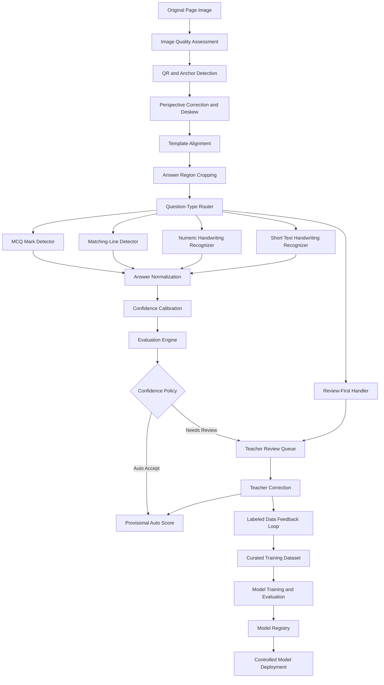

### AI Service Categories

#### Computer Vision Services

- image quality scoring
- paper detection
- QR detection
- anchor detection
- perspective correction
- template alignment
- answer region cropping
- mark detection
- matching-line detection

#### Recognition Services

- handwritten digit recognition
- constrained word recognition
- short phrase recognition
- symbol recognition
- blank answer detection
- erased or overwritten answer detection

#### Evaluation Services

- exact-match scoring
- normalized text scoring
- numeric tolerance scoring
- phonetic or spelling-tolerant scoring
- partial credit scoring
- rubric-assisted scoring
- semantic scoring only where carefully validated

#### Model Operations Services

- model registry
- offline evaluation
- shadow deployment
- canary deployment
- model rollback
- drift detection
- dataset governance

### Confidence Architecture

Confidence must be computed and stored at multiple levels:

| Stage | Confidence Signal |
| --- | --- |
| Capture quality | blur, glare, resolution, page completeness |
| QR decode | decode success, checksum, metadata consistency |
| Page rectification | detected corners, perspective distortion, alignment quality |
| Answer crop | crop completeness, region overlap, template fit |
| MCQ detection | selected option confidence, multiple mark probability |
| Matching detection | line endpoint confidence, pair confidence |
| Handwriting recognition | top prediction probability, alternatives, language model score |
| Scoring | answer match confidence, rule confidence, model agreement |
| Finalization | reviewed or auto-accepted status |

### AI Decision Policy

| Condition | Action |
| --- | --- |
| High recognition confidence and deterministic scoring | Auto-score |
| Medium confidence but low mark impact | Optional review based on policy |
| Low confidence | Teacher review required |
| Conflicting signals | Teacher review required |
| Unsupported question type | Teacher review required |
| Missing or damaged crop | Rescan or manual review |
| Model version under evaluation | Shadow mode, no automatic final marks |

### Model Versioning

Every AI output must include:

- model name
- model version
- model artifact hash
- inference timestamp
- input artifact id
- preprocessing version
- confidence score
- top alternatives where relevant
- deployment mode: production, canary, shadow, or experimental

### Model Training Data Flow

```mermaid
flowchart LR
    Review["Teacher Reviewed Answers"] --> LabelStore["Labeled Data Store"]
    LabelStore --> Curate["Data Curation and Quality Checks"]
    Curate --> Split["Train/Validation/Test Split"]
    Split --> Train["Model Training"]
    Train --> Eval["Offline Evaluation"]
    Eval --> Bias["Segment Evaluation\nGrade, language, school, scan quality"]
    Bias --> Registry["Model Registry"]
    Registry --> Shadow["Shadow Deployment"]
    Shadow --> Canary["Canary Deployment"]
    Canary --> Prod["Production Deployment"]
    Prod --> Monitor["Runtime Monitoring"]
    Monitor --> Review
```

### AI Guardrails

- Do not finalize low-confidence handwritten answers automatically.
- Do not train models on tenant data unless contractually allowed.
- Keep datasets traceable to consent and retention policies.
- Evaluate model performance by grade, language, school type, device class, and question type.
- Maintain human-readable evidence for each suggested mark.
- Use deterministic rules for scoring whenever possible.
- Keep model inference outputs separate from final marks.

## Image Processing Architecture

### Image Processing Goals

- Convert variable mobile photos into standardized assessment page images.
- Preserve original images for audit.
- Generate processed page images and answer crops for AI and teacher review.
- Identify quality failures early and guide rescan when needed.

### Image Pipeline

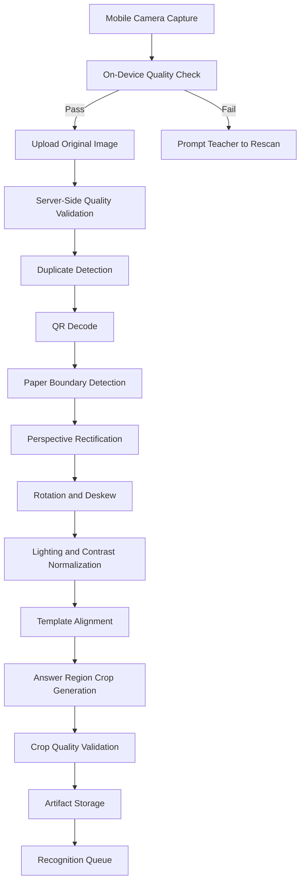

### On-Device Processing

The teacher web app should perform lightweight checks before upload:

- page is inside frame
- corners are visible
- image is not obviously blurry
- brightness is acceptable
- QR area is visible where expected
- duplicate capture warning
- assessment context matches selected workflow where possible

On-device checks reduce upload waste but must not be the only validation layer.

### Server-Side Processing

Server-side image processing is authoritative because it can use heavier models and consistent versions.

Required outputs:

- original image artifact
- normalized page image artifact
- page transform matrix
- QR metadata
- template alignment metadata
- answer crop artifacts
- crop coordinates
- diagnostic flags
- processing version

### Image Artifact Lifecycle

| Artifact | Stored | Purpose |
| --- | --- | --- |
| Original scan | Yes | Audit, reprocessing, dispute resolution |
| Processed page | Yes | Review, reproducible processing |
| Answer crop | Yes | Recognition, teacher review |
| Thumbnail | Yes | Fast dashboard display |
| Intermediate debug images | Limited or sampled | Engineering diagnostics |

### Image Quality Failure Handling

| Failure | User or System Action |
| --- | --- |
| Blur | Ask teacher to rescan |
| Missing page corner | Ask teacher to rescan |
| QR unreadable but page alignable | Use fallback and route to review |
| Wrong assessment page | Block or route to manual resolution |
| Duplicate scan | Merge, replace, or ignore based on teacher action |
| Severe shadow | Attempt normalization, then rescan if confidence remains low |
| Template mismatch | Manual resolution by teacher/admin |

## Teacher Dashboard Architecture

### Dashboard Goals

- Let teachers complete assessment workflows quickly.
- Make AI decisions inspectable.
- Reduce cognitive load by showing only what needs attention.
- Provide actionable concept-level insights.

### Frontend Architecture

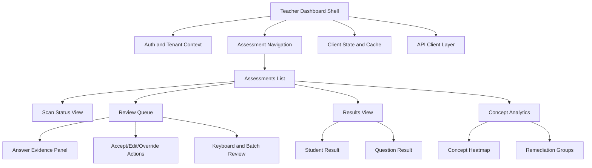

### Teacher Dashboard Modules

| Module | Purpose |
| --- | --- |
| Assessment list | Shows assigned, active, processing, review pending, finalized assessments |
| Scan status | Shows students and pages scanned, missing, failed, duplicate, or pending |
| Review queue | Shows uncertain answers requiring teacher action |
| Evidence panel | Shows answer crop, recognized answer, expected answer, confidence, suggested mark |
| Finalization | Confirms all required review tasks are complete before locking marks |
| Results | Shows student-wise, question-wise, and concept-wise marks |
| Analytics | Shows class learning gaps and remediation groups |
| Exports | Allows CSV, Excel, and PDF report generation |

### Dashboard Data Strategy

- Use paginated APIs for review queues.
- Use signed image URLs for answer crops.
- Cache assessment metadata and concepts locally.
- Use server-side filtering for class, section, student, question, and review status.
- Use real-time updates or polling for processing status.
- Avoid loading full-resolution images until needed.

### Teacher Review State Machine

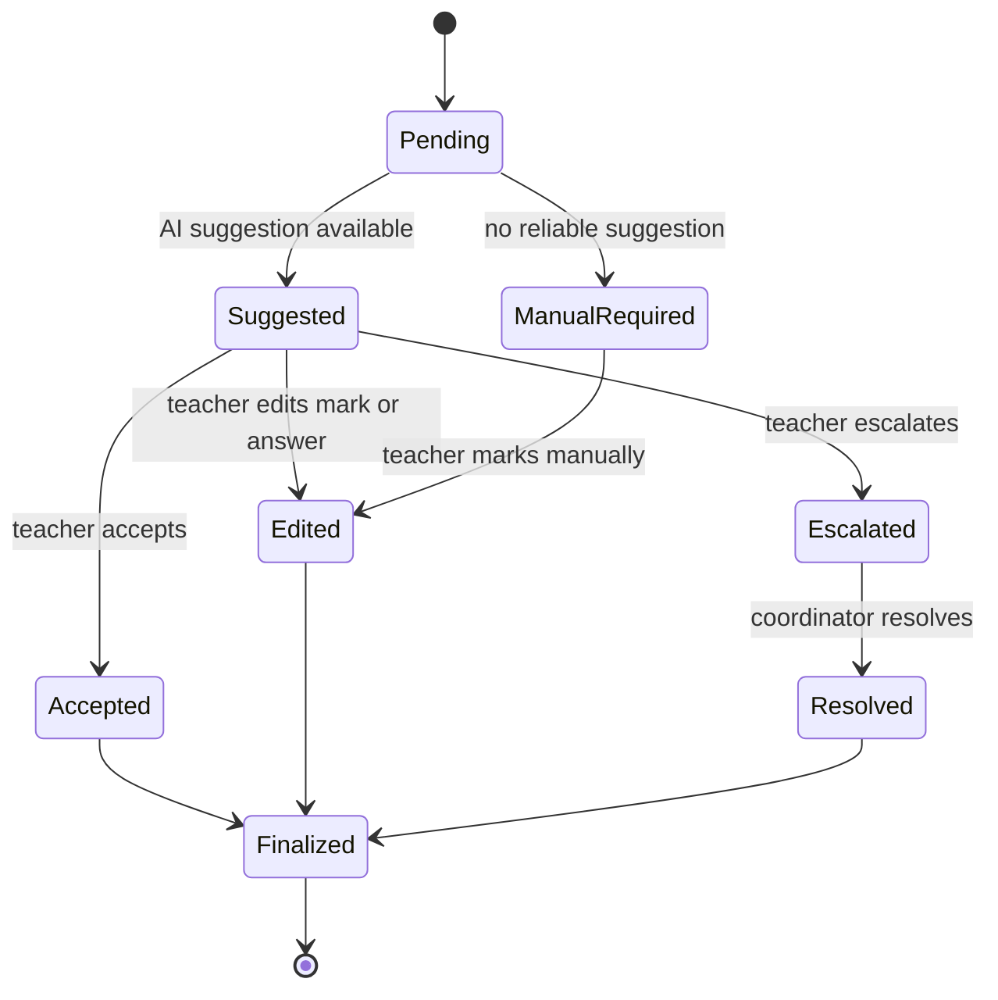

## Authentication Architecture

### Authentication Goals

- Secure access for teachers, school admins, program admins, and platform operators.
- Support mobile and web sessions.
- Support multi-tenant authorization.
- Support future SSO for large institutions.

### Auth Architecture Diagram

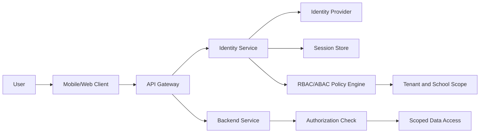

### Authentication Methods

Initial supported methods:

- mobile number with OTP for teachers where appropriate
- email and password for admins
- password reset and account recovery
- device/session management

Future methods:

- Google Workspace or Microsoft Entra ID SSO
- government identity provider integration
- school-managed SAML/OIDC
- multi-factor authentication for admins

### Authorization Model

Use role-based access control with attribute-based constraints.

Roles:

- teacher
- school academic coordinator
- school admin
- program admin
- tenant admin
- support operator
- platform admin

Attributes:

- tenant id
- school id
- class id
- section id
- subject
- assessment id
- assigned teacher id
- academic year

### Token Strategy

- Short-lived access tokens.
- Refresh tokens with rotation.
- Device-bound refresh sessions for mobile.
- Token revocation on password reset, role change, or suspicious activity.
- Signed service-to-service tokens for internal calls.

### Authorization Requirements

- Every request must include tenant context.
- Services must enforce authorization, not only the API gateway.
- Image access must use short-lived signed URLs.
- Support users must use time-limited, audited access.
- Mark edits must require explicit authenticated user identity.

## Cloud Architecture

### Cloud Design

SmartFLN should run on a cloud-native architecture with managed services where possible. The design should be portable enough to support AWS, Azure, or GCP, with infrastructure abstractions kept clean.

### Recommended Cloud Capabilities

| Capability | Cloud Service Category |
| --- | --- |
| Public ingress | DNS, CDN, WAF, load balancer |
| APIs and web services | Managed Kubernetes or container apps |
| Background workers | Kubernetes worker pools or managed job platform |
| GPU inference | GPU node pool or managed inference endpoints |
| Transactional database | Managed MongoDB |
| Cache | Managed Redis |
| Queue | Managed message broker or Kafka-compatible service |
| Object storage | S3-compatible encrypted bucket storage |
| Secrets | Managed secrets vault |
| Logs and metrics | Managed observability stack |
| Backups | Managed backup vault |
| Data warehouse | Managed warehouse or lakehouse |

### Network Architecture

- Public subnets contain only load balancers and edge ingress components.
- Application services run in private subnets.
- Databases, queues, and caches run in isolated private data subnets.
- Administrative access uses bastionless secure access or managed session tooling.
- Egress is controlled through NAT and allowlists.
- Private endpoints are preferred for object storage, database, queue, and secrets access.

### Environment Strategy

Required environments:

- local development
- shared development
- QA
- staging
- production
- disaster recovery environment

Staging must mirror production topology closely enough to test migrations, model rollouts, queue behavior, and deployment runbooks.

## Caching Strategy

### Cache Layers

| Layer | Purpose |
| --- | --- |
| CDN cache | Static web assets, public documentation, immutable generated resources where safe |
| Browser cache | Assessment metadata, user preferences, offline scan state |
| API response cache | Low-risk read-heavy data such as concepts and assessment summaries |
| Redis cache | Sessions, rate limits, job locks, hot metadata, processing status |
| Database read replicas | Query scaling for dashboards and reports |
| Analytics materialized views | Class, concept, school, and program aggregates |

### Redis Usage

Redis should be used for:

- short-lived session metadata
- distributed locks for idempotent processing
- upload session state
- scan processing progress
- rate limiting counters
- review queue cursors
- temporary signed URL metadata
- feature flag cache
- tenant configuration cache

Redis should not be the source of truth for final marks, assessment records, review decisions, or audit events.

### Cache Invalidation

- Assessment templates are immutable after release, so they are safe to cache aggressively by version.
- Roster changes invalidate class and student lookup caches.
- Review actions invalidate result summaries and review queue counts.
- Finalization invalidates assessment status and analytics caches.
- Tenant and role changes must invalidate authorization-related caches immediately.

### Offline Mobile Cache

The teacher web app should cache:

- assigned assessments
- class roster
- scan queue
- upload status
- local image references until upload completes
- teacher session state

Offline data must be encrypted on device where possible and cleared on logout or device deauthorization.

## Storage Strategy

### Object Storage

Object storage is the system of record for binary artifacts:

- original scans
- processed page images
- answer crops
- thumbnails
- generated paper PDFs
- export files
- model artifacts where supported
- debug samples where retention allows

### Storage Key Design

Storage paths should include:

- tenant id
- school id
- academic year
- assessment id
- student or paper instance id
- artifact type
- artifact id or version

Do not rely on storage paths for authorization. Authorization must be enforced by services and signed URL generation.

### Storage Classes

| Artifact | Default Storage | Retention |
| --- | --- | --- |
| Generated PDF | Standard | Academic year plus policy period |
| Original scan | Standard then infrequent access | Policy-driven |
| Processed page | Standard then infrequent access | Policy-driven |
| Answer crop | Standard | At least until dispute window ends |
| Thumbnail | Standard | Same as related scan |
| Export file | Short-lived standard | Expire after configured period |
| Debug artifacts | Restricted storage | Short retention, sampled only |

### Encryption

- Encrypt all objects at rest.
- Use tenant-aware encryption keys where required by contract.
- Use TLS for all transfers.
- Use signed URLs with short expiration.
- Block public bucket access.

### Metadata

Object metadata should include:

- content type
- checksum
- source scan id
- processing version
- model version where applicable
- retention class
- tenant id
- creation timestamp

## API Gateway

### Responsibilities

The API Gateway is the controlled entry point for mobile, web, and partner API traffic.

Responsibilities:

- TLS termination
- request authentication
- tenant context validation
- rate limiting
- request size limits
- route management
- API versioning
- request correlation id creation
- WAF integration
- abuse protection
- response compression
- request and response logging metadata

### Routing

Route groups:

- `/auth` for authentication and session flows
- `/tenants` for organization and school setup
- `/roster` for student and class management
- `/assessments` for assessment authoring and assignment
- `/papers` for PDF generation and print batches
- `/scans` for upload sessions and scan status
- `/reviews` for teacher review queues and actions
- `/results` for marks and result summaries
- `/analytics` for reports and dashboards
- `/exports` for file exports
- `/admin` for privileged operational actions

### Gateway Policies

- Reject oversized image uploads unless using signed object storage upload.
- Enforce stricter rate limits on login, OTP, and export endpoints.
- Require idempotency keys for upload confirmations and review submissions.
- Attach correlation id to every downstream request.
- Block requests without tenant context except public authentication and health endpoints.

## Message Queue

### Queue Architecture

The queue decouples user-facing APIs from long-running image, AI, scoring, analytics, and export workflows.

Recommended capabilities:

- durable messages
- retry policies
- dead-letter queues
- delayed retries
- message ordering where required
- consumer groups
- backpressure controls
- message tracing metadata

### Event Topics

| Event | Producer | Consumers |
| --- | --- | --- |
| `scan.uploaded` | Scan Service | Processing Orchestrator |
| `scan.duplicate_detected` | Scan Service | Teacher Dashboard, Audit |
| `page.qr_decoded` | QR Service | Processing Orchestrator |
| `page.rectified` | Image Processing Service | Template Alignment |
| `page.aligned` | Template Service | Answer Extraction |
| `answer.crop_created` | Answer Extraction | Recognition Service |
| `answer.recognized` | Recognition Service | Evaluation Service |
| `answer.scored` | Evaluation Service | Review Service, Analytics |
| `review.required` | Evaluation Service | Teacher Review Service |
| `review.completed` | Teacher Review Service | Evaluation Service, Analytics, Audit |
| `assessment.finalized` | Review Service | Analytics, Export, Notification |
| `analytics.updated` | Analytics Service | Notification Service |
| `export.requested` | Export Service | Export Worker |
| `model.deployed` | Model Registry | AI Services, Audit |

### Message Contract Requirements

Each message should include:

- event id
- event type
- tenant id
- correlation id
- causation id
- source service
- schema version
- timestamp
- entity references
- idempotency key
- retry count

Messages should not include large image payloads. They should include references to object storage artifacts.

## Background Workers

### Worker Categories

| Worker | Responsibility |
| --- | --- |
| Scan ingestion worker | Confirms uploads, computes checksums, detects duplicates |
| Image quality worker | Validates image quality and page completeness |
| QR worker | Decodes QR and validates metadata |
| Rectification worker | Corrects perspective and normalizes page |
| Template alignment worker | Aligns page to template version |
| Crop worker | Generates answer crops |
| Recognition worker | Runs question-type-specific recognition |
| Scoring worker | Applies scoring rules and confidence policies |
| Review routing worker | Creates teacher review tasks |
| Analytics worker | Updates aggregates and materialized views |
| Export worker | Generates CSV, Excel, and PDF reports |
| Notification worker | Sends processing, review, and finalization notifications |
| Cleanup worker | Applies retention and deletes expired exports |
| Model evaluation worker | Runs offline model evaluation jobs |

### Worker Design Requirements

- Workers must be idempotent.
- Workers must record stage status before and after execution.
- Workers must store diagnostic failure reasons.
- Workers must use bounded retries.
- Workers must send unrecoverable jobs to dead-letter queues.
- Workers must support safe reprocessing from original scans.
- Workers must include model and processing version in outputs.

### Processing State Machine

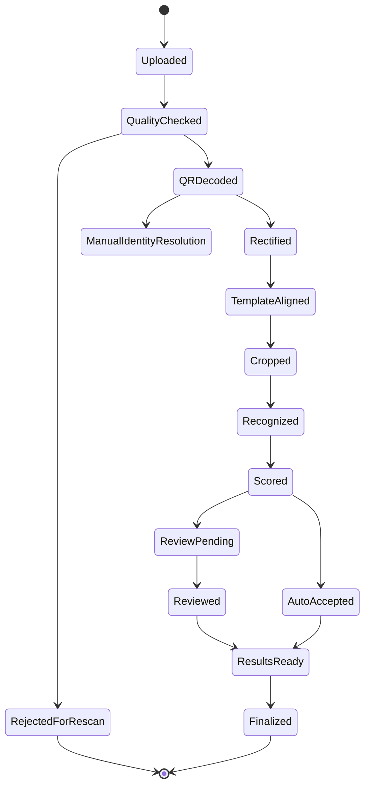

## Scalability Strategy

### Scaling Dimensions

SmartFLN must scale across:

- number of schools
- number of teachers
- number of students
- number of assessments
- number of scanned pages
- image size
- AI inference cost
- dashboard query load
- report generation volume

### Horizontal Scaling

- API services are stateless and horizontally scalable.
- Workers scale by queue depth and processing latency.
- GPU inference workers scale separately from CPU workers.
- Read-heavy dashboard queries use read replicas and analytics stores.
- Object storage scales independently from compute.
- CDN serves static assets and generated downloads where safe.

### Workload Isolation

Separate workloads:

- user-facing APIs
- scan ingestion
- CPU image processing
- GPU inference
- scoring
- analytics
- exports
- model training and evaluation

This prevents a large scan batch from slowing teacher review or login flows.

### Backpressure

When processing volume exceeds capacity:

- accept uploads but show delayed processing status
- prioritize active teacher review and finalization workflows
- process pages in fair tenant-aware queues
- throttle non-urgent exports
- scale workers automatically
- protect databases from write spikes through queue buffering

### Tenant Fairness

- Apply per-tenant rate limits.
- Use queue partitions or priorities for large deployments.
- Prevent one school or program from starving others.
- Track tenant-level processing latency and failures.

### Database Scaling Strategy

- Use indexes aligned with tenant, assessment, class, and status filters.
- Partition scan and answer tables.
- Move older academic years to cold partitions.
- Use read replicas for reports.
- Use warehouse for cross-school analytics.
- Avoid synchronous dashboard queries over raw answer-crop tables at scale.

## Failure Recovery Strategy

### Failure Recovery Principles

- Never lose an uploaded scan once upload is confirmed.
- Preserve original scans for reprocessing.
- Make every processing stage retryable.
- Surface failures clearly to teachers and admins.
- Prefer partial results over all-or-nothing failure where safe.
- Keep final marks protected from duplicate processing.

### Common Failures and Recovery

| Failure | Recovery |
| --- | --- |
| Mobile offline | Queue locally and resume upload |
| Upload interrupted | Resumable upload with checksum verification |
| Duplicate upload | Detect checksum/page identity and merge or ignore |
| QR unreadable | Use fallback identity, then route to manual resolution |
| Image processing failure | Retry with alternate parameters, then request rescan |
| AI inference timeout | Retry on another worker or mark for review |
| Queue consumer failure | Message retry and dead-letter handling |
| Database write conflict | Idempotency key and optimistic concurrency |
| Analytics update failure | Rebuild derived aggregates from source events |
| Export generation failure | Retry and show failed export status |
| Notification failure | Retry with provider fallback where configured |

### Idempotency

Required idempotency keys:

- upload session id
- scan image checksum
- scanned page id
- processing stage id
- answer crop id
- recognition job id
- scoring job id
- review action id
- export job id

### Dead-Letter Queue Handling

Dead-letter queues must preserve:

- failed message
- error reason
- failure count
- service version
- correlation id
- tenant id
- related entity ids

Operations staff need dashboards to inspect, replay, or permanently fail dead-letter items.

### Reprocessing

The system must support reprocessing:

- one page
- one student paper
- one assessment batch
- one model version comparison
- one template version if not finalized

Reprocessing after finalization must create a new audit trail and must not silently alter locked results.

## Security Strategy

### Security Goals

- Protect student personally identifiable information.
- Protect scanned answer images.
- Prevent unauthorized mark changes.
- Maintain tenant isolation.
- Make all sensitive actions auditable.
- Reduce attack surface through least privilege.

### Threat Model Areas

| Area | Threat | Control |
| --- | --- | --- |
| Authentication | Account takeover | MFA for admins, OTP throttling, session rotation |
| Authorization | Cross-school data access | Tenant-scoped RBAC/ABAC checks |
| Image access | Public scan leakage | Private buckets and signed URLs |
| Mark changes | Unauthorized edits | Role checks and audit logs |
| APIs | Abuse and scraping | Rate limits, WAF, request validation |
| Queues | Message tampering | Private network, signed service identity |
| Database | Data breach | Encryption, least privilege, backups, monitoring |
| AI training | Unauthorized data use | Dataset consent and governance controls |
| Support access | Insider risk | Just-in-time access and audit |
| Exports | Uncontrolled sharing | Expiring links, access logs, watermarking where needed |

### Data Protection

- Encrypt data in transit with TLS.
- Encrypt databases and object storage at rest.
- Use managed key management.
- Consider tenant-specific keys for enterprise and government deployments.
- Hash or tokenize sensitive identifiers where possible.
- Minimize guardian and parent data in early versions.
- Apply retention policies to raw scans, exports, and logs.

### Secrets Management

- Store secrets in a managed secrets vault.
- Rotate secrets regularly.
- Use workload identity instead of long-lived static credentials where possible.
- Never store secrets in source code, logs, queue messages, or client apps.

### Secure Development Requirements

- Threat modeling for major features.
- Dependency scanning.
- Container image scanning.
- Static and dynamic security testing.
- Security review for AI data pipelines.
- Access review for production systems.
- Incident response runbooks.

## Monitoring

### Monitoring Goals

- Detect user-facing issues quickly.
- Detect pipeline slowdowns before schools are blocked.
- Detect model degradation and high review spikes.
- Track tenant-level and system-level SLOs.

### Key Metrics

#### Product Metrics

- assessments created
- scan batches completed
- average pages per assessment
- review tasks per assessment
- finalization rate
- teacher active usage

#### Pipeline Metrics

- upload success rate
- scan-to-processing latency
- stage-level processing latency
- queue depth by topic
- dead-letter count
- processing failure rate
- rescan request rate

#### AI Metrics

- confidence distribution by question type
- auto-accept rate
- teacher override rate
- recognition accuracy on reviewed samples
- model latency
- model error rate
- drift indicators by school, language, device, and template

#### Infrastructure Metrics

- API latency
- API error rate
- database CPU, memory, locks, slow queries
- Redis memory and evictions
- queue broker health
- worker CPU/GPU utilization
- object storage errors
- node health

### SLO Examples

| Area | SLO |
| --- | --- |
| API availability | 99.5%+ for production |
| Upload confirmation | 99% under 10 seconds after object upload completes |
| Valid scan processing | 95% processed within target batch window |
| Review queue availability | 99.5% |
| Final mark audit retrieval | 99.9% |

## Logging

### Logging Principles

- Logs must be structured.
- Logs must include correlation id, tenant id, service name, version, and request id where applicable.
- Logs must not include raw student answers unless explicitly approved and protected.
- Sensitive values must be redacted.
- Logs must be searchable by assessment, scan, page, answer crop, and review task ids.

### Log Types

| Log Type | Purpose |
| --- | --- |
| Application logs | Service behavior and errors |
| Access logs | API and object access |
| Audit logs | Security and mark-changing actions |
| Pipeline logs | Processing stage diagnostics |
| AI inference logs | Model metadata, latency, confidence summary |
| Admin logs | Configuration and privileged actions |

### Audit Logging

Audit logs must be append-only and include:

- actor
- role
- tenant
- action
- target entity
- previous value where appropriate
- new value where appropriate
- timestamp
- IP/device metadata
- correlation id

Audited actions:

- login failures and suspicious activity
- role changes
- roster imports
- assessment publication
- paper generation
- scan deletion or replacement
- review decisions
- mark edits
- finalization
- exports
- support access
- model deployment changes

## Observability

### Observability Architecture

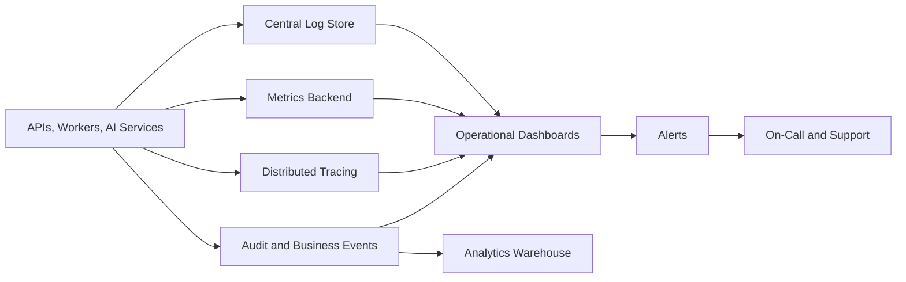

### Required Traces

Distributed traces should connect:

- mobile upload session creation
- scan upload confirmation
- queue events
- image processing stages
- AI inference calls
- scoring
- review task creation
- teacher review action
- analytics refresh

### Dashboards

Required dashboards:

- executive health dashboard
- school onboarding dashboard
- scan processing dashboard
- AI accuracy and review dashboard
- queue and worker dashboard
- database performance dashboard
- API performance dashboard
- security audit dashboard
- tenant-level SLA dashboard

### Alerting

Alerts should fire on:

- API availability drop
- login failure spike
- upload failure spike
- queue backlog breach
- dead-letter spike
- database replication lag
- object storage access errors
- AI inference latency spike
- teacher override rate spike
- scan quality failure spike
- no processing activity during expected school hours

## Disaster Recovery

### Disaster Recovery Goals

- Protect student assessment records and scanned artifacts.
- Restore core service quickly after infrastructure failure.
- Preserve auditability and final marks.
- Support clear runbooks for school-facing communication.

### Recovery Targets

Initial production targets:

- RPO for transactional database: 15 minutes or better
- RPO for object storage: 15 minutes or better where cross-region replication is enabled
- RTO for core APIs: 4 hours or better
- RTO for scan processing: 8 hours or better
- RTO for analytics and exports: 24 hours or better

Mature production targets:

- RPO for transactional database: 5 minutes or better
- RTO for core APIs: 1 hour or better
- RTO for scan processing: 4 hours or better

### Backup Strategy

- Continuous MongoDB backups with point-in-time recovery where supported.
- Daily full backups.
- Cross-region backup copies.
- Object storage versioning where cost and policy allow.
- Backup encryption with managed keys.
- Regular restore drills.
- Backup access restricted and audited.

### Disaster Recovery Architecture

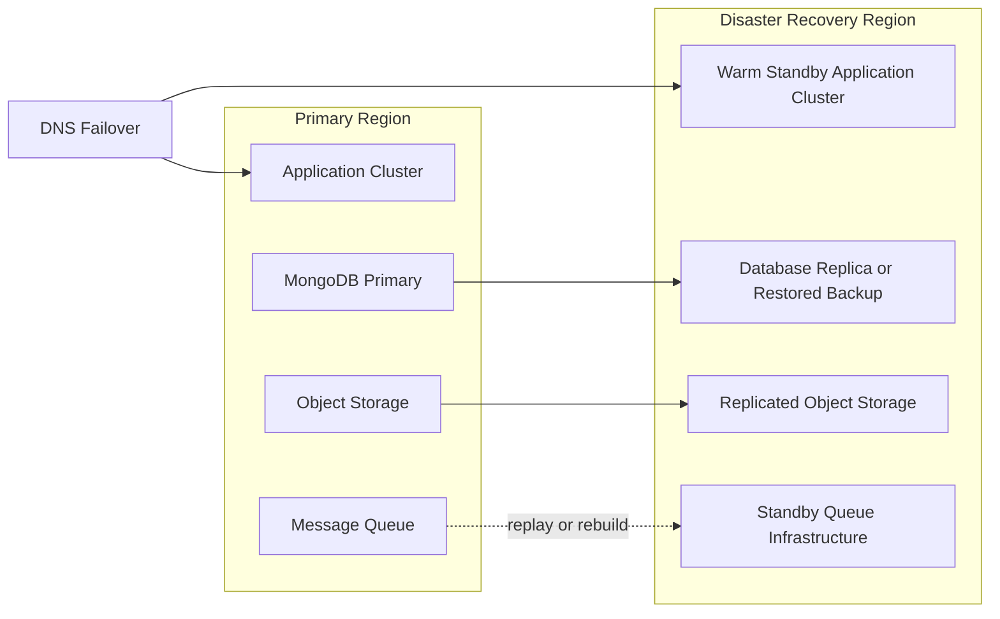

### Recovery Runbooks

Required runbooks:

- database restore
- object storage restore
- queue replay
- worker backlog recovery
- regional failover
- failed model rollback
- accidental assessment finalization reversal policy
- tenant data export and deletion
- security incident response

### Data Rebuild Strategy

Derived data should be rebuildable:

- analytics aggregates from final marks and answer results
- dashboards from transactional state
- exports from result tables
- model evaluation reports from labeled datasets

Source-of-truth data that must be protected:

- roster
- assessments
- templates
- scans
- answer crops
- recognition results
- final marks
- review actions
- audit logs

## End-to-End Processing Flow

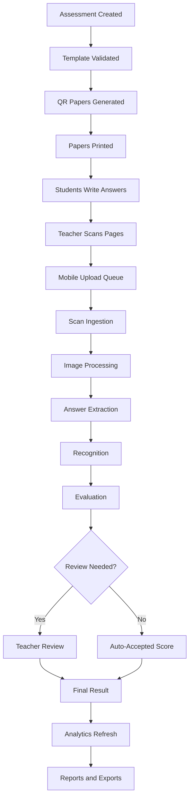

## Data Privacy and Compliance Architecture

### Privacy Requirements

- Collect only data required for assessment and reporting.
- Provide tenant-level retention settings.
- Separate student identity from model training datasets where possible.
- Support deletion or anonymization by tenant policy.
- Log access to student data and answer images.
- Restrict raw scan access to authorized users.

### Data Classification

| Data Type | Classification | Controls |
| --- | --- | --- |
| Student name and identifiers | Sensitive | Encryption, RBAC, audit |
| Answer images | Sensitive | Private storage, signed URLs, retention |
| Marks and concept results | Sensitive academic record | RBAC, audit, export controls |
| Teacher account data | Sensitive | Auth controls, encryption |
| Aggregated school analytics | Restricted | Tenant access, reporting controls |
| Model metrics without PII | Internal | Access control |
| Public product assets | Public | CDN cache |

### Retention Model

Retention must be configurable by deployment:

- raw scans retained through academic dispute window
- answer crops retained for model review only if permitted
- exports expire automatically
- audit logs retained longer than operational logs
- anonymized aggregates may be retained for longitudinal analytics where allowed

## Analytics Architecture

### Analytics Layers

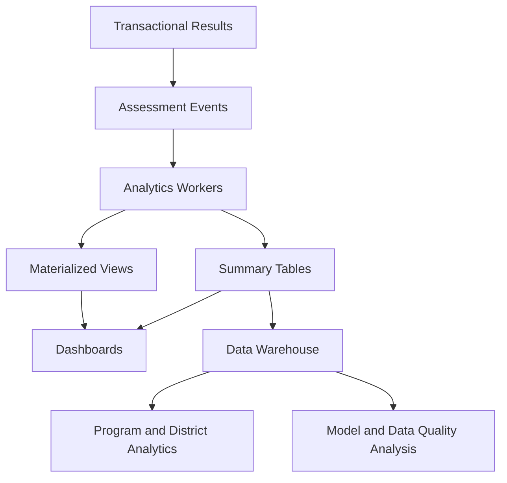

### Analytics Outputs

- student total marks
- question-wise performance
- concept-wise performance
- class learning gaps
- school summary
- assessment difficulty indicators
- frequently missed concepts
- teacher review load
- scan quality trends
- model confidence trends

### Analytics Constraints

- Do not run heavy analytics directly on raw scan-processing tables during school hours.
- Keep final marks as the source of truth for academic reporting.
- Mark analytics records with assessment version and scoring version.
- Clearly distinguish provisional results from finalized results.

## API Architecture

### API Principles

- APIs are tenant-scoped.
- APIs are versioned.
- API responses include stable identifiers.
- Mutating APIs require idempotency keys where retries are likely.
- APIs return actionable error codes.
- Image upload and download use signed object storage URLs rather than passing large files through core API services.

### API Categories

| Category | Examples |
| --- | --- |
| Identity | login, refresh, logout, device sessions |
| Tenant | schools, configuration, feature flags |
| Roster | students, classes, sections, imports |
| Assessment | create, publish, assign, version |
| Template | page layouts, answer regions, validation |
| Paper | generate PDF, print batch status |
| Scan | upload session, confirm upload, scan status |
| Processing | page status, failure reason, reprocess request |
| Review | queue, answer details, action submit |
| Results | student result, class result, finalization |
| Analytics | concept reports, trends, dashboards |
| Export | request export, download export |
| Admin | operational tools, support workflows |

## Teacher Web Scanning Architecture

### Teacher Web App Responsibilities

- Authenticate teacher.
- Load assigned assessments and class roster.
- Guide capture flow.
- Perform basic quality checks.
- Queue scans offline.
- Upload scans through resumable upload.
- Show sync and processing status.
- Avoid exposing unauthorized student data.

### Web Scan Sync Flow

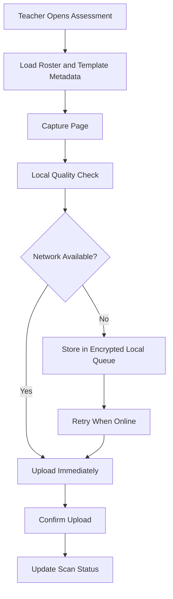

### Web Scan Failure Handling

- Keep local queue until server confirms upload.
- Show clear per-page status.
- Prevent accidental duplicate scanning where possible.
- Allow teacher to replace a bad scan.
- Support logout protections for queued sensitive images.

## Cloud Cost Strategy

### Cost Drivers

- image storage volume
- AI inference
- GPU availability
- database size
- queue throughput
- exports
- observability volume
- cross-region replication

### Cost Controls

- compress images before upload without harming recognition.
- generate thumbnails for dashboards.
- use staged inference so expensive models run only when needed.
- use lifecycle policies for older images.
- sample debug artifacts.
- separate hot and cold storage.
- autoscale GPU workers.
- cache immutable metadata.
- archive older academic years.

## Production Readiness Checklist

### Before Pilot

- QR paper generation works.
- Mobile scan queue works.
- Original scans are retained.
- Page processing is observable.
- Teacher review is auditable.
- Basic reports are exportable.
- Role-based access is enforced.

### Before Multi-School Production

- Queue retries and dead-letter handling are operational.
- Database backups and restore drills pass.
- Object storage retention policies are active.
- Security logging is enabled.
- Worker autoscaling is tested.
- Tenant isolation tests pass.
- AI confidence thresholds are validated.

### Before District or Government Scale

- Multi-region disaster recovery plan is tested.
- Data warehouse is available.
- Model monitoring is active.
- Tenant-level SLAs are visible.
- Support tooling is mature.
- Compliance documentation is complete.
- Cost monitoring is automated.

## Architecture Decisions to Finalize Later

These decisions should be made before implementation begins:

- Cloud provider: AWS, Azure, GCP, or cloud-agnostic deployment.
- MVP client framework: React web application.
- API backend framework: Express.js on Node.js.
- Queue technology: RabbitMQ, Kafka, cloud-native queue, or hybrid.
- Container platform: Kubernetes, managed container apps, or serverless workers.
- Model serving strategy: self-hosted ONNX/TensorRT, managed inference, or hybrid.
- Data warehouse choice.
- SSO requirements for first institutional customers.
- Retention policy by market and contract type.
- Initial supported language and handwriting scope.

## Final Architecture Principle

SmartFLN must be architected as a trust system, not only an automation system. The platform is successful when it processes paper at scale, keeps teachers in control, protects student data, explains every mark, and converts classroom assessment into timely learning action.
