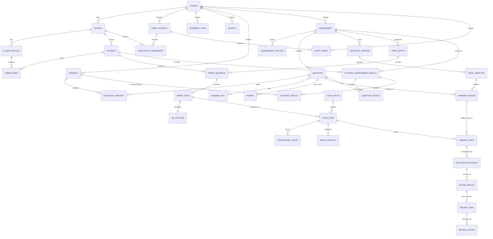

# SmartFLN Database Design

AI Powered QR Enabled Assessment System

## Purpose

This document defines the production database architecture for SmartFLN. It covers the logical data model, entity relationships, normalization rules, tables, indexes, constraints, foreign keys, partitioning, scaling, backup, recovery, and future database expansion.

This is a database design document only. It does not contain implementation code, SQL migrations, or ORM models.

## Database Goals

- Preserve a complete audit trail from printed paper to final marks.
- Maintain strong relational integrity for schools, rosters, assessments, templates, scans, answers, scores, reviews, and analytics.
- Support multi-tenant SaaS deployments across thousands of schools.
- Scale high-volume image-processing and answer-level data without slowing teacher workflows.
- Keep final academic records consistent, auditable, and recoverable.
- Support analytics without overloading transactional tables.
- Enable safe reprocessing of scans and model outputs.
- Support future multilingual, multi-board, multi-program, and government-scale deployments.

## Recommended Database Stack

### Primary Transactional Database

MongoDB is the required primary application database because SmartFLN must use the MERN stack.

Reasons:

- native document model for assessment, scan, review, and analytics workflows
- flexible schema evolution during early product development
- mature indexing and aggregation pipelines
- replica sets for high availability
- sharding support for high-volume tenants and scan workloads
- change streams for event-driven projections where useful
- point-in-time recovery options through managed MongoDB providers
- strong alignment with the MERN stack

### Supporting Stores

| Store | Purpose |
| --- | --- |
| MongoDB | Source of truth for application documents and academic records |
| Object storage | Source of truth for binary files: scans, crops, processed images, PDFs, exports |
| Redis | Cache, sessions, processing progress, locks, rate limits |
| Message queue | Asynchronous pipeline and worker coordination |
| Analytics warehouse | Long-term cross-school analytics and reporting |
| Search index | Optional search over students, assessments, review tasks, and support views |

## Data Ownership Principles

- The database stores metadata and academic records, not large binary image payloads.
- Images and PDFs are stored in object storage and referenced by artifact ids.
- Tables are tenant-scoped unless explicitly global.
- Assessment templates are immutable after publication.
- Final marks are locked after finalization and changed only through audited correction flows.
- Recognition outputs and scoring outputs are stored separately from final teacher-approved results.
- Analytics tables are derived and rebuildable from source transactional data.
- Audit logs are append-only.

## Tenant and Isolation Model

SmartFLN is multi-tenant. A tenant may represent a school group, NGO program, district, government project, or private school chain.

Tenant isolation must be enforced through:

- `tenant_id` on all tenant-scoped tables
- authorization checks in services
- tenant-aware indexes
- tenant-aware object storage paths
- tenant-aware cache keys
- optional MongoDB field-level encryption and tenant-scoped access controls for high-compliance deployments

Tenant-scoped tables should use composite uniqueness where needed, such as:

- unique school code per tenant
- unique student external id per tenant or school
- unique assessment code per tenant
- unique paper instance per assessment and student

## ER Diagram

## Database Domains

| Domain | Tables | Source of Truth |
| --- | --- | --- |
| Tenant and school setup | tenant, school, academic_year, class_section | MongoDB |
| Identity and access | user_account, role, permission, user_role_assignment, session | MongoDB plus Redis for short-lived session cache |
| Roster | student, enrollment, guardian_contact optional | MongoDB |
| Assessment authoring | assessment, question, concept, answer_key, rubric | MongoDB |
| Template and paper | template_version, page_template, answer_region, print_batch, paper_instance, paper_page, qr_payload | MongoDB plus object storage for PDFs |
| Scan processing | scan_batch, scan_page, processing_stage, image_artifact | MongoDB plus object storage |
| AI and recognition | recognition_result, model_version, inference_run | MongoDB |
| Evaluation and review | score_result, review_task, review_action | MongoDB |
| Results and analytics | student_assessment_result, question_result, concept_result, aggregate collections | MongoDB and analytics warehouse |
| Export | export_job, export_artifact | MongoDB plus object storage |
| Audit | audit_event | Append-only MongoDB collection or dedicated audit store |

## Normalization Strategy

### Target Normal Form

The transactional model should be normalized to Third Normal Form where practical.

Goals:

- avoid duplicate student, school, question, and concept data
- keep assessment metadata separate from result data
- keep template layout separate from scanned artifact records
- keep raw recognition output separate from final teacher-approved score
- keep analytics as derived data rather than manually edited records

### Normalization Rules

#### First Normal Form

- Every table has a primary key.
- Columns contain atomic values unless they are controlled metadata fields.
- Repeating groups are moved to child tables.

Examples:

- A student can have many enrollments, stored in `enrollment`.
- A question can map to many concepts, stored in `question_concept`.
- A review task can have many actions, stored in `review_action`.

#### Second Normal Form

- Non-key attributes depend on the full primary key.
- Composite uniqueness is used only for business rules.

Examples:

- `answer_region` depends on one page template and one question.
- `paper_page` depends on one paper instance and one page number.

#### Third Normal Form

- Non-key attributes do not depend on other non-key attributes.

Examples:

- Student class membership is not stored directly on `student`; it is stored in `enrollment`.
- Concept metadata is not duplicated in `question_result`; results reference `concept`.
- Template coordinates are not duplicated in `answer_crop`; crops reference `answer_region` and store applied coordinates.

### Controlled Denormalization

Some denormalization is acceptable for performance and auditability.

Allowed denormalized fields:

- `tenant_id` repeated across tenant-scoped tables for isolation and indexing
- snapshot student display name in finalized result exports if policy allows
- snapshot question text or marks in final result records to preserve historical reports
- aggregate counts and scores in analytics tables
- immutable JSON diagnostic metadata for processing stages

Controlled JSON fields may be used for:

- image diagnostics
- model output alternatives
- confidence signal breakdown
- audit event details
- tenant configuration

JSON fields must not replace core relational relationships.

## Table Design Conventions

### Primary Keys

Use globally unique ids for major entities.

Recommended id style:

- UUID or ULID for distributed systems
- sortable ULID where event ordering and operational debugging benefit

### Common Columns

Most tables should include:

- `id`
- `tenant_id` where tenant-scoped
- `created_at`
- `updated_at`
- `created_by` where user-created
- `updated_by` where user-edited
- `deleted_at` for soft delete where appropriate
- `version` for optimistic concurrency where needed

### Status Columns

Use controlled status values for lifecycle entities.

Examples:

- assessment: draft, published, archived
- scan page: uploaded, processing, failed, processed
- review task: pending, resolved, escalated, cancelled
- export job: requested, queued, rendering, ready, failed, expired

### Naming

- Table names should be singular or consistently plural. This document uses singular names.
- Foreign keys should use `{entity}_id`.
- Timestamp columns should end with `_at`.
- Boolean columns should start with `is_`, `has_`, or `can_`.

## Core Tables

## Tenant and School Tables

### `tenant`

Represents a customer organization, program, school chain, district, or deployment boundary.

| Column | Description |
| --- | --- |
| `id` | Primary key |
| `name` | Tenant display name |
| `type` | school_chain, ngo_program, district, government, demo, internal |
| `status` | active, suspended, archived |
| `country_code` | Deployment country |
| `default_timezone` | Tenant default timezone |
| `data_region` | Storage and processing region |
| `settings` | Controlled JSON configuration |
| `created_at` | Creation timestamp |
| `updated_at` | Last update timestamp |

Constraints:

- `name` required
- `status` required
- tenant status must block access when suspended

Indexes:

- primary key on `id`
- index on `status`
- index on `type`

### `school`

Represents a school inside a tenant.

| Column | Description |
| --- | --- |
| `id` | Primary key |
| `tenant_id` | Foreign key to tenant |
| `name` | School name |
| `code` | Tenant-specific school code |
| `address` | Optional address |
| `city` | City |
| `state` | State or province |
| `status` | active, inactive, archived |
| `metadata` | Controlled JSON for local identifiers |
| `created_at` | Creation timestamp |
| `updated_at` | Last update timestamp |

Foreign keys:

- `school.tenant_id` references `tenant.id`

Constraints:

- unique `tenant_id, code`
- school cannot be active if tenant is suspended

Indexes:

- `tenant_id, status`
- `tenant_id, code`
- `tenant_id, name`

### `academic_year`

Defines academic periods.

| Column | Description |
| --- | --- |
| `id` | Primary key |
| `tenant_id` | Foreign key to tenant |
| `name` | Display name such as 2026-2027 |
| `start_date` | Start date |
| `end_date` | End date |
| `status` | planned, active, closed |

Constraints:

- `start_date < end_date`
- unique `tenant_id, name`

Indexes:

- `tenant_id, status`
- `tenant_id, start_date, end_date`

### `class_section`

Represents a grade/class and section in a school.

| Column | Description |
| --- | --- |
| `id` | Primary key |
| `tenant_id` | Tenant scope |
| `school_id` | Foreign key to school |
| `academic_year_id` | Foreign key to academic year |
| `grade_level` | 1, 2, 3, 4, 5 initially |
| `section_name` | Section label |
| `medium` | Language medium where applicable |
| `status` | active, archived |

Foreign keys:

- `school_id` references `school.id`
- `academic_year_id` references `academic_year.id`

Constraints:

- unique `school_id, academic_year_id, grade_level, section_name`

Indexes:

- `tenant_id, school_id, academic_year_id`
- `tenant_id, grade_level`

## Identity and Access Tables

### `user_account`

Represents teachers, admins, program users, support users, and platform users.

| Column | Description |
| --- | --- |
| `id` | Primary key |
| `tenant_id` | Tenant scope, nullable only for platform users if required |
| `display_name` | User display name |
| `email` | Email address |
| `phone` | Phone number |
| `status` | invited, active, locked, disabled |
| `last_login_at` | Last login time |
| `metadata` | Controlled JSON |
| `created_at` | Creation timestamp |
| `updated_at` | Last update timestamp |

Constraints:

- email unique where present within tenant
- phone unique where present within tenant
- status required

Indexes:

- `tenant_id, email`
- `tenant_id, phone`
- `tenant_id, status`

### `role`

Defines roles such as teacher, school_admin, program_admin, support_operator.

| Column | Description |
| --- | --- |
| `id` | Primary key |
| `name` | Role name |
| `scope_type` | platform, tenant, school, class_section |
| `description` | Role description |

Constraints:

- unique `name, scope_type`

### `permission`

Defines fine-grained permissions.

| Column | Description |
| --- | --- |
| `id` | Primary key |
| `key` | Permission key |
| `description` | Description |

Constraints:

- unique `key`

### `role_permission`

Maps roles to permissions.

| Column | Description |
| --- | --- |
| `role_id` | Foreign key to role |
| `permission_id` | Foreign key to permission |

Constraints:

- primary key `role_id, permission_id`

### `user_role_assignment`

Assigns a user to a role within a tenant, school, class, or section.

| Column | Description |
| --- | --- |
| `id` | Primary key |
| `tenant_id` | Tenant scope |
| `user_id` | Foreign key to user_account |
| `role_id` | Foreign key to role |
| `school_id` | Optional school scope |
| `class_section_id` | Optional class-section scope |
| `subject_id` | Optional subject scope |
| `status` | active, expired, revoked |
| `starts_at` | Assignment start |
| `ends_at` | Assignment end |

Foreign keys:

- `user_id` references `user_account.id`
- `role_id` references `role.id`
- `school_id` references `school.id`
- `class_section_id` references `class_section.id`

Indexes:

- `tenant_id, user_id, status`
- `tenant_id, school_id, role_id`
- `tenant_id, class_section_id, role_id`

### `user_session`

Stores session metadata. Short-lived session cache may live in Redis, but durable session audit remains in MongoDB.

| Column | Description |
| --- | --- |
| `id` | Primary key |
| `tenant_id` | Tenant scope |
| `user_id` | Foreign key to user_account |
| `device_id` | Client device id |
| `status` | active, revoked, expired |
| `created_at` | Session creation |
| `expires_at` | Expiry |
| `revoked_at` | Revocation time |
| `ip_address` | Last known IP |
| `user_agent` | Client info |

Indexes:

- `user_id, status`
- `tenant_id, device_id`
- `expires_at`

## Roster Tables

### `student`

Represents a student.

| Column | Description |
| --- | --- |
| `id` | Primary key |
| `tenant_id` | Tenant scope |
| `school_id` | Foreign key to school |
| `external_student_id` | School or program identifier |
| `admission_number` | Optional school admission number |
| `display_name` | Student name |
| `date_of_birth` | Optional |
| `gender` | Optional |
| `status` | active, transferred, inactive, archived |
| `metadata` | Controlled JSON |
| `created_at` | Creation timestamp |
| `updated_at` | Last update timestamp |

Foreign keys:

- `school_id` references `school.id`

Constraints:

- unique `tenant_id, school_id, external_student_id` where external id exists
- unique `tenant_id, school_id, admission_number` where admission number exists

Indexes:

- `tenant_id, school_id, status`
- `tenant_id, school_id, display_name`
- `tenant_id, external_student_id`

### `enrollment`

Represents a student's class-section membership for an academic year.

| Column | Description |
| --- | --- |
| `id` | Primary key |
| `tenant_id` | Tenant scope |
| `student_id` | Foreign key to student |
| `class_section_id` | Foreign key to class_section |
| `academic_year_id` | Foreign key to academic_year |
| `roll_number` | Section roll number |
| `status` | active, transferred, withdrawn |
| `start_date` | Enrollment start |
| `end_date` | Enrollment end |

Foreign keys:

- `student_id` references `student.id`
- `class_section_id` references `class_section.id`
- `academic_year_id` references `academic_year.id`

Constraints:

- one active enrollment per student per academic year unless policy allows exceptions
- unique `class_section_id, roll_number` where roll number exists

Indexes:

- `tenant_id, class_section_id, status`
- `tenant_id, student_id, academic_year_id`
- `tenant_id, academic_year_id, status`

### `guardian_contact`

Optional table for parent or guardian reporting.

| Column | Description |
| --- | --- |
| `id` | Primary key |
| `tenant_id` | Tenant scope |
| `student_id` | Foreign key to student |
| `name` | Guardian name |
| `relationship` | Relationship |
| `phone` | Phone number |
| `email` | Email |
| `is_primary` | Primary contact flag |
| `consent_status` | allowed, not_allowed, unknown |

Indexes:

- `tenant_id, student_id`
- `tenant_id, phone`

## Curriculum and Assessment Tables

### `subject`

Defines subjects.

| Column | Description |
| --- | --- |
| `id` | Primary key |
| `tenant_id` | Tenant scope |
| `name` | Subject name |
| `code` | Subject code |
| `grade_level` | Optional grade binding |
| `status` | active, archived |

Constraints:

- unique `tenant_id, code, grade_level`

Indexes:

- `tenant_id, grade_level, status`

### `concept`

Represents a learning concept, competency, skill, or standard.

| Column | Description |
| --- | --- |
| `id` | Primary key |
| `tenant_id` | Tenant scope |
| `subject_id` | Foreign key to subject |
| `parent_concept_id` | Optional hierarchy |
| `code` | Concept code |
| `name` | Concept name |
| `grade_level` | Grade |
| `description` | Description |
| `status` | active, archived |

Foreign keys:

- `subject_id` references `subject.id`
- `parent_concept_id` references `concept.id`

Constraints:

- unique `tenant_id, subject_id, code`

Indexes:

- `tenant_id, subject_id, grade_level`
- `tenant_id, parent_concept_id`

### `assessment`

Represents an assessment.

| Column | Description |
| --- | --- |
| `id` | Primary key |
| `tenant_id` | Tenant scope |
| `school_id` | Optional school-specific assessment |
| `academic_year_id` | Academic year |
| `subject_id` | Subject |
| `grade_level` | Class level |
| `title` | Assessment title |
| `type` | diagnostic, formative, summative, practice |
| `status` | draft, published, archived |
| `total_marks` | Total marks |
| `published_at` | Publication time |
| `created_by` | Creator user |
| `created_at` | Creation timestamp |
| `updated_at` | Last update timestamp |

Foreign keys:

- `tenant_id` references `tenant.id`
- `school_id` references `school.id`
- `academic_year_id` references `academic_year.id`
- `subject_id` references `subject.id`
- `created_by` references `user_account.id`

Indexes:

- `tenant_id, academic_year_id, grade_level, subject_id`
- `tenant_id, school_id, status`
- `tenant_id, status, published_at`

### `assessment_section`

Optional grouping inside an assessment.

| Column | Description |
| --- | --- |
| `id` | Primary key |
| `tenant_id` | Tenant scope |
| `assessment_id` | Foreign key to assessment |
| `title` | Section title |
| `display_order` | Order |
| `marks` | Section marks |

Foreign keys:

- `assessment_id` references `assessment.id`

Indexes:

- `assessment_id, display_order`

### `question`

Represents one scorable question or sub-question.

| Column | Description |
| --- | --- |
| `id` | Primary key |
| `tenant_id` | Tenant scope |
| `assessment_id` | Foreign key to assessment |
| `assessment_section_id` | Optional section |
| `question_number` | Display number |
| `question_type` | mcq, true_false, numeric, short_text, matching, drawing, rubric |
| `prompt_text` | Optional text |
| `max_marks` | Maximum marks |
| `display_order` | Ordering |
| `scoring_mode` | auto, assisted, review_only |
| `metadata` | Controlled JSON |

Foreign keys:

- `assessment_id` references `assessment.id`
- `assessment_section_id` references `assessment_section.id`

Constraints:

- unique `assessment_id, question_number`
- `max_marks >= 0`

Indexes:

- `tenant_id, assessment_id, display_order`
- `tenant_id, question_type`

### `question_concept`

Maps questions to concepts.

| Column | Description |
| --- | --- |
| `question_id` | Foreign key to question |
| `concept_id` | Foreign key to concept |
| `weight` | Concept weight for scoring |

Constraints:

- primary key `question_id, concept_id`
- `weight > 0`

Indexes:

- `concept_id`

### `answer_key`

Stores expected answers for objective or constrained questions.

| Column | Description |
| --- | --- |
| `id` | Primary key |
| `tenant_id` | Tenant scope |
| `question_id` | Foreign key to question |
| `answer_value` | Expected answer |
| `normalized_value` | Normalized expected answer |
| `is_primary` | Primary answer flag |
| `marks` | Marks for this answer |
| `matching_pair_data` | Controlled JSON for matching questions |
| `tolerance` | Numeric tolerance where applicable |

Foreign keys:

- `question_id` references `question.id`

Indexes:

- `tenant_id, question_id`
- `question_id, normalized_value`

### `rubric`

Stores rubric criteria for partial or teacher-reviewed scoring.

| Column | Description |
| --- | --- |
| `id` | Primary key |
| `tenant_id` | Tenant scope |
| `question_id` | Foreign key to question |
| `criterion` | Rubric criterion |
| `max_marks` | Marks for criterion |
| `display_order` | Order |
| `metadata` | Controlled JSON |

Indexes:

- `tenant_id, question_id, display_order`

## Template and Paper Tables

### `template_version`

Represents an immutable assessment layout version.

| Column | Description |
| --- | --- |
| `id` | Primary key |
| `tenant_id` | Tenant scope |
| `assessment_id` | Foreign key to assessment |
| `version_number` | Template version |
| `status` | draft, validated, published, retired |
| `page_count` | Number of pages |
| `coordinate_system` | Coordinate reference |
| `created_at` | Creation timestamp |
| `published_at` | Publication timestamp |

Constraints:

- unique `assessment_id, version_number`
- published templates are immutable

Indexes:

- `tenant_id, assessment_id, status`

### `page_template`

Represents page-level layout.

| Column | Description |
| --- | --- |
| `id` | Primary key |
| `tenant_id` | Tenant scope |
| `template_version_id` | Foreign key to template_version |
| `page_number` | Page number |
| `width` | Page width in template units |
| `height` | Page height in template units |
| `anchor_data` | Controlled JSON for alignment anchors |
| `qr_region` | Controlled JSON for QR placement |

Constraints:

- unique `template_version_id, page_number`

Indexes:

- `tenant_id, template_version_id, page_number`

### `answer_region`

Defines a scannable answer region.

| Column | Description |
| --- | --- |
| `id` | Primary key |
| `tenant_id` | Tenant scope |
| `page_template_id` | Foreign key to page_template |
| `question_id` | Foreign key to question |
| `region_type` | answer_box, bubble_group, matching_area, drawing_area |
| `x` | X coordinate |
| `y` | Y coordinate |
| `width` | Region width |
| `height` | Region height |
| `metadata` | Controlled JSON |

Foreign keys:

- `page_template_id` references `page_template.id`
- `question_id` references `question.id`

Constraints:

- coordinates must be non-negative
- width and height must be positive
- one or more regions may map to one question if the template requires it

Indexes:

- `tenant_id, page_template_id`
- `tenant_id, question_id`

### `print_batch`

Represents a generated printable PDF batch.

| Column | Description |
| --- | --- |
| `id` | Primary key |
| `tenant_id` | Tenant scope |
| `assessment_id` | Foreign key to assessment |
| `template_version_id` | Foreign key to template_version |
| `class_section_id` | Target class section |
| `status` | generating, ready, failed, archived |
| `pdf_artifact_id` | Foreign key to image_artifact or artifact table |
| `generated_by` | User |
| `generated_at` | Timestamp |

Indexes:

- `tenant_id, assessment_id, status`
- `tenant_id, class_section_id, generated_at`

### `paper_instance`

Represents a student-specific or generic paper.

| Column | Description |
| --- | --- |
| `id` | Primary key |
| `tenant_id` | Tenant scope |
| `print_batch_id` | Foreign key to print_batch |
| `assessment_id` | Foreign key to assessment |
| `student_id` | Nullable for generic paper |
| `paper_code` | Unique paper code |
| `status` | generated, printed, scanned, voided |

Constraints:

- unique `tenant_id, paper_code`
- unique `assessment_id, student_id` for student-specific paper where student exists

Indexes:

- `tenant_id, assessment_id, student_id`
- `tenant_id, print_batch_id`

### `paper_page`

Represents one expected page in a paper instance.

| Column | Description |
| --- | --- |
| `id` | Primary key |
| `tenant_id` | Tenant scope |
| `paper_instance_id` | Foreign key to paper_instance |
| `page_template_id` | Foreign key to page_template |
| `page_number` | Page number |
| `qr_payload_id` | Foreign key to qr_payload |
| `status` | expected, scanned, missing, invalid |

Constraints:

- unique `paper_instance_id, page_number`

Indexes:

- `tenant_id, paper_instance_id, page_number`
- `tenant_id, qr_payload_id`

### `qr_payload`

Stores QR payload metadata.

| Column | Description |
| --- | --- |
| `id` | Primary key |
| `tenant_id` | Tenant scope |
| `payload_version` | QR schema version |
| `payload_hash` | Hash of payload |
| `signature` | Signature or checksum |
| `paper_instance_id` | Foreign key |
| `page_number` | Page number |
| `created_at` | Creation timestamp |

Constraints:

- unique `tenant_id, payload_hash`

Indexes:

- `tenant_id, paper_instance_id, page_number`
- `payload_hash`

## Scan and Image Processing Tables

### `scan_batch`

Represents a teacher scanning session.

| Column | Description |
| --- | --- |
| `id` | Primary key |
| `tenant_id` | Tenant scope |
| `assessment_id` | Foreign key to assessment |
| `class_section_id` | Foreign key to class_section |
| `teacher_id` | Foreign key to user_account |
| `status` | active, uploaded, processing, completed, failed |
| `started_at` | Start timestamp |
| `completed_at` | Completion timestamp |

Indexes:

- `tenant_id, assessment_id, class_section_id`
- `tenant_id, teacher_id, started_at`
- `tenant_id, status`

### `scan_page`

Represents one uploaded scan of one page.

| Column | Description |
| --- | --- |
| `id` | Primary key |
| `tenant_id` | Tenant scope |
| `scan_batch_id` | Foreign key to scan_batch |
| `paper_page_id` | Nullable until identified |
| `paper_instance_id` | Nullable until identified |
| `student_id` | Nullable until identified |
| `assessment_id` | Assessment context |
| `page_number` | Decoded or resolved page number |
| `upload_status` | pending, uploaded, confirmed, failed |
| `processing_status` | queued, processing, processed, failed, rescan_required |
| `image_artifact_id` | Original image artifact id |
| `checksum` | Image checksum |
| `captured_at` | Device capture time |
| `uploaded_at` | Upload time |
| `identified_at` | Identity resolution time |

Foreign keys:

- `scan_batch_id` references `scan_batch.id`
- `paper_page_id` references `paper_page.id`
- `paper_instance_id` references `paper_instance.id`
- `student_id` references `student.id`
- `assessment_id` references `assessment.id`

Constraints:

- checksum required after upload confirmation
- one active scan should be canonical per `paper_page_id`

Indexes:

- `tenant_id, assessment_id, processing_status`
- `tenant_id, scan_batch_id`
- `tenant_id, paper_page_id`
- `tenant_id, student_id, assessment_id`
- `tenant_id, checksum`
- `uploaded_at`

### `image_artifact`

Stores metadata for binary artifacts in object storage.

| Column | Description |
| --- | --- |
| `id` | Primary key |
| `tenant_id` | Tenant scope |
| `artifact_type` | original_scan, processed_page, answer_crop, thumbnail, generated_pdf, export_pdf |
| `storage_uri` | Object storage URI or key |
| `content_type` | MIME type |
| `size_bytes` | File size |
| `checksum` | Artifact checksum |
| `encryption_key_id` | Key reference where applicable |
| `retention_until` | Retention timestamp |
| `created_at` | Creation timestamp |

Constraints:

- unique `tenant_id, checksum, artifact_type` where deduplication is allowed
- `storage_uri` required

Indexes:

- `tenant_id, artifact_type, created_at`
- `tenant_id, retention_until`
- `checksum`

### `processing_stage`

Tracks pipeline stages and diagnostics.

| Column | Description |
| --- | --- |
| `id` | Primary key |
| `tenant_id` | Tenant scope |
| `scan_page_id` | Foreign key to scan_page |
| `stage_name` | quality_check, qr_decode, rectification, alignment, crop, recognition, scoring |
| `status` | queued, running, succeeded, failed, skipped |
| `attempt_count` | Retry count |
| `started_at` | Start time |
| `finished_at` | End time |
| `error_code` | Failure code |
| `diagnostics` | Controlled JSON |
| `worker_version` | Worker version |

Constraints:

- unique `scan_page_id, stage_name, attempt_count`

Indexes:

- `tenant_id, scan_page_id, stage_name`
- `tenant_id, stage_name, status`
- `tenant_id, status, started_at`

### `answer_crop`

Represents one cropped answer region from a scanned page.

| Column | Description |
| --- | --- |
| `id` | Primary key |
| `tenant_id` | Tenant scope |
| `scan_page_id` | Foreign key to scan_page |
| `answer_region_id` | Foreign key to answer_region |
| `question_id` | Foreign key to question |
| `student_id` | Foreign key to student |
| `assessment_id` | Foreign key to assessment |
| `crop_artifact_id` | Foreign key to image_artifact |
| `crop_quality_score` | Numeric quality score |
| `coordinates` | Controlled JSON of applied crop coordinates |
| `status` | created, recognition_queued, recognized, failed, review_required |
| `created_at` | Creation timestamp |

Foreign keys:

- `scan_page_id` references `scan_page.id`
- `answer_region_id` references `answer_region.id`
- `question_id` references `question.id`
- `student_id` references `student.id`
- `assessment_id` references `assessment.id`
- `crop_artifact_id` references `image_artifact.id`

Constraints:

- one canonical crop per `scan_page_id, answer_region_id` unless reprocessing versioning is enabled

Indexes:

- `tenant_id, assessment_id, question_id`
- `tenant_id, student_id, assessment_id`
- `tenant_id, status`
- `tenant_id, scan_page_id`

## AI, OCR, and Recognition Tables

### `model_version`

Tracks AI model versions.

| Column | Description |
| --- | --- |
| `id` | Primary key |
| `model_name` | Model name |
| `version` | Model version |
| `artifact_uri` | Model artifact reference |
| `artifact_hash` | Hash |
| `status` | training, evaluation, shadow, canary, production, retired |
| `metrics` | Controlled JSON |
| `created_at` | Creation timestamp |
| `deployed_at` | Deployment timestamp |

Constraints:

- unique `model_name, version`

Indexes:

- `model_name, status`

### `inference_run`

Tracks inference execution.

| Column | Description |
| --- | --- |
| `id` | Primary key |
| `tenant_id` | Tenant scope |
| `model_version_id` | Foreign key to model_version |
| `input_artifact_id` | Foreign key to image_artifact |
| `inference_type` | mcq, matching, digit, handwriting, blank_detection |
| `started_at` | Start time |
| `finished_at` | End time |
| `latency_ms` | Runtime |
| `status` | succeeded, failed |
| `diagnostics` | Controlled JSON |

Indexes:

- `tenant_id, inference_type, started_at`
- `model_version_id, status`

### `recognition_result`

Stores OCR/HTR/recognition output.

| Column | Description |
| --- | --- |
| `id` | Primary key |
| `tenant_id` | Tenant scope |
| `answer_crop_id` | Foreign key to answer_crop |
| `question_id` | Foreign key to question |
| `inference_run_id` | Foreign key to inference_run |
| `strategy` | mcq_detector, htr_digit, htr_text, matching_detector, review_only |
| `raw_output` | Controlled JSON |
| `recognized_value` | Primary recognized value |
| `normalized_value` | Normalized value |
| `confidence` | Recognition confidence |
| `alternatives` | Controlled JSON |
| `status` | succeeded, failed, review_only |
| `created_at` | Creation timestamp |

Foreign keys:

- `answer_crop_id` references `answer_crop.id`
- `question_id` references `question.id`
- `inference_run_id` references `inference_run.id`

Indexes:

- `tenant_id, answer_crop_id`
- `tenant_id, question_id, status`
- `tenant_id, confidence`
- `tenant_id, created_at`

## Evaluation and Review Tables

### `score_result`

Stores machine-generated or rule-generated scoring result.

| Column | Description |
| --- | --- |
| `id` | Primary key |
| `tenant_id` | Tenant scope |
| `recognition_result_id` | Foreign key to recognition_result |
| `answer_crop_id` | Foreign key to answer_crop |
| `question_id` | Foreign key to question |
| `student_id` | Foreign key to student |
| `assessment_id` | Foreign key to assessment |
| `raw_marks` | Suggested marks |
| `max_marks` | Max marks |
| `scoring_strategy` | exact, tolerance, phonetic, semantic, rubric, manual_required |
| `confidence` | Scoring confidence |
| `decision` | auto_accept, review_required, rescan_required, rejected |
| `explanation` | Controlled JSON |
| `scoring_version` | Rule version |
| `created_at` | Creation timestamp |

Foreign keys:

- `recognition_result_id` references `recognition_result.id`
- `answer_crop_id` references `answer_crop.id`
- `question_id` references `question.id`
- `student_id` references `student.id`
- `assessment_id` references `assessment.id`

Indexes:

- `tenant_id, assessment_id, student_id`
- `tenant_id, assessment_id, question_id`
- `tenant_id, decision`
- `tenant_id, confidence`

### `review_task`

Represents a human review task.

| Column | Description |
| --- | --- |
| `id` | Primary key |
| `tenant_id` | Tenant scope |
| `score_result_id` | Foreign key to score_result |
| `answer_crop_id` | Foreign key to answer_crop |
| `assessment_id` | Foreign key to assessment |
| `student_id` | Foreign key to student |
| `question_id` | Foreign key to question |
| `assigned_to` | Optional user |
| `status` | pending, viewed, resolved, escalated, cancelled |
| `priority` | Review priority |
| `reason_code` | low_confidence, ambiguous, unsupported, crop_issue |
| `created_at` | Creation timestamp |
| `resolved_at` | Resolution timestamp |

Indexes:

- `tenant_id, assessment_id, status`
- `tenant_id, assigned_to, status`
- `tenant_id, question_id, status`
- `tenant_id, priority, created_at`

### `review_action`

Stores teacher or coordinator decisions.

| Column | Description |
| --- | --- |
| `id` | Primary key |
| `tenant_id` | Tenant scope |
| `review_task_id` | Foreign key to review_task |
| `reviewer_id` | Foreign key to user_account |
| `action_type` | accept, edit_answer, override_marks, mark_blank, escalate, resolve |
| `previous_value` | Controlled JSON |
| `new_value` | Controlled JSON |
| `final_marks` | Final marks after action |
| `reason` | Optional reason |
| `created_at` | Timestamp |

Indexes:

- `tenant_id, review_task_id`
- `tenant_id, reviewer_id, created_at`
- `tenant_id, created_at`

Constraints:

- final marks must be between 0 and question max marks
- resolved review task must have at least one resolving action

## Result Tables

### `student_assessment_result`

Represents final or provisional result for one student in one assessment.

| Column | Description |
| --- | --- |
| `id` | Primary key |
| `tenant_id` | Tenant scope |
| `assessment_id` | Foreign key to assessment |
| `student_id` | Foreign key to student |
| `class_section_id` | Foreign key to class_section |
| `status` | provisional, review_pending, ready, finalized, corrected |
| `total_marks` | Marks obtained |
| `max_marks` | Maximum marks |
| `percentage` | Percentage |
| `auto_scored_count` | Count of auto-scored questions |
| `reviewed_count` | Count of reviewed questions |
| `blank_count` | Blank answers |
| `finalized_at` | Finalization timestamp |
| `finalized_by` | User who finalized |
| `result_version` | Version for corrections |

Constraints:

- unique `assessment_id, student_id, result_version`
- total marks between 0 and max marks

Indexes:

- `tenant_id, assessment_id, status`
- `tenant_id, student_id, assessment_id`
- `tenant_id, class_section_id, assessment_id`

### `question_result`

Represents final or provisional score for one student-question.

| Column | Description |
| --- | --- |
| `id` | Primary key |
| `tenant_id` | Tenant scope |
| `student_assessment_result_id` | Foreign key |
| `assessment_id` | Foreign key |
| `student_id` | Foreign key |
| `question_id` | Foreign key |
| `answer_crop_id` | Foreign key |
| `score_result_id` | Foreign key |
| `review_action_id` | Nullable |
| `marks_awarded` | Marks |
| `max_marks` | Max marks |
| `answer_status` | answered, blank, invalid, absent, not_scanned |
| `scoring_source` | auto, teacher_review, admin_correction |
| `confidence` | Final confidence where relevant |
| `status` | provisional, finalized, corrected |

Constraints:

- unique `student_assessment_result_id, question_id`
- marks awarded between 0 and max marks

Indexes:

- `tenant_id, assessment_id, question_id`
- `tenant_id, student_id, assessment_id`
- `tenant_id, scoring_source`

### `concept_result`

Represents concept-level performance for a student assessment.

| Column | Description |
| --- | --- |
| `id` | Primary key |
| `tenant_id` | Tenant scope |
| `student_assessment_result_id` | Foreign key |
| `assessment_id` | Foreign key |
| `student_id` | Foreign key |
| `concept_id` | Foreign key |
| `marks_awarded` | Concept marks |
| `max_marks` | Concept max marks |
| `percentage` | Concept percentage |
| `mastery_level` | needs_support, developing, proficient |
| `status` | provisional, finalized |

Constraints:

- unique `student_assessment_result_id, concept_id`

Indexes:

- `tenant_id, assessment_id, concept_id`
- `tenant_id, student_id, concept_id`
- `tenant_id, mastery_level`

## Analytics Tables

Analytics tables are derived and rebuildable.

### `class_assessment_aggregate`

| Column | Description |
| --- | --- |
| `id` | Primary key |
| `tenant_id` | Tenant scope |
| `assessment_id` | Assessment |
| `class_section_id` | Class section |
| `student_count` | Students included |
| `completed_count` | Completed results |
| `average_marks` | Average marks |
| `average_percentage` | Average percentage |
| `review_pending_count` | Pending review count |
| `updated_at` | Last refresh |

Indexes:

- `tenant_id, assessment_id, class_section_id`
- `tenant_id, updated_at`

### `concept_aggregate`

| Column | Description |
| --- | --- |
| `id` | Primary key |
| `tenant_id` | Tenant scope |
| `assessment_id` | Assessment |
| `class_section_id` | Class section |
| `concept_id` | Concept |
| `student_count` | Students included |
| `average_percentage` | Average performance |
| `needs_support_count` | Count below threshold |
| `updated_at` | Last refresh |

Indexes:

- `tenant_id, assessment_id, class_section_id, concept_id`
- `tenant_id, concept_id, updated_at`

### `question_aggregate`

| Column | Description |
| --- | --- |
| `id` | Primary key |
| `tenant_id` | Tenant scope |
| `assessment_id` | Assessment |
| `question_id` | Question |
| `attempt_count` | Attempts |
| `correct_count` | Correct or full-score count |
| `partial_count` | Partial marks count |
| `blank_count` | Blank count |
| `average_marks` | Average marks |
| `override_rate` | Teacher override rate |
| `updated_at` | Last refresh |

Indexes:

- `tenant_id, assessment_id, question_id`
- `tenant_id, override_rate`

## Export and Audit Tables

### `export_job`

Tracks report export jobs.

| Column | Description |
| --- | --- |
| `id` | Primary key |
| `tenant_id` | Tenant scope |
| `requested_by` | User |
| `export_type` | student_pdf, class_pdf, csv, excel, audit_pdf |
| `assessment_id` | Optional assessment |
| `class_section_id` | Optional class |
| `student_id` | Optional student |
| `status` | requested, queued, rendering, ready, failed, expired |
| `artifact_id` | Output artifact |
| `requested_at` | Request time |
| `completed_at` | Completion time |
| `expires_at` | Link expiry |

Indexes:

- `tenant_id, requested_by, requested_at`
- `tenant_id, status`
- `tenant_id, assessment_id`

### `audit_event`

Append-only audit log.

| Column | Description |
| --- | --- |
| `id` | Primary key |
| `tenant_id` | Tenant scope |
| `actor_user_id` | User who performed action |
| `actor_type` | user, service, system |
| `action` | Action key |
| `entity_type` | Target entity type |
| `entity_id` | Target entity id |
| `school_id` | Optional school scope |
| `assessment_id` | Optional assessment scope |
| `ip_address` | IP address |
| `device_id` | Device id |
| `correlation_id` | Request or workflow trace |
| `details` | Controlled JSON |
| `created_at` | Event time |

Constraints:

- append-only; no updates or deletes except policy-governed archival

Indexes:

- `tenant_id, created_at`
- `tenant_id, actor_user_id, created_at`
- `tenant_id, entity_type, entity_id`
- `tenant_id, assessment_id, created_at`
- `correlation_id`

## Relationship Rules

### Tenant Relationships

- One tenant has many schools.
- One tenant has many users, students, assessments, templates, scans, and results.
- Tenant deletion should be policy-controlled and usually implemented through archival, not immediate hard delete.

### School and Roster Relationships

- One school has many class sections.
- One school has many students.
- One student may have many enrollments over academic years.
- One active enrollment per student per academic year is the default policy.
- A teacher may be assigned to multiple class sections.

### Assessment Relationships

- One assessment has many questions.
- One question may map to many concepts.
- One concept may appear in many questions and assessments.
- One assessment may have many template versions, but only one published version should be active for a paper batch.

### Paper Relationships

- One print batch has many paper instances.
- One paper instance belongs to one assessment and optionally one student.
- One paper instance has many paper pages.
- One paper page has one QR payload.

### Scan Relationships

- One scan batch has many scan pages.
- One scan page maps to one paper page after identification.
- One scan page may produce many answer crops.
- One answer crop maps to one answer region and one question.

### AI and Evaluation Relationships

- One answer crop may have many recognition results over reprocessing versions.
- One recognition result may have one or more score results if scoring rules are re-run.
- One score result may create one review task.
- One review task may have many review actions.
- One question result references the selected score or review outcome used for final marks.

### Result Relationships

- One student assessment result has many question results.
- One student assessment result has many concept results.
- Class and concept aggregates are derived from finalized or provisional results.

## Foreign Key Strategy

### Required Foreign Keys

All core relationships must use foreign keys where write volume permits:

- school to tenant
- class section to school
- student to school
- enrollment to student and class section
- assessment to tenant, subject, academic year
- question to assessment
- answer region to page template and question
- paper instance to assessment and student
- paper page to paper instance and page template
- scan page to scan batch, paper page, student, assessment
- answer crop to scan page, answer region, question, student
- recognition result to answer crop
- score result to recognition result and answer crop
- review task to score result
- review action to review task and reviewer
- result rows to student, assessment, question, concept

### Delete Behavior

Recommended delete behavior:

| Relationship | Delete Behavior |
| --- | --- |
| tenant to school | restrict or archive |
| school to student | restrict or archive |
| assessment to question | restrict after publication |
| question to answer key | cascade only while draft |
| template to page template | restrict after publication |
| paper instance to paper page | restrict after print generation |
| scan page to answer crop | restrict after processing |
| score result to review task | restrict |
| result to question result | restrict after finalization |
| user to review action | restrict; never delete actor history |

Soft deletion or archival is preferred for academic records.

## Constraints

### Entity Constraints

- Required names, status values, and tenant ids must be non-null.
- Status columns must use controlled values.
- Marks cannot be negative.
- Marks awarded cannot exceed max marks.
- Percentages must be between 0 and 100.
- Date ranges must have start before end.

### Business Constraints

- Published assessments cannot be edited in-place.
- Published templates cannot be changed in-place.
- A paper instance cannot point to a draft template.
- A final result cannot be changed without correction workflow.
- An answer cannot be auto-scored if identity is unresolved.
- An answer cannot be auto-scored if crop quality is below threshold.
- A review task cannot be resolved without a review action.
- An export cannot be generated without permission and result status validation.

### Uniqueness Constraints

Recommended unique constraints:

- `school`: tenant and school code
- `student`: tenant, school, external student id
- `class_section`: school, academic year, grade, section
- `assessment`: tenant and assessment code if codes are introduced
- `question`: assessment and question number
- `template_version`: assessment and version number
- `page_template`: template version and page number
- `paper_instance`: assessment and student for student-specific papers
- `paper_page`: paper instance and page number
- `qr_payload`: tenant and payload hash
- `student_assessment_result`: assessment, student, result version
- `question_result`: student assessment result and question
- `concept_result`: student assessment result and concept

## Index Strategy

### Index Design Principles

- Every large tenant-scoped table needs indexes beginning with `tenant_id`.
- Common dashboard filters should be indexed.
- Foreign keys used in joins should be indexed.
- Status and timestamp combinations should be indexed for workflow queues and dashboards.
- Avoid excessive indexes on high-write tables.
- Use partial indexes for active, pending, and unresolved records.
- Use BRIN indexes for very large append-only time-series tables where appropriate.

### High-Value Indexes

| Table | Index Purpose |
| --- | --- |
| `student` | roster lookup by school, status, name |
| `enrollment` | class roster lookup |
| `assessment` | teacher/admin assessment list |
| `question` | assessment question loading |
| `paper_instance` | lookup by assessment and student |
| `paper_page` | lookup by paper and page |
| `scan_page` | processing status, student assessment page lookup, duplicate detection |
| `processing_stage` | worker dashboard and retry queries |
| `answer_crop` | answer lookup by assessment, student, question |
| `recognition_result` | AI performance and review analysis |
| `score_result` | review routing and result calculation |
| `review_task` | teacher review queue |
| `question_result` | assessment analytics |
| `concept_result` | concept dashboard |
| `audit_event` | audit search by actor, entity, time |

### Partial Index Examples

Recommended partial index concepts:

- pending review tasks by teacher or assessment
- scan pages where processing status is failed
- export jobs where status is queued or rendering
- active enrollments
- active user role assignments
- unresolved identity resolution tasks if implemented separately

### Query Patterns to Optimize

Teacher dashboard:

- active assessments assigned to teacher
- scan status by class and assessment
- pending review tasks by teacher and assessment
- student result summary

Admin dashboard:

- assessment progress by school/class
- missing scans
- review backlog
- concept analytics

AI pipeline:

- fetch queued pages by processing status
- fetch answer crops by recognition status
- update stage status idempotently

Analytics:

- question results by assessment and class
- concept results by assessment and class
- override rate by question and model version

## Scaling Strategy

### Scaling Levels

#### Level 1: Pilot

- Single MongoDB replica set or managed cluster.
- Strict schema boundaries.
- Basic indexes.
- Object storage for all images.
- Derived analytics in MongoDB aggregate collections.

#### Level 2: Multi-School Production

- Managed MongoDB with replica sets.
- Connection pooling.
- Partition high-volume tables.
- Separate worker queues.
- Materialized views for analytics.
- Dedicated audit retention policy.

#### Level 3: Large Program or District

- Partition by tenant, assessment, date, or academic year.
- Dedicated analytics warehouse.
- Separate read replicas for dashboards and exports.
- Dedicated processing metadata cluster if needed.
- Tenant-level throughput controls.
- Archive older academic years.

#### Level 4: Government Scale

- Multi-region replication.
- Sharded tenant clusters if required.
- Data lake or warehouse for longitudinal analytics.
- Dedicated compliance and audit store.
- Data residency controls.

### Read Scaling

- Use read replicas for dashboards and exports.
- Use materialized views for class and concept analytics.
- Use cache for immutable assessment and template metadata.
- Use search index for fuzzy roster or support lookup.

### Write Scaling

- Keep scan ingestion lightweight.
- Use queues for all heavy processing.
- Batch analytics updates where appropriate.
- Use idempotent writes to tolerate retries.
- Avoid hot rows for assessment progress by using event-based aggregation.

### High-Volume Tables

Likely high-volume tables:

- `scan_page`
- `processing_stage`
- `image_artifact`
- `answer_crop`
- `recognition_result`
- `score_result`
- `question_result`
- `audit_event`

These tables need early partition planning.

## Partitioning Strategy

### Partitioning Goals

- Keep high-volume tables queryable.
- Support academic-year archival.
- Improve maintenance, vacuuming, and backup management.
- Reduce index bloat.
- Support tenant-level data isolation and deletion policies.

### Recommended Partition Keys

| Table | Partition Strategy |
| --- | --- |
| `scan_page` | by academic year or assessment date, optionally tenant hash |
| `processing_stage` | by month or assessment date |
| `image_artifact` | by artifact creation month and tenant |
| `answer_crop` | by assessment id hash or academic year |
| `recognition_result` | by month or assessment id hash |
| `score_result` | by assessment id hash or academic year |
| `question_result` | by academic year or assessment id hash |
| `audit_event` | by month or quarter |
| `export_job` | by creation month |

### Tenant Partitioning

For very large tenants:

- allocate heavy tenants to dedicated database clusters
- partition by tenant hash inside shared clusters
- use tenant-level object storage prefixes
- maintain tenant-level backup and export processes

### Academic Year Archival

At the end of an academic year:

- finalize all assessments
- close active enrollments
- freeze result records
- archive raw processing metadata where policy allows
- move old partitions to lower-cost storage if supported
- retain audit and final marks per compliance policy

## Backup Strategy

### Backup Goals

- Recover from accidental deletion, corruption, infrastructure failure, and regional outage.
- Preserve academic records and audit trails.
- Support point-in-time recovery.
- Validate backups regularly.

### Database Backups

Required:

- continuous write-ahead log archiving
- point-in-time recovery
- daily full backups
- backup encryption
- cross-region backup copies for production
- backup retention by environment and contract
- regular restore drills

Recommended retention:

| Environment | Retention |
| --- | --- |
| Development | 3-7 days |
| QA/Staging | 7-14 days |
| Production pilot | 30 days |
| Production school SaaS | 35-90 days |
| Government or regulated deployment | Contract-defined, often longer |

### Object Storage Backups

Object storage must protect:

- original scans
- processed pages
- answer crops
- generated papers
- export reports within retention

Recommended controls:

- object versioning for critical buckets where cost permits
- cross-region replication for production
- lifecycle policies
- retention locks for audit-critical artifacts where required
- checksum validation

### Backup Validation

Backup validation should include:

- restore database to isolated environment
- verify schema migrations
- verify recent assessment results
- verify original scan artifact references
- verify answer crop access
- verify audit event continuity
- verify export regeneration from restored data

## Recovery Strategy

### Recovery Objectives

Initial production targets:

- database RPO: 15 minutes or better
- object storage RPO: 15 minutes or better with replication
- core database RTO: 4 hours or better
- scan processing RTO: 8 hours or better
- analytics RTO: 24 hours or better

Mature production targets:

- database RPO: 5 minutes or better
- object storage RPO: 5-15 minutes depending on region replication
- core database RTO: 1 hour or better
- scan processing RTO: 4 hours or better

### Recovery Order

1. Restore identity, tenant, roster, assessment, and template data.
2. Restore scan metadata and object artifact references.
3. Restore final marks, review actions, and audit logs.
4. Restore processing state and queued jobs.
5. Rebuild analytics from final source data.
6. Regenerate exports if needed.

### Recovery Scenarios

| Scenario | Recovery Action |
| --- | --- |
| Accidental row deletion | Point-in-time restore into side database and selective recovery |
| Bad deployment corrupts derived analytics | Rebuild analytics from results |
| Queue messages lost | Rebuild processing jobs from scan and processing state |
| Model output bug | Reprocess affected answer crops in comparison mode |
| Object missing | Restore from versioned object storage or backup replica |
| Primary database outage | Fail over to replica or restore backup |
| Regional outage | Activate DR region and restore replicated database/object storage |

### Rebuildable Data

Can be rebuilt:

- analytics aggregates
- materialized views
- dashboard caches
- export files
- processing queue messages
- derived progress counters

Must be protected:

- tenant and school data
- user and role data
- roster
- assessment definitions
- templates
- generated paper identity
- original scans
- review actions
- final marks
- audit events

## Data Retention and Archival

### Retention Categories

| Data | Retention Recommendation |
| --- | --- |
| Final marks | Long-term academic policy |
| Review actions | Same as final marks or audit policy |
| Audit events | Long-term compliance policy |
| Original scans | Through dispute window, longer if contract requires |
| Answer crops | Through dispute window or model training consent period |
| Processed images | Shorter than original scans if reproducible |
| Debug artifacts | Short retention, sampled only |
| Export files | Short-lived, regenerate when needed |
| Logs | Operational retention, usually shorter than audit |

### Archival Requirements

- Archived data must remain tenant-isolated.
- Archived final marks must remain reportable.
- Archived raw images may be deleted after retention while keeping final academic records.
- Deletion of student personal data must respect legal, contractual, and academic record policies.

## Data Privacy

### Sensitive Data

Sensitive data includes:

- student names and identifiers
- scanned answer images
- marks and concept performance
- teacher account data
- guardian contact information
- audit trails involving academic decisions

### Privacy Controls

- Limit PII fields in analytics warehouse.
- Use pseudonymous ids in model training datasets where possible.
- Keep raw images out of logs.
- Use signed URLs for image access.
- Audit access to student answer images.
- Support tenant-level data deletion and export where required.
- Avoid storing plain sensitive data in QR payloads.

## Migration Strategy

### Migration Principles

- Use versioned migrations.
- Migrations must be backward-compatible during rolling deployments.
- Avoid long blocking migrations on high-volume tables.
- Add nullable columns first, backfill asynchronously, then enforce constraints.
- Use feature flags for schema-dependent features.
- Test migrations on production-sized staging data.

### Migration Phases

1. Add schema.
2. Deploy application compatibility.
3. Backfill data.
4. Validate data.
5. Enforce constraints.
6. Remove old schema only after safe window.

## Data Quality Rules

### Roster Quality

- Student duplicates must be detected by external id, admission number, and name similarity.
- Active students must have active enrollment for assessment participation.
- Roll numbers should be unique within class section where used.

### Assessment Quality

- Every published question must have max marks.
- Auto-scored questions must have answer keys or scoring rules.
- Every question must map to at least one concept unless explicitly exempt.
- Published assessments must have a validated template.

### Scan Quality

- Every confirmed scan must have checksum and original artifact id.
- Every canonical scanned page should resolve to one paper page.
- Duplicate scans must be resolved before finalization.

### Result Quality

- Every expected question must have a question result or an explicit absent/invalid/not-scanned status.
- Finalization requires no unresolved required review tasks.
- Final result totals must equal the sum of question results.
- Concept totals must be derivable from question-concept mappings.

## Reporting and Analytics Data Model

### Transactional Reporting

Use MongoDB for:

- teacher review queues
- current assessment status
- class result summary
- student result page
- basic concept analytics

### Warehouse Reporting

Use analytics warehouse for:

- multi-year trends
- district dashboards
- model performance analysis
- large cross-school comparisons
- longitudinal FLN tracking

### Materialized Views

Potential materialized views:

- assessment completion status by class
- pending review count by teacher
- concept performance by class
- question difficulty by assessment
- scan quality by school and device

Refresh strategy:

- event-driven incremental updates for teacher dashboards
- scheduled refresh for large admin dashboards
- full rebuild after major correction or migration

## Future Expansion

### Future Academic Features

Additional tables or extensions may be needed for:

- question bank
- adaptive assessment
- remediation recommendation
- worksheet generation
- student learning profile
- parent reports
- oral reading fluency assessments
- attendance-linked assessment analytics
- curriculum framework mapping

### Future AI Features

Potential expansion:

- dataset table for consented training samples
- annotation project table
- model evaluation benchmark table
- model drift metric table
- human labeling workflow tables
- active learning sample queue
- language-specific model registry

### Future Integrations

Potential tables:

- external_system
- external_mapping
- sync_job
- sync_error
- webhook_subscription
- webhook_delivery
- API client credentials

### Future Scale Features

Potential expansion:

- tenant shard registry
- regional data residency mapping
- cold archive catalog
- data export request registry
- compliance hold table
- deletion request workflow

### Future Security and Compliance

Potential expansion:

- consent records
- data processing agreement metadata
- support access request table
- privileged access session table
- security incident table
- retention policy table
- legal hold table

## Database Readiness Checklist

Before implementation begins:

- Confirm cloud provider and managed MongoDB capabilities.
- Confirm primary key strategy.
- Confirm tenant isolation strategy.
- Confirm first MVP question types.
- Confirm data retention requirements.
- Confirm audit requirements.
- Confirm whether student-specific papers are required in MVP.
- Confirm initial analytics scope.
- Confirm model training data consent rules.
- Confirm expected pilot and year-one data volume.

Before production:

- Load test high-volume tables.
- Validate indexes with realistic dashboard queries.
- Test scan processing writes under queue load.
- Test backup and point-in-time recovery.
- Test object artifact restore.
- Test tenant isolation.
- Test finalization and correction audit trail.
- Test analytics rebuild from source data.

## Final Database Principle

SmartFLN's database must protect trust. It must make every result explainable, every mark traceable, every teacher decision auditable, and every school tenant safely isolated while still scaling to millions of paper pages.
