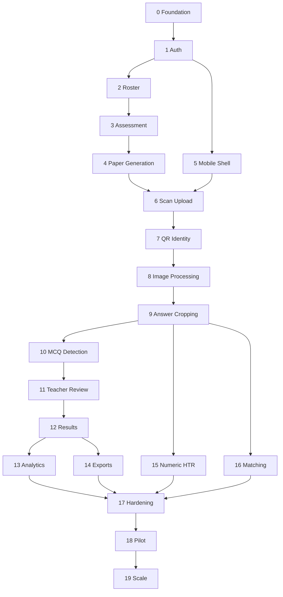

# SmartFLN Implementation Plan

AI Powered QR Enabled Assessment System

## Purpose

This document splits SmartFLN into independently deployable milestones. Each milestone has clear objectives, deliverables, expected file areas, estimated time, dependencies, and acceptance criteria.

This plan is designed for a production startup build, not a throwaway prototype. Every milestone should be deployable to at least a development or staging environment, observable, testable, and demo-ready.

## Planning Assumptions

- Initial product scope targets Classes 1-5 paper-based assessments.
- MVP starts with QR identity, paper generation, scanning, page processing, MCQ scoring, simple numeric support, teacher review, basic results, and concept analytics.
- Initial deployment is multi-tenant SaaS, with future private-cloud or government deployment options.
- Mobile is Android-first.
- Web admin and dashboard are browser-first.
- AI automation is conservative: low-confidence answers go to teacher review.
- Binary files are stored in object storage.
- PostgreSQL is the primary transactional database.
- Long-running scan and AI work runs through queues and workers.
- Each milestone should keep security, auditability, and tenant isolation in view from the beginning.

## Team Assumptions

Recommended team for the plan:

- 1 product manager
- 1 principal architect or tech lead
- 2 backend engineers
- 1 frontend web engineer
- 1 mobile engineer
- 1 AI/computer vision engineer
- 1 QA automation engineer
- 1 DevOps/platform engineer
- part-time UX designer
- part-time curriculum/assessment expert

Estimates assume a focused team with parallel workstreams. A smaller team can still follow the plan, but calendar time will increase.

## Milestone Overview

| Milestone | Name | Deployable Outcome | Estimate |
| --- | --- | --- | --- |
| 0 | Project Foundation | Repo, environments, CI/CD, architecture guardrails | 1-2 weeks |
| 1 | Core Platform and Auth | Login, tenants, roles, base admin shell | 2-3 weeks |
| 2 | School, Roster, and Class Setup | Schools, classes, students, imports | 2-3 weeks |
| 3 | Assessment Authoring Foundation | Assessments, questions, answer keys, concepts | 3-4 weeks |
| 4 | Template and Paper Generation | QR-enabled printable PDFs | 3-4 weeks |
| 5 | Mobile Teacher App Shell | Teacher login, assignments, offline-safe app base | 2-3 weeks |
| 6 | Scan Upload and Storage | Scan batch, signed uploads, sync status | 3-4 weeks |
| 7 | QR and Page Identity Pipeline | QR decode, paper/page/student identification | 3-4 weeks |
| 8 | Image Processing Pipeline | boundary detection, rectification, enhancement | 4-5 weeks |
| 9 | Template Alignment and Answer Cropping | answer crops from aligned pages | 3-4 weeks |
| 10 | MCQ and Blank Detection MVP | objective scoring for supported questions | 3-4 weeks |
| 11 | Teacher Review Workflow | review queue, evidence, overrides, audit | 3-4 weeks |
| 12 | Result Generation and Finalization | provisional/final results and locking | 2-3 weeks |
| 13 | Basic Analytics | concept, question, student, class reports | 3-4 weeks |
| 14 | PDF/CSV Export | secure export jobs and downloads | 2-3 weeks |
| 15 | Numeric Handwriting MVP | constrained digit recognition and review | 4-6 weeks |
| 16 | Matching Question MVP | matching-line detection and assisted scoring | 4-6 weeks |
| 17 | Production Hardening | observability, recovery, load, security | 4-6 weeks |
| 18 | Pilot Release | controlled school pilot with support tooling | 3-4 weeks |
| 19 | Scale Release | multi-school readiness and analytics expansion | 6-8 weeks |

## Dependency Map

## Milestone 0: Project Foundation

Status: Implemented.

### Objectives

- Establish the engineering foundation.
- Create repository structure, coding standards, CI/CD, environments, and deployment path.
- Decide initial stack choices.
- Set up documentation, issue tracking, branching, and release conventions.

### Deliverables

- Monorepo or multi-repo structure agreed and created.
- Backend, web, mobile, AI, and infrastructure directories scaffolded.
- CI pipeline for lint, tests, type checks, and build.
- Development, staging, and production environment strategy.
- Docker/container strategy.
- Secrets management approach.
- Basic health endpoint deployed.
- Architecture decision record process.

### Files

Expected file areas:

- `README.md`
- `docs/`
- `apps/api/`
- `apps/web/`
- `apps/mobile/`
- `services/ai/`
- `packages/shared/`
- `infra/`
- `.github/workflows/` or equivalent CI folder
- `docker/`
- `.env.example`
- `docs/adr/`

### Estimated Time

1-2 weeks.

### Dependencies

- Product and architecture documentation approved.
- Initial stack decisions made.
- Cloud account or local deployment environment available.

### Acceptance Criteria

- A developer can clone the repo and run basic services locally.
- CI runs automatically on pull requests.
- Health endpoint deploys to development environment.
- Basic web app and API shell are reachable.
- Secrets are not committed.
- Architecture decision records can be created.

## Milestone 1: Core Platform and Authentication

### Objectives

- Build secure login and tenant-aware access foundation.
- Support teacher and admin authentication.
- Establish JWT, sessions, roles, and permissions.
- Create base admin web shell and teacher app login shell.

### Deliverables

- Auth APIs: login, OTP request/verify, refresh, logout, current user.
- JWT access and refresh token handling.
- Tenant, school, role, and permission primitives.
- Admin web login screen.
- Mobile login screen.
- Base API gateway middleware for auth, request id, tenant context.
- Audit events for login and logout.

### Files

Expected file areas:

- `apps/api/src/modules/auth/`
- `apps/api/src/modules/tenants/`
- `apps/api/src/modules/users/`
- `apps/api/src/modules/audit/`
- `apps/web/src/app/login/`
- `apps/web/src/layouts/admin-shell/`
- `apps/mobile/lib/features/auth/`
- `packages/shared/auth/`
- `infra/secrets/`
- `docs/openapi/auth.yaml`

### Estimated Time

2-3 weeks.

### Dependencies

- Milestone 0.
- JWT claim design confirmed.
- Role and permission model confirmed.

### Acceptance Criteria

- Teacher can log in on mobile.
- Admin can log in on web.
- Access token and refresh token work.
- Expired access token can be refreshed.
- Unauthorized requests are rejected.
- Tenant context is enforced.
- Login/logout audit events are stored.
- Basic role-based route protection works.

## Milestone 2: School, Roster, and Class Setup

### Objectives

- Allow admins to set up schools, academic years, classes, sections, teachers, students, and enrollments.
- Enable teachers to see assigned classes.
- Support roster import with validation.

### Deliverables

- School CRUD.
- Academic year CRUD.
- Class-section CRUD.
- Student CRUD.
- Enrollment management.
- Teacher assignment to class/section.
- CSV/XLSX roster import workflow.
- Roster validation and duplicate detection.
- Admin screens for school, class, student, and roster import.

### Files

Expected file areas:

- `apps/api/src/modules/schools/`
- `apps/api/src/modules/academic-years/`
- `apps/api/src/modules/class-sections/`
- `apps/api/src/modules/students/`
- `apps/api/src/modules/enrollments/`
- `apps/api/src/modules/imports/`
- `apps/web/src/app/admin/schools/`
- `apps/web/src/app/admin/classes/`
- `apps/web/src/app/admin/students/`
- `apps/web/src/app/admin/roster-import/`
- `packages/shared/validation/`
- `docs/openapi/roster.yaml`

### Estimated Time

2-3 weeks.

### Dependencies

- Milestone 1.
- Database migration strategy.
- Initial roster import format agreed.

### Acceptance Criteria

- Admin can create a school, academic year, class, and section.
- Admin can add students manually.
- Admin can import students from a file.
- Import shows row-level validation errors.
- Teacher can see assigned class after login.
- Duplicate student warnings appear.
- All roster data is tenant-scoped.

## Milestone 3: Assessment Authoring Foundation

### Objectives

- Create structured assessment data.
- Support questions, marks, answer keys, rubrics, subjects, and concepts.
- Allow assessments to be saved as drafts and published.

### Deliverables

- Subject and concept management.
- Assessment CRUD.
- Question CRUD.
- Answer key CRUD.
- Rubric CRUD.
- Question-concept mapping.
- Assessment publish workflow.
- Admin/teacher assessment builder screens.
- API validation for supported question types.

### Files

Expected file areas:

- `apps/api/src/modules/subjects/`
- `apps/api/src/modules/concepts/`
- `apps/api/src/modules/assessments/`
- `apps/api/src/modules/questions/`
- `apps/api/src/modules/answer-keys/`
- `apps/api/src/modules/rubrics/`
- `apps/web/src/app/admin/assessments/`
- `apps/web/src/components/assessment-builder/`
- `packages/shared/assessment-types/`
- `docs/openapi/assessments.yaml`

### Estimated Time

3-4 weeks.

### Dependencies

- Milestone 2.
- Initial supported question types confirmed.
- Curriculum/concept structure confirmed.

### Acceptance Criteria

- Admin can create an assessment draft.
- Admin can add MCQ, true/false, numeric, short text, and matching question metadata.
- Questions can be mapped to concepts.
- Answer keys and rubrics can be saved.
- Assessment cannot publish if required metadata is missing.
- Published assessment is locked from unsafe in-place edits.

## Milestone 4: Template and Paper Generation

### Objectives

- Generate machine-readable printable assessment papers.
- Add QR payload creation, page templates, answer regions, and paper instances.
- Produce secure downloadable PDFs.

### Deliverables

- Template version model.
- Page template model.
- Answer region model.
- QR payload generation.
- Paper instance generation.
- Print batch generation.
- PDF rendering.
- PDF preview/download.
- Print batch detail screen.
- Basic sample print validation placeholder.

### Files

Expected file areas:

- `apps/api/src/modules/templates/`
- `apps/api/src/modules/paper-generation/`
- `apps/api/src/modules/qr/`
- `apps/api/src/modules/artifacts/`
- `apps/web/src/app/admin/templates/`
- `apps/web/src/app/admin/papers/`
- `apps/web/src/components/template-builder/`
- `apps/web/src/components/pdf-preview/`
- `services/pdf-renderer/`
- `packages/shared/qr-schema/`
- `docs/openapi/papers.yaml`

### Estimated Time

3-4 weeks.

### Dependencies

- Milestone 3.
- QR schema approved.
- PDF rendering approach selected.
- Object storage available.

### Acceptance Criteria

- Admin can create or select a template.
- Admin can map answer regions to questions.
- Template validation catches missing QR, missing answer regions, and invalid coordinates.
- Admin can generate a student-specific paper batch.
- Generated PDF includes QR on each page.
- Each paper page has a stored QR payload.
- PDF download uses secure signed URL.

## Milestone 5: Mobile Teacher App Shell

### Objectives

- Build the Android-first teacher app foundation.
- Support login, assigned assessments, local storage, and navigation.
- Prepare offline-first scan queue architecture.

### Deliverables

- Mobile app shell.
- Teacher login and token refresh.
- Tenant/school context.
- Assigned assessment list.
- Assessment detail screen.
- Offline local data store.
- Sync status foundation.
- Crash/error reporting foundation.

### Files

Expected file areas:

- `apps/mobile/lib/app/`
- `apps/mobile/lib/features/auth/`
- `apps/mobile/lib/features/assessments/`
- `apps/mobile/lib/features/sync/`
- `apps/mobile/lib/features/settings/`
- `apps/mobile/lib/core/network/`
- `apps/mobile/lib/core/storage/`
- `apps/mobile/lib/core/navigation/`
- `apps/api/src/modules/mobile/`
- `docs/openapi/mobile.yaml`

### Estimated Time

2-3 weeks.

### Dependencies

- Milestone 1.
- Milestone 3 for assigned assessments.
- Mobile framework selected.

### Acceptance Criteria

- Teacher can log in on Android.
- Teacher can view assigned assessments.
- Teacher can open assessment detail.
- App survives network loss without crashing.
- Local cache stores assigned assessment metadata.
- Token refresh works on mobile.

## Milestone 6: Scan Upload and Storage

### Objectives

- Enable teachers to scan and upload paper images.
- Implement scan batches, upload sessions, signed object storage URLs, and upload confirmation.
- Protect scans from loss during offline or failed upload.

### Deliverables

- Mobile camera capture screen.
- Scan preview and retake.
- Local encrypted scan queue.
- Upload session API.
- Signed upload URL generation.
- Upload confirmation API.
- Scan batch and scan page database records.
- Scan checklist and sync status screens.
- Basic duplicate checksum detection.

### Files

Expected file areas:

- `apps/mobile/lib/features/scanner/`
- `apps/mobile/lib/features/scan_queue/`
- `apps/mobile/lib/features/sync/`
- `apps/api/src/modules/scan-batches/`
- `apps/api/src/modules/scan-pages/`
- `apps/api/src/modules/upload-sessions/`
- `apps/api/src/modules/artifacts/`
- `apps/web/src/app/admin/scans/`
- `packages/shared/upload/`
- `docs/openapi/scans.yaml`

### Estimated Time

3-4 weeks.

### Dependencies

- Milestone 4 for paper/page expectations.
- Milestone 5 for mobile shell.
- Object storage configured.

### Acceptance Criteria

- Teacher can create a scan batch.
- Teacher can capture a page image.
- Image is stored locally before upload.
- App uploads image through signed URL.
- Upload confirmation stores checksum and artifact reference.
- Offline scans upload after reconnect.
- Admin/teacher can see uploaded scan status.
- Duplicate exact scan is detected.

## Milestone 7: QR and Page Identity Pipeline

### Objectives

- Decode QR from uploaded scans.
- Identify tenant, school, assessment, paper, student, page, and template version.
- Create manual identity resolution workflow for failed QR cases.

### Deliverables

- QR detection worker.
- QR decode and payload validation.
- Student/page identity binding.
- Processing stage tracking.
- Manual identity resolution API.
- Teacher/admin identity resolution screen.
- QR failure diagnostics.
- Events for page identified or resolution required.

### Files

Expected file areas:

- `services/ai/src/qr/`
- `services/workers/src/qr-worker/`
- `apps/api/src/modules/processing/`
- `apps/api/src/modules/identity-resolution/`
- `apps/mobile/lib/features/identity_resolution/`
- `apps/web/src/app/admin/identity-resolution/`
- `packages/shared/events/`
- `packages/shared/qr-schema/`
- `docs/openapi/processing.yaml`

### Estimated Time

3-4 weeks.

### Dependencies

- Milestone 6.
- QR payloads from Milestone 4.
- Queue infrastructure.

### Acceptance Criteria

- QR is decoded from valid uploaded page scans.
- Decoded payload is validated with checksum/signature.
- Scan page is linked to paper page and student.
- QR failures create identity resolution tasks.
- Teacher can manually resolve a failed page.
- Manual resolution is audited.
- Processing stage statuses are visible.

## Milestone 8: Image Processing Pipeline

### Objectives

- Convert raw mobile photos into usable normalized page images.
- Implement image quality checks, boundary detection, perspective correction, enhancement, and shadow handling.

### Deliverables

- Image quality worker.
- Document boundary detection.
- Perspective correction.
- Rotation and deskew.
- Image enhancement.
- Shadow reduction.
- Processed page artifact storage.
- Processing diagnostics.
- Rescan required workflow for severe failures.

### Files

Expected file areas:

- `services/ai/src/image_quality/`
- `services/ai/src/document_detection/`
- `services/ai/src/enhancement/`
- `services/ai/src/perspective/`
- `services/workers/src/image-processing-worker/`
- `apps/api/src/modules/processing-diagnostics/`
- `apps/mobile/lib/features/rescan/`
- `apps/web/src/app/admin/processing/`
- `packages/shared/image-diagnostics/`

### Estimated Time

4-5 weeks.

### Dependencies

- Milestone 7.
- Representative sample scans.
- Object storage and queue infrastructure.

### Acceptance Criteria

- Valid scan produces processed page image.
- Quality score and diagnostic flags are stored.
- Severe blur, missing corners, or unreadable pages create rescan request.
- Perspective correction works on common classroom scan angles.
- Original image is preserved.
- Processed page can be viewed in admin diagnostics.

## Milestone 9: Template Alignment and Answer Cropping

### Objectives

- Align processed pages to template versions.
- Crop all answer regions accurately.
- Store answer crop artifacts for recognition and review.

### Deliverables

- Template alignment worker.
- Anchor/QR-based alignment.
- Answer crop generation.
- Crop quality scoring.
- Crop artifact storage.
- Answer crop API.
- Answer crop viewer in admin/review screens.

### Files

Expected file areas:

- `services/ai/src/template_alignment/`
- `services/ai/src/answer_cropping/`
- `services/workers/src/crop-worker/`
- `apps/api/src/modules/answer-crops/`
- `apps/web/src/components/answer-crop-viewer/`
- `apps/mobile/lib/components/answer_crop_viewer/`
- `packages/shared/template-coordinates/`
- `packages/shared/artifacts/`

### Estimated Time

3-4 weeks.

### Dependencies

- Milestone 8.
- Valid template and answer region data from Milestone 4.

### Acceptance Criteria

- Every expected answer region creates a crop for a valid page.
- Crop references student, question, page, assessment, and answer region.
- Crop quality score is stored.
- Bad or incomplete crop is flagged.
- Crop can be displayed in web and mobile review surfaces.
- Cropping is reproducible using stored template and transform metadata.

## Milestone 10: MCQ and Blank Detection MVP

### Objectives

- Auto-detect selected MCQ options.
- Detect blank answers for objective regions.
- Score MCQ/true-false questions against answer keys.
- Route ambiguous responses to review.

### Deliverables

- MCQ detector.
- True/false detector using MCQ infrastructure.
- Blank answer detector.
- Objective scoring engine.
- Confidence score for objective questions.
- Review task creation for ambiguous marks.
- Unit and dataset tests for MCQ samples.

### Files

Expected file areas:

- `services/ai/src/mcq_detection/`
- `services/ai/src/blank_detection/`
- `services/workers/src/recognition-worker/`
- `apps/api/src/modules/recognition-results/`
- `apps/api/src/modules/evaluation/`
- `apps/api/src/modules/score-results/`
- `packages/shared/scoring/`
- `packages/shared/confidence/`
- `datasets/test/mcq/`

### Estimated Time

3-4 weeks.

### Dependencies

- Milestone 9.
- Assessment answer keys from Milestone 3.

### Acceptance Criteria

- Clear MCQ marks are recognized.
- Blank MCQ regions are recognized.
- Multiple or faint marks route to review.
- Objective score result is created with confidence and explanation.
- Teacher can see suggested score in review task if review is needed.
- Accuracy target on internal sample set is met before pilot use.

## Milestone 11: Teacher Review Workflow

### Objectives

- Allow teachers to resolve uncertain answers.
- Display evidence, AI suggestions, expected answers, confidence, and reason for review.
- Record teacher decisions and audit events.

### Deliverables

- Review task APIs.
- Review queue screen on mobile.
- Review detail screen on mobile.
- Web review monitor.
- Accept, edit answer, override marks, mark blank, mark invalid, escalate actions.
- Review audit logging.
- Review completion updates result pipeline.

### Files

Expected file areas:

- `apps/api/src/modules/review-tasks/`
- `apps/api/src/modules/review-actions/`
- `apps/api/src/modules/audit/`
- `apps/mobile/lib/features/review/`
- `apps/web/src/app/admin/reviews/`
- `apps/web/src/components/review-evidence-panel/`
- `packages/shared/review/`
- `docs/openapi/reviews.yaml`

### Estimated Time

3-4 weeks.

### Dependencies

- Milestone 10.
- Answer crop viewer from Milestone 9.
- Auth and role model from Milestone 1.

### Acceptance Criteria

- Teacher can open pending review queue.
- Teacher can view answer crop, AI suggestion, expected answer, and confidence.
- Teacher can accept or override score.
- Review action updates score state.
- Review action is audited.
- Pending review count updates correctly.
- Escalation path exists for coordinator/admin.

## Milestone 12: Result Generation and Finalization

### Objectives

- Generate provisional and final student results.
- Calculate question-wise, total, and concept-ready scores.
- Block finalization if scans, processing, or reviews are incomplete.

### Deliverables

- Student assessment result generation.
- Question result generation.
- Result summary APIs.
- Teacher result screens.
- Finalization checklist.
- Finalization API.
- Correction workflow placeholder.
- Result audit events.

### Files

Expected file areas:

- `apps/api/src/modules/results/`
- `apps/api/src/modules/finalization/`
- `apps/mobile/lib/features/results/`
- `apps/web/src/app/admin/results/`
- `apps/web/src/components/result-table/`
- `packages/shared/results/`
- `packages/shared/finalization/`
- `docs/openapi/results.yaml`

### Estimated Time

2-3 weeks.

### Dependencies

- Milestone 11.
- Scoring outputs from Milestone 10.

### Acceptance Criteria

- Student result totals are calculated correctly.
- Result distinguishes auto-scored and teacher-reviewed answers.
- Finalization is blocked when required review tasks are pending.
- Final marks lock after finalization.
- Finalization event is audited.
- Teacher can view class and student result summaries.

## Milestone 13: Basic Analytics

### Objectives

- Provide actionable concept, question, student, and class analytics.
- Help teachers identify learning gaps and remediation groups.
- Give admins assessment progress and performance summaries.

### Deliverables

- Concept result calculation.
- Question aggregate calculation.
- Class assessment aggregate.
- Teacher analytics dashboard.
- Admin analytics dashboard.
- Concept-wise class report.
- Question difficulty report.
- Analytics refresh worker.

### Files

Expected file areas:

- `apps/api/src/modules/analytics/`
- `services/workers/src/analytics-worker/`
- `apps/mobile/lib/features/analytics/`
- `apps/web/src/app/admin/analytics/`
- `apps/web/src/components/charts/`
- `apps/web/src/components/analytics-tables/`
- `packages/shared/analytics/`
- `docs/openapi/analytics.yaml`

### Estimated Time

3-4 weeks.

### Dependencies

- Milestone 12.
- Concept mapping from Milestone 3.

### Acceptance Criteria

- Teacher can view weak concepts for an assessment.
- Teacher can view students needing support by concept.
- Admin can view class-level assessment summary.
- Question analytics show correct, partial, blank, and reviewed counts.
- Analytics clearly distinguishes provisional and finalized data.
- Analytics can be rebuilt from source results.

## Milestone 14: PDF/CSV Export

### Objectives

- Generate secure exports for results, analytics, and audit reports.
- Support asynchronous export jobs and signed downloads.

### Deliverables

- Export request API.
- Export job worker.
- Student PDF report.
- Class PDF report.
- Result CSV export.
- Concept analytics CSV export.
- Export center screen.
- Secure signed download URLs.
- Export audit events.

### Files

Expected file areas:

- `apps/api/src/modules/exports/`
- `services/workers/src/export-worker/`
- `services/pdf-renderer/`
- `apps/web/src/app/admin/exports/`
- `apps/mobile/lib/features/exports/`
- `packages/shared/export/`
- `templates/reports/`
- `docs/openapi/exports.yaml`

### Estimated Time

2-3 weeks.

### Dependencies

- Milestone 12.
- Milestone 13 for analytics exports.
- Object storage.

### Acceptance Criteria

- Teacher/admin can request PDF export.
- Export job status is visible.
- Ready export can be downloaded through signed URL.
- Export contains correct result data.
- Provisional exports are clearly labeled.
- Export creation and download are audited.
- Expired exports are not downloadable.

## Milestone 15: Numeric Handwriting MVP

### Objectives

- Recognize constrained handwritten numeric answers.
- Score exact or tolerance-based numeric questions.
- Route low-confidence numeric answers to teacher review.

### Deliverables

- Numeric handwriting recognizer.
- Digit preprocessing and segmentation.
- Numeric answer normalization.
- Numeric scoring rules.
- Confidence calibration for digit recognition.
- Teacher review integration.
- Evaluation dataset for numeric responses.

### Files

Expected file areas:

- `services/ai/src/htr_numeric/`
- `services/ai/src/digit_segmentation/`
- `services/workers/src/numeric-recognition-worker/`
- `apps/api/src/modules/model-versions/`
- `packages/shared/numeric-scoring/`
- `packages/shared/confidence/`
- `datasets/test/numeric/`
- `docs/model-cards/numeric-htr.md`

### Estimated Time

4-6 weeks.

### Dependencies

- Milestone 9.
- Milestone 11.
- Sample numeric handwriting dataset.
- Model version registry foundation.

### Acceptance Criteria

- Clear single and multi-digit answers are recognized.
- Numeric answer confidence is stored.
- Low-confidence answers route to review.
- Teacher sees recognized numeric answer and alternatives.
- Numeric scoring respects exact/tolerance policy.
- Internal evaluation meets MVP threshold before enabling auto-score.

## Milestone 16: Matching Question MVP

### Objectives

- Detect matching lines between left and right items.
- Map line endpoints to options.
- Score exact and partial matches.
- Route ambiguous matching responses to review.

### Deliverables

- Matching region preprocessing.
- Line detection.
- Endpoint-to-option mapping.
- Matching pair normalization.
- Partial scoring rules.
- Review evidence for matching questions.
- Matching-specific diagnostics.
- Evaluation dataset for matching responses.

### Files

Expected file areas:

- `services/ai/src/matching_detection/`
- `services/ai/src/line_detection/`
- `services/workers/src/matching-recognition-worker/`
- `apps/api/src/modules/matching-evaluation/`
- `apps/mobile/lib/features/review/matching/`
- `apps/web/src/components/matching-evidence-viewer/`
- `packages/shared/matching-scoring/`
- `datasets/test/matching/`
- `docs/model-cards/matching-detection.md`

### Estimated Time

4-6 weeks.

### Dependencies

- Milestone 9.
- Milestone 11.
- Matching template metadata from Milestone 4.
- Sample matching response dataset.

### Acceptance Criteria

- Clear matching lines are detected.
- Endpoints map to expected options.
- Exact and partial scoring works.
- Crossed or ambiguous lines route to review.
- Teacher can review matching evidence.
- Matching diagnostics are visible for failed cases.

## Milestone 17: Production Hardening

### Objectives

- Prepare the MVP for real school pilots.
- Improve reliability, security, observability, performance, backup, and recovery.

### Deliverables

- Structured logging across services.
- Metrics dashboards.
- Distributed tracing.
- Error tracking.
- Queue retry and dead-letter dashboards.
- Backup and restore validation.
- Rate limiting.
- Security headers and request validation.
- Load testing.
- Tenant isolation tests.
- Mobile crash monitoring.
- AI performance monitoring.
- Operational runbooks.

### Files

Expected file areas:

- `infra/monitoring/`
- `infra/logging/`
- `infra/alerts/`
- `infra/backups/`
- `infra/security/`
- `apps/api/src/common/observability/`
- `apps/api/src/common/rate-limits/`
- `services/workers/src/common/retry/`
- `docs/runbooks/`
- `tests/load/`
- `tests/security/`
- `tests/tenant-isolation/`

### Estimated Time

4-6 weeks.

### Dependencies

- Milestones 1-16 as applicable for MVP scope.
- Production-like staging environment.

### Acceptance Criteria

- Staging environment mirrors production topology.
- Backups restore successfully in a drill.
- API latency and error dashboards exist.
- Queue backlog and dead-letter dashboards exist.
- Scan processing failure alerts exist.
- Tenant isolation tests pass.
- Load test supports pilot volume target.
- Security review blockers are resolved.
- Runbooks exist for common failures.

## Milestone 18: Pilot Release

### Objectives

- Deploy SmartFLN to a controlled group of pilot schools.
- Validate end-to-end workflows under real classroom conditions.
- Collect accuracy, usability, and operational feedback.

### Deliverables

- Pilot tenant setup.
- Pilot school onboarding.
- Teacher training material.
- Assessment templates for pilot.
- Support workflow.
- Pilot monitoring dashboard.
- Feedback collection process.
- Accuracy evaluation report.
- Pilot bug triage process.

### Files

Expected file areas:

- `docs/pilot/`
- `docs/training/`
- `docs/support/`
- `docs/runbooks/pilot-support.md`
- `apps/web/src/app/admin/pilot-dashboard/`
- `apps/api/src/modules/feedback/`
- `apps/mobile/lib/features/help/`
- `datasets/pilot/evaluation/`
- `reports/pilot/`

### Estimated Time

3-4 weeks for initial pilot launch and first feedback cycle.

### Dependencies

- Milestone 17.
- Pilot schools selected.
- Consent, privacy, and data agreements complete.
- Printed paper logistics ready.

### Acceptance Criteria

- Teachers can conduct a full paper assessment.
- Teachers can scan papers without engineering support.
- QR identity works on valid pilot scans.
- MCQ and supported numeric questions are processed.
- Doubtful answers appear in teacher review.
- Teachers can finalize results.
- Concept analytics are generated.
- Support team can diagnose common failures.
- Pilot metrics are reported.

## Milestone 19: Scale Release

### Objectives

- Prepare for broader multi-school rollout.
- Improve performance, admin operations, analytics, onboarding, and support tooling.
- Add scale controls for tenants, queues, storage, and model monitoring.

### Deliverables

- Multi-school onboarding workflow.
- Program-level analytics.
- Tenant-level processing dashboards.
- Advanced export bundles.
- Improved mobile scanning guidance.
- Model monitoring dashboard.
- Teacher review productivity improvements.
- Data quality dashboard.
- Cost monitoring.
- Automated tenant provisioning.
- Expanded documentation and training.

### Files

Expected file areas:

- `apps/api/src/modules/tenant-provisioning/`
- `apps/api/src/modules/program-analytics/`
- `apps/web/src/app/admin/program-dashboard/`
- `apps/web/src/app/admin/data-quality/`
- `apps/web/src/app/admin/model-monitoring/`
- `apps/mobile/lib/features/scanner_guidance/`
- `infra/cost-monitoring/`
- `infra/autoscaling/`
- `docs/onboarding/`
- `docs/training/`
- `docs/scale-readiness/`

### Estimated Time

6-8 weeks.

### Dependencies

- Milestone 18.
- Pilot learnings incorporated.
- Scale targets agreed.

### Acceptance Criteria

- New school can be onboarded through documented workflow.
- Program admin can monitor multiple schools.
- Queue and worker autoscaling supports agreed load.
- AI review and override metrics are visible by school and question type.
- Data quality issues are visible to admins.
- Cost dashboard exists for scans, storage, and inference.
- Support team can operate without direct engineering involvement for common issues.

## Cross-Cutting Workstreams

## Quality Assurance

### Objectives

- Build confidence at every milestone.
- Prevent regressions in scoring, scan processing, auth, and final marks.

### Deliverables

- Unit tests.
- API integration tests.
- Mobile workflow tests.
- Web UI tests.
- AI dataset regression tests.
- Tenant isolation tests.
- Accessibility checks.
- Load tests.

### Files

Expected file areas:

- `tests/unit/`
- `tests/integration/`
- `tests/e2e/`
- `tests/mobile/`
- `tests/ai-regression/`
- `tests/accessibility/`
- `tests/load/`

### Acceptance Criteria

- Every milestone includes automated test coverage.
- Critical workflows have end-to-end tests.
- AI model changes run against benchmark datasets.
- Finalization and review flows have regression tests.

## Security and Compliance

### Objectives

- Protect student data and academic records.
- Ensure access is controlled and auditable.

### Deliverables

- Threat model.
- Data classification.
- Secrets management.
- Audit logging.
- Secure signed URLs.
- Role-based access tests.
- Data retention rules.
- Support access controls.

### Files

Expected file areas:

- `docs/security/`
- `docs/privacy/`
- `infra/security/`
- `apps/api/src/modules/audit/`
- `apps/api/src/common/authorization/`
- `tests/security/`

### Acceptance Criteria

- No sensitive data is exposed without authorization.
- Mark-changing actions are audited.
- Support access is time-limited and audited.
- Tenant isolation tests pass.

## AI Evaluation

### Objectives

- Measure AI accuracy before and after release.
- Prevent unsafe auto-scoring.

### Deliverables

- Golden datasets for QR, page detection, MCQ, numeric, matching.
- Model cards.
- Confidence calibration reports.
- Teacher override analysis.
- Shadow/canary deployment process.

### Files

Expected file areas:

- `datasets/`
- `reports/ai-evaluation/`
- `docs/model-cards/`
- `services/ai/evaluation/`
- `apps/web/src/app/admin/model-monitoring/`

### Acceptance Criteria

- AI outputs include model version.
- Accuracy is measured by question type.
- Low-confidence outputs route to review.
- New models pass offline evaluation before production use.

## Documentation and Training

### Objectives

- Make the product operable by schools and support teams.

### Deliverables

- Teacher quick-start guide.
- Admin setup guide.
- Scanner tips.
- Assessment template guide.
- Support runbooks.
- Troubleshooting guide.
- Pilot playbook.

### Files

Expected file areas:

- `docs/training/`
- `docs/support/`
- `docs/runbooks/`
- `docs/user-guides/`
- `docs/template-guidelines/`

### Acceptance Criteria

- Teachers can scan using documentation alone.
- Admins can set up roster and assessment.
- Support team can resolve common issues.

## Release Strategy

### Environment Progression

Each milestone should move through:

1. Local development.
2. Shared development.
3. QA.
4. Staging.
5. Pilot or production release when eligible.

### Release Types

| Release Type | Use |
| --- | --- |
| Internal demo | Validate milestone internally |
| QA release | Test milestone workflows |
| Staging release | Production-like validation |
| Pilot release | Limited real users |
| Production release | Broader school rollout |

### Feature Flags

Use feature flags for:

- numeric handwriting auto-score
- matching detection
- teacher review shortcuts
- exports
- analytics dashboards
- model versions
- tenant-specific confidence thresholds

## MVP Cut Line

### MVP Must Include

- authentication
- tenant/school/class/student setup
- assessment authoring
- QR paper generation
- mobile scanning
- scan upload
- QR identity
- image processing
- answer cropping
- MCQ scoring
- teacher review
- final results
- basic concept analytics
- PDF/CSV export
- audit logs
- production monitoring

### MVP Can Exclude

- fully automatic open handwriting grading
- parent portal
- district-scale analytics
- LMS/SIS integrations
- multilingual HTR
- advanced remediation generation
- fully automated matching if not ready
- long-form writing scoring

## Milestone Acceptance Governance

Each milestone is complete only when:

- deliverables are implemented
- acceptance criteria pass
- deployment to target environment succeeds
- critical tests pass
- observability exists for new workflows
- documentation is updated
- security and tenant-scope checks pass
- product owner signs off

## Estimated Timeline

### MVP Timeline

With a focused team, the MVP through Milestone 14 plus production hardening can be achieved in approximately 24-34 weeks.

This includes:

- platform and auth
- roster
- assessment authoring
- paper generation
- mobile scanning
- QR and image pipeline
- answer cropping
- MCQ scoring
- review
- results
- analytics
- exports
- hardening

### AI Expansion Timeline

Numeric handwriting and matching question support add approximately 8-12 weeks depending on dataset availability and accuracy targets.

### Pilot and Scale Timeline

Pilot and scale rollout add approximately 9-12 weeks after the MVP core is stable.

## Risk-Based Sequencing Notes

- Build QR and paper generation early because every downstream workflow depends on page identity.
- Build mobile upload reliability before advanced AI because bad scans destroy model accuracy.
- Build teacher review before handwriting automation because review protects trust.
- Build analytics after final result integrity is reliable.
- Build exports after results and analytics are stable.
- Treat numeric handwriting and matching as measured AI expansions, not assumptions.

## Final Implementation Principle

SmartFLN should be built as a sequence of trustworthy, deployable slices. The system earns scale one milestone at a time: first identity, then capture, then processing, then review, then results, then analytics, then broader AI automation.
