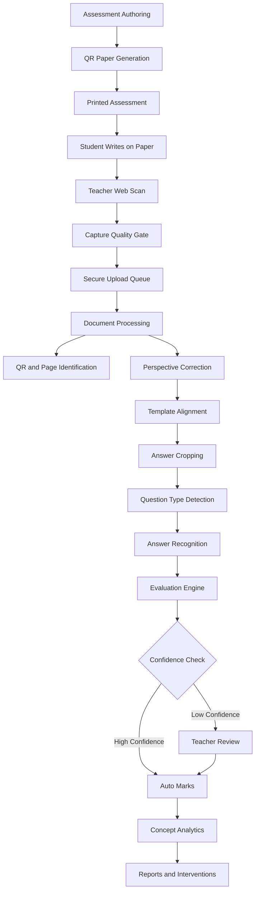

# SmartFLN

AI Powered QR Enabled Assessment System

## Project Vision

SmartFLN is a paper-first assessment intelligence platform for foundational learning. The vision is to digitize school assessments without forcing schools, teachers, or young children to abandon paper.

Students in Classes 1-5 continue writing on normal printed sheets. Teachers scan those sheets using a mobile phone. SmartFLN identifies the student, paper, page, answer regions, question types, handwritten responses, marks, and concept-wise learning gaps automatically, while sending uncertain cases to teacher review.

The long-term vision is to become the assessment operating system for foundational literacy and numeracy programs across schools, districts, NGOs, and governments.

## Mission

SmartFLN exists to reduce teacher assessment workload, improve evaluation consistency, and provide timely concept-level learning analytics while preserving the simplicity, trust, and accessibility of paper-based classroom assessment.

The mission is not to replace the classroom, teacher, or notebook. The mission is to make paper assessments measurable at scale.

## Problem

Foundational learning assessments are still largely paper based because paper is cheap, familiar, inclusive, and developmentally appropriate for young learners. However, paper creates a major data and operations gap.

Teachers must manually:

- identify each student sheet
- sort and track pages
- check handwriting
- evaluate MCQs, short answers, matching questions, and working steps
- calculate marks
- map answers to concepts
- prepare remedial plans
- enter marks into registers or spreadsheets
- report outcomes to school leaders

At small classroom scale this is slow. At school, district, or state scale it becomes a systemic bottleneck.

## Existing Problems

### Manual Evaluation Burden

Teachers spend significant time on repetitive checking, totaling, and data entry. This reduces time available for teaching, feedback, and remediation.

### Delayed Learning Feedback

Assessment results often arrive days or weeks after the test. By then, teachers may have moved to the next concept and students may continue with unresolved gaps.

### Low-Resolution Analytics

Traditional marks usually show only total scores. They rarely reveal which concept, skill, question type, or misconception caused the error.

### OMR Limitations

OMR works well for fixed bubbles but struggles with the realities of primary classrooms:

- children write words, numbers, drawings, and working steps
- many questions require short handwritten answers
- matching, tracing, counting, spelling, and numeracy tasks are common
- special answer sheets are restrictive
- partial credit and rubric-based grading are difficult

### Generic OCR Limitations

Generic OCR and document scanning tools can digitize pages, but they are not assessment systems. They usually do not understand the paper template, student identity, page sequence, answer boundaries, question intent, marks, concepts, or teacher review workflow.

### Data Entry Fragmentation

Schools often use a mix of registers, Excel files, messaging apps, LMS tools, and manual reports. Assessment data becomes fragmented and hard to compare.

### Mobile Capture Variability

Real classroom photos vary widely in lighting, angle, blur, shadows, paper folds, backgrounds, camera quality, and teacher scanning behavior.

### Handwriting Variability

Young learners have inconsistent handwriting, spacing, alignment, spelling, digit formation, and answer placement. This makes naive OCR unreliable.

### Trust and Fairness

Automatic grading must be explainable, auditable, and reviewable. Teachers, parents, and administrators need confidence that marks are fair.

## Research Gap

The current market and research landscape has strong pieces, but not a complete production-ready solution for low-cost, QR-enabled, paper-preserving foundational assessment.

### What Exists Today

- OMR and bubble-sheet apps can grade objective responses quickly.
- LMS platforms can distribute and grade digital assignments.
- Document scanning apps can crop, enhance, and export paper images.
- AI-assisted grading tools can help group or review scanned responses.
- OCR and handwriting recognition models can transcribe some handwritten text.

### What Is Missing

SmartFLN targets the gap between classroom paper and structured learning analytics:

- end-to-end identification of student, assessment, page, and answer regions from ordinary printed paper
- mobile-first image capture quality control for low-resource school environments
- template-aware answer segmentation for Class 1-5 paper formats
- support for MCQs, handwritten short answers, matching questions, numeracy responses, and teacher-designed rubrics
- concept-wise analytics rather than only total marks
- confidence-based human review before marks become final
- continuous improvement from teacher corrections
- deployment model suitable for thousands of schools with variable devices and connectivity

The central research challenge is not only handwriting recognition. The deeper challenge is a reliable assessment pipeline that combines computer vision, document intelligence, handwriting recognition, question understanding, scoring, analytics, and human-in-the-loop review.

## Our Innovation

SmartFLN combines QR-enabled paper identity, mobile computer vision, AI answer recognition, rule-based and model-based evaluation, and teacher review into one product workflow.

### 1. QR-Enabled Paper Intelligence

Each printed assessment carries QR metadata such as:

- school
- class
- section
- assessment
- student
- subject
- paper version
- page number
- template version

This reduces ambiguity and makes the system robust even when pages are scanned out of order.

### 2. Web Camera Capture Quality Gate

The teacher web app checks whether the paper is visible, in focus, well lit, and properly framed before upload. For MVP, teachers use the same React web app on a phone browser rather than a separate mobile app. The goal is to catch bad images at capture time instead of failing later in processing.

### 3. Document Detection and Rectification

The vision pipeline detects paper boundaries, corrects perspective, deskews the page, normalizes image quality, and aligns it against the expected template.

### 4. Template-Aware Answer Cropping

Instead of trying to understand the whole page at once, SmartFLN uses assessment templates and page anchors to crop each answer region precisely.

### 5. Question-Type-Aware Recognition

Different question types require different recognition strategies:

- MCQs: mark detection and option disambiguation
- matching: line/path detection and pair validation
- short text: handwriting recognition and semantic matching
- numbers: digit recognition and tolerance rules
- spelling: exact or phonetic comparison
- drawing/tracing: rubric or teacher-review workflow

### 6. Confidence-Based Evaluation

Every recognized answer receives a confidence score. High-confidence answers can be auto-evaluated. Low-confidence or ambiguous answers are routed to teacher review.

### 7. Concept-Wise Analytics

Each question is mapped to one or more learning concepts. Results are aggregated into student, class, school, and assessment-level insights.

### 8. Teacher-in-the-Loop Learning

Teacher corrections become structured feedback for improving answer recognition, scoring rules, and future model performance.

## Why This Is Better Than OMR

OMR is useful for bubble-based tests. SmartFLN is designed for real primary classroom assessment.

| Capability | Traditional OMR | SmartFLN |
| --- | --- | --- |
| Requires special answer format | Yes | No, works with designed printed papers |
| Supports handwritten answers | No | Yes, with confidence-based review |
| Supports matching questions | Limited | Yes |
| Supports partial credit | Limited | Yes, through rubrics and rules |
| Identifies student automatically | Usually requires roll/bubble coding | QR-based identity |
| Handles page-level metadata | Limited | Built into QR and template |
| Works with phone camera | Usually not the primary workflow | Mobile-first |
| Provides concept analytics | Limited | Core feature |
| Routes doubtful answers to teachers | No | Yes |
| Preserves paper classroom workflow | Partly | Yes |

SmartFLN does not reject OMR. It absorbs the strengths of OMR for objective questions and extends assessment digitization to handwritten and semi-structured responses.

## Target Users

### Primary Users

- Class 1-5 teachers
- School academic coordinators
- FLN program managers
- Assessment teams
- School administrators

### Secondary Users

- District education officers
- NGO program teams
- Government education departments
- Parents, through summary reports where appropriate
- Curriculum and content teams

### Beneficiaries

- Students who receive faster feedback
- Teachers who spend less time on repetitive checking
- Schools that receive timely learning-gap visibility
- Education systems that need reliable assessment data at scale

## Expected Accuracy

These are product targets, not guaranteed initial results. Accuracy depends on paper design, scan quality, language, handwriting, question type, training data, and review workflow.

### Target Accuracy by Capability

| Capability | MVP Target | Production Target |
| --- | ---: | ---: |
| QR detection and decoding on valid scans | 98.5%+ | 99.5%+ |
| Student, assessment, and page identification | 98.5%+ | 99.5%+ |
| Paper boundary detection and rectification | 95%+ | 98%+ |
| Template alignment | 95%+ | 98%+ |
| Answer-region cropping correctness | 94%+ | 97%+ |
| MCQ mark detection | 96%+ | 98.5%+ |
| Matching-question detection | 85%+ | 93%+ |
| Numeric handwritten answer recognition | 85%+ | 94%+ |
| Short handwritten text recognition | 75%+ | 90%+ for constrained answers |
| Auto-scoring agreement on high-confidence answers | 90%+ | 95%+ |
| Final marks after teacher review | 99%+ audit accuracy target | 99.5%+ audit accuracy target |

### Review Coverage Target

The system should not attempt to auto-grade everything on day one. A healthy early deployment may route 20-40% of answers to teacher review. As data quality improves, reviewed volume should decrease while accuracy remains protected.

### Accuracy Principle

SmartFLN should prefer "I am not sure; ask the teacher" over confidently assigning a wrong mark.

## Technology Stack

SmartFLN will be built on the MERN stack. This is the primary technology requirement for the product.

MERN means:

- MongoDB for application data
- Express.js for REST APIs
- React for the web dashboard and admin panel
- Node.js for backend services, workers, and orchestration

For MVP, SmartFLN will be a web app only. Teachers, admins, and reviewers use the React web application. Teachers can scan papers from a phone browser using web camera APIs where supported.

### Teacher Web App

- React web app optimized for desktop, tablet, and phone browsers
- Browser camera capture for paper scanning where supported
- Camera capture with real-time quality checks
- Offline-tolerant scan queue where browser capabilities allow
- Local image compression and encryption
- Teacher authentication and role-based access

### Web Application

- React for teacher, admin, and review dashboards
- Responsive design for tablets, laptops, and school office desktops
- Role-based analytics views

### Backend Platform

- Node.js with Express.js for core APIs
- Node.js workers for background processing and AI orchestration
- MongoDB for school, student, assessment, scan, review, result, and analytics documents
- Redis for caching, locks, and short-lived queues
- Object storage such as S3-compatible storage for scanned images and processed artifacts
- Message queue such as RabbitMQ, Kafka, or cloud-native queues for asynchronous processing

### Computer Vision and AI

- OpenCV for image preprocessing, perspective correction, thresholding, and geometric operations
- Node-compatible OpenCV and model inference bindings where production-ready
- External model training tools may be used offline only when approved, but production application services remain MERN-oriented
- ONNX Runtime or equivalent inference runtime may be used behind Node services when needed
- QR decoding libraries with redundancy and fallback
- Object detection or segmentation models for layout and answer regions when templates are insufficient
- Handwriting recognition models tuned for age group, language, and answer type
- Rule engines for deterministic scoring
- LLM or vision-language model support only where reliability, privacy, cost, and auditability permit

### Analytics

- Event and assessment data model for concept-level reporting
- MongoDB aggregation pipelines and derived analytics collections for early MVP analytics
- Data warehouse later for district-scale reporting
- BI export to CSV, Excel, and government reporting formats

### Infrastructure

- Containerized services
- Kubernetes or managed container platform for scale
- Terraform or equivalent infrastructure-as-code
- CI/CD with automated tests, migrations, and deployment gates
- Observability with OpenTelemetry, structured logs, metrics, tracing, and alerting

### Security

- Encryption in transit and at rest
- Signed URLs for image access
- Role-based access control
- Audit logs for mark edits and reviews
- Data retention policies
- Tenant isolation for schools and organizations

## High Level Architecture



## Architecture Components

### Assessment Authoring Service

Creates assessments, question metadata, answer keys, rubrics, concepts, marks, templates, and paper versions.

### Paper Generation Service

Generates printable PDFs with QR codes, page anchors, answer regions, and versioned templates.

### Mobile Capture App

Guides teachers through scanning and queues uploads even when connectivity is weak.

### Document Processing Service

Detects paper boundaries, rectifies perspective, normalizes image quality, decodes QR codes, and aligns images to templates.

### Answer Extraction Service

Crops answer regions and attaches each crop to student, page, question, concept, and assessment metadata.

### Recognition Service

Runs question-type-specific recognition for bubbles, handwritten text, digits, matching lines, and other answer formats.

### Evaluation Engine

Scores recognized answers using answer keys, rubrics, tolerance rules, semantic matching, and confidence thresholds.

### Teacher Review Console

Allows teachers to review uncertain answers, override marks, inspect evidence, and finalize results.

### Analytics Engine

Aggregates results into concept-level, student-level, class-level, school-level, and assessment-level reports.

### Model Improvement Pipeline

Uses reviewed answers as labeled data for continuous model evaluation and retraining.

## Core Product Principles

- Paper stays.
- Teacher remains the final authority.
- Automation must be measurable and auditable.
- Low confidence must trigger review, not silent failure.
- The system must work in imperfect classroom conditions.
- Accuracy must be measured by question type, not only overall score.
- Analytics must lead to action, not just dashboards.
- The product must scale from one classroom to thousands of schools.

## Future Scope

### Academic Scope

- Adaptive remediation recommendations
- Student learning profiles
- Skill progression tracking
- Oral reading and fluency assessment integration
- Multilingual handwriting support
- State or national FLN framework mapping

### Product Scope

- Parent reports
- School leader dashboards
- District dashboards
- Question bank and assessment builder
- Auto-generated remedial worksheets
- Teacher collaboration and moderation
- Offline-first school deployments
- LMS and SIS integrations

### AI Scope

- Better handwriting recognition for young learners
- Layout generalization across paper formats
- Error pattern detection
- Misconception clustering
- Human feedback based model improvement
- Multimodal evaluation for drawings, number lines, and working steps

### Platform Scope

- Multi-tenant SaaS
- On-premise or private-cloud deployment for governments
- API platform for partner integrations
- Data warehouse for longitudinal learning analysis
- Model monitoring and drift detection

## Market and Research References

The product direction is informed by known limitations and capabilities in the current ecosystem:

- Gradescope supports paper-based assignments, bubble sheets, analytics, and AI-assisted answer grouping, primarily for broader/higher-education assessment workflows: https://www.gradescope.com/
- ZipGrade demonstrates that teachers value phone-based paper quiz grading, especially for OMR-style answer sheets: https://www.zipgrade.com/
- Google Classroom supports digital assignment grading workflows, but does not solve phone-scanned paper answer evaluation end to end: https://support.google.com/edu/classroom/answer/6020294
- Recent AI-assisted grading research shows meaningful grading-time reduction, while also highlighting the difficulty of reliable handwritten-answer interpretation: https://arxiv.org/abs/2408.12870

## Current Project Status

Milestone 0 implementation has started.

Current repository contents:

- product, architecture, workflow, database, AI, API, UI/UX, and implementation planning documentation
- dependency-light Node.js API foundation
- health and version endpoints
- API foundation tests using Node's built-in test runner
- CI skeleton
- Dockerfile for the API service
- local development runbook and architecture decision record

Run the current foundation tests:

```bash
node --test apps/api/test/health.test.js
```

Run the current API service:

```bash
node apps/api/src/main.js
```
