# SmartFLN System Flow

AI Powered QR Enabled Assessment System

## Purpose

This document defines the end-to-end workflows for SmartFLN. It explains how teachers, students, school admins, mobile apps, backend services, AI services, queues, databases, and storage systems interact from login to final reports.

This is a workflow document only. It does not contain implementation code.

## Flow Design Principles

- Every workflow must be traceable from user action to system result.
- Every scan must be linked to a tenant, school, assessment, student, paper, page, and template version.
- Every AI output must include confidence, model version, and source artifact reference.
- Every low-confidence or ambiguous result must enter a teacher review workflow.
- Every final mark must be reproducible from source scan, answer crop, recognition output, scoring rule, and review action.
- Every long-running workflow must be asynchronous, retryable, observable, and idempotent.
- Every workflow must support operational failure recovery.

## Key Actors

| Actor | Role |
| --- | --- |
| Student | Writes answers on printed paper |
| Teacher | Logs in, scans papers, reviews doubtful answers, finalizes results |
| School Admin | Manages rosters, assessments, reports, and school-level monitoring |
| Program Admin | Monitors multiple schools and program-level analytics |
| Mobile App | Captures paper images and syncs scans |
| Web Dashboard | Provides review, analytics, and admin workflows |
| API Gateway | Secures and routes all client API requests |
| Backend Services | Manage business data and user workflows |
| AI Services | Process images, recognize answers, and calculate confidence |
| Message Queue | Coordinates asynchronous processing |
| Background Workers | Execute image, OCR, scoring, analytics, and export tasks |
| Object Storage | Stores scans, processed images, answer crops, PDFs, and exports |
| Database | Stores transactional assessment, result, review, and audit data |

## Core Services Used In Flows

| Service | Workflow Responsibility |
| --- | --- |
| Identity Service | Login, token validation, session management |
| Tenant Service | Tenant, school, and feature configuration |
| Roster Service | Student, class, section, and teacher assignments |
| Assessment Service | Assessment, question, concept, answer key, and rubric data |
| Template Service | Page layout, anchor, and answer region definitions |
| Paper Generation Service | Printable paper PDF generation |
| QR Service | QR payload creation, validation, decoding |
| Scan Ingestion Service | Upload sessions, scan confirmation, duplicate detection |
| Image Processing Service | Quality validation, page detection, rectification, normalization |
| Answer Extraction Service | Template alignment and answer crop generation |
| OCR/HTR Service | Printed OCR and handwritten text recognition |
| Recognition Service | MCQ, matching, numeric, handwriting, and blank detection |
| Evaluation Service | Scoring and confidence policy application |
| Teacher Review Service | Review tasks, teacher decisions, mark overrides |
| Analytics Service | Concept, question, student, class, and school analytics |
| Result Service | Final result assembly and publication |
| Export Service | PDF, CSV, Excel, and report generation |
| Notification Service | Processing and review notifications |
| Audit Service | Immutable audit events |

## Master Assessment Lifecycle

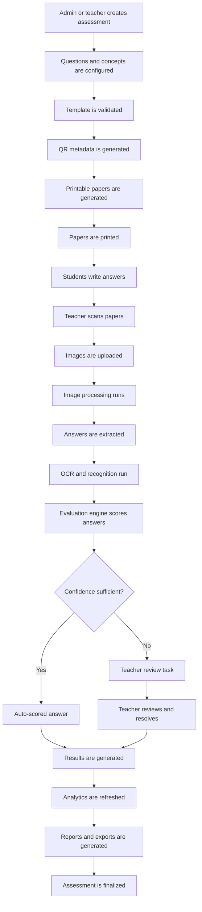

## Master Sequence

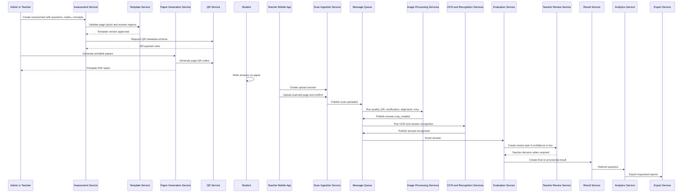

## Master State Diagram

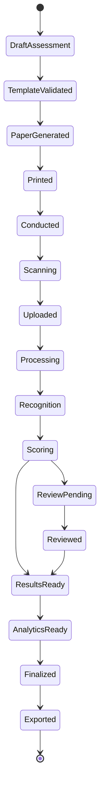

## Workflow 1: Teacher Login

### Objective

Authenticate the teacher securely, establish tenant and school context, load assigned classes and assessments, and prepare the mobile or web session.

### Preconditions

- Teacher account exists.
- Teacher is assigned to one or more schools/classes/sections.
- Device has network access for initial login.
- Tenant is active.

### Output

- Authenticated session.
- Access token and refresh token.
- Teacher role and permission scope.
- Assigned assessments and class context.
- Device session registered.

### Teacher Login Sequence

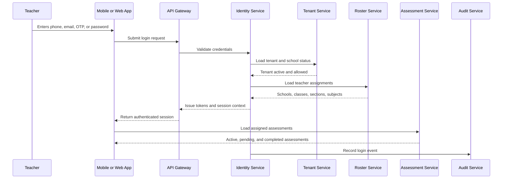

### Teacher Login Flow Chart

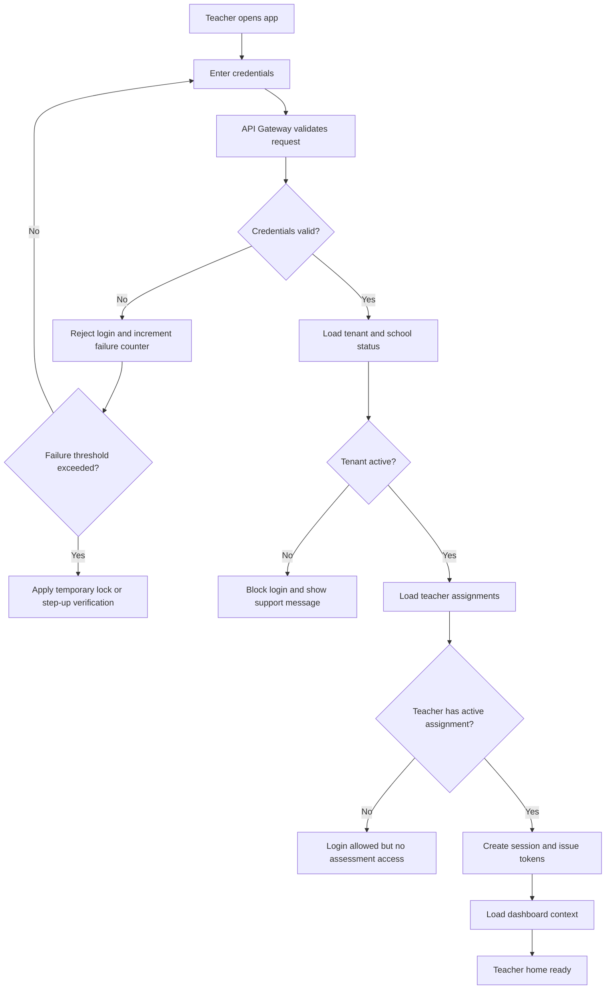

### Teacher Session State Diagram

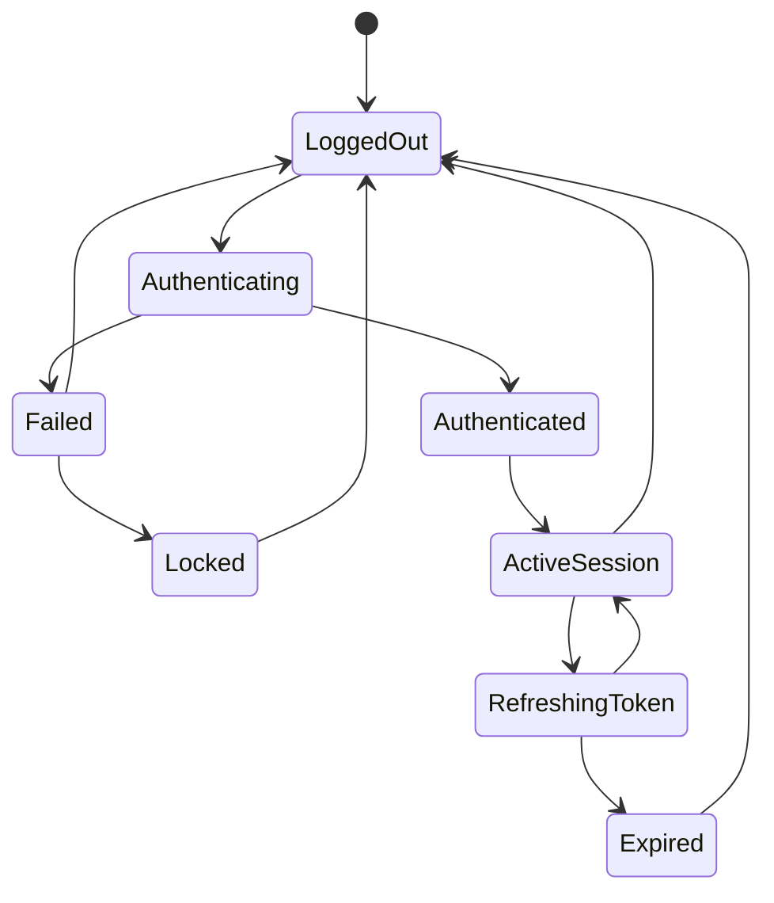

### Failure Handling

| Failure | Handling |
| --- | --- |
| Wrong password or OTP | Reject, log failure, throttle repeated attempts |
| Tenant disabled | Block login and show support contact |
| Teacher not assigned | Allow login only if policy permits, show no active classes |
| Token expired | Refresh token if valid |
| Device lost | Revoke device session |
| Suspicious login | Require step-up verification or admin unlock |

## Workflow 2: Student Identification

### Objective

Identify the student, assessment, paper instance, and page from scanned paper with maximum reliability.

### Identification Methods

Primary method:

- QR code on every page.

Fallback methods:

- visual page anchors
- assessment context selected by teacher
- paper template version
- class roster
- handwritten or printed student label area
- scan order within batch
- manual teacher resolution

### QR Payload Contents

The QR payload should identify:

- tenant id
- school id
- academic year
- assessment id
- paper instance id
- student id or anonymous paper code
- class and section
- subject
- page number
- total pages
- template version
- paper version
- checksum or signature

### Student Identification Sequence

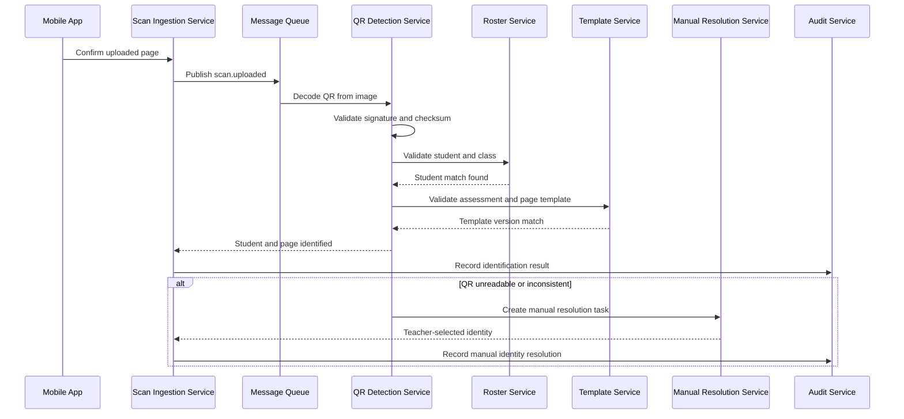

### Student Identification Flow Chart

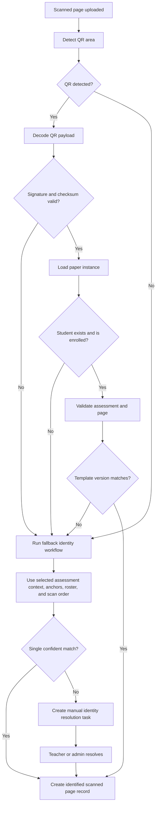

### Identification State Diagram

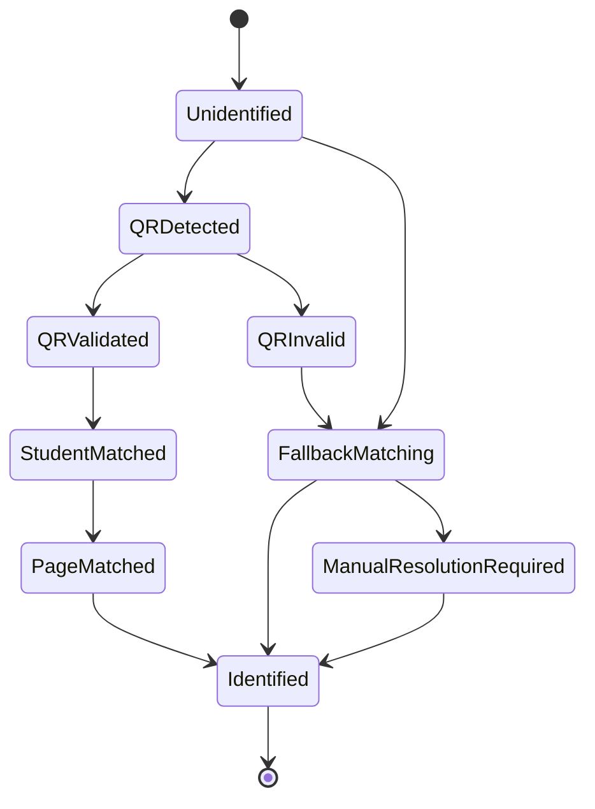

### Data Quality Rules

- A page cannot proceed to final scoring without assessment and page identity.
- A page can proceed to image processing before manual identity is resolved, but final result assignment must wait.
- Duplicate page identity must be detected before creating final answer records.
- Manual resolution must be audited.

## Workflow 3: Paper Generation

### Objective

Generate printable assessment papers that are human-friendly for students and machine-readable for SmartFLN.

### Preconditions

- Assessment is created.
- Questions, marks, concepts, answer keys, and rubrics are defined.
- Template layout is validated.
- Class roster is available if student-specific papers are required.

### Output

- Printable PDF.
- Paper instances.
- Page instances.
- QR payloads.
- Template version references.
- Print batch metadata.

### Paper Generation Sequence

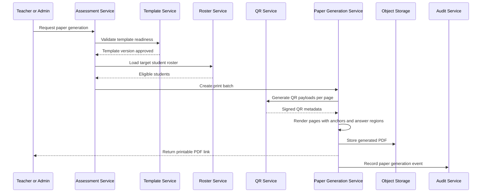

### Paper Generation Flow Chart

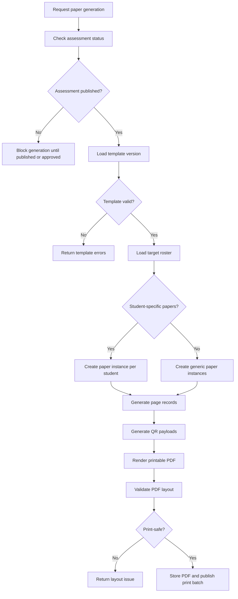

### Paper Generation State Diagram

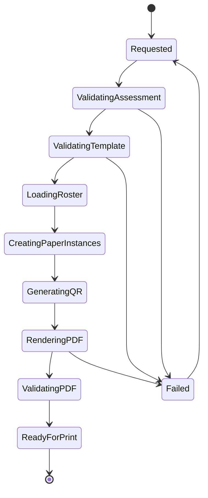

### Paper Generation Rules

- A generated paper must reference immutable assessment and template versions.
- If the assessment changes, a new paper version must be generated.
- Student-specific QR codes must not expose readable personal data directly.
- Paper output must include print-safe margins and anchor regions.
- The generated PDF must be stored as an immutable artifact.

## Workflow 4: QR Generation

### Objective

Create QR codes that reliably identify every page while remaining secure, compact, and resilient to print and scan quality issues.

### QR Generation Sequence

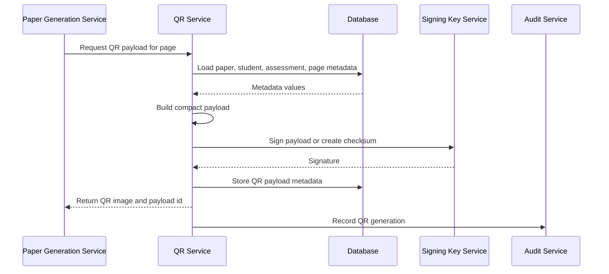

### QR Generation Flow Chart

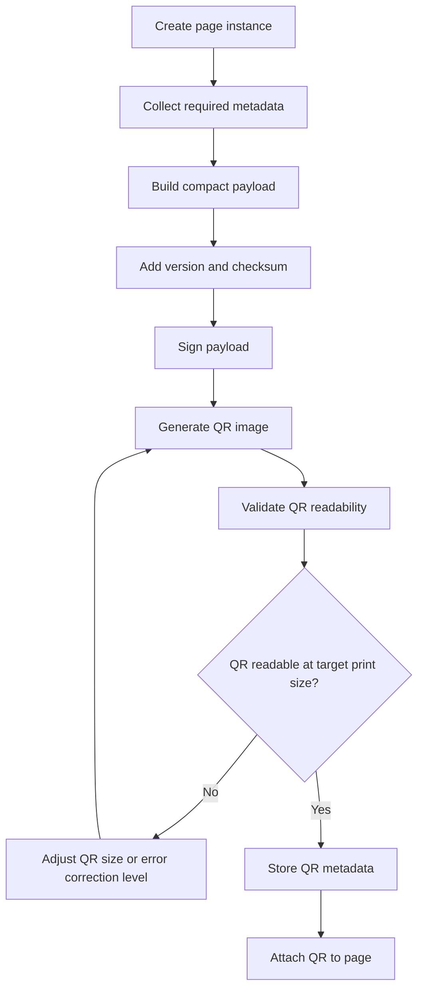

### QR State Diagram

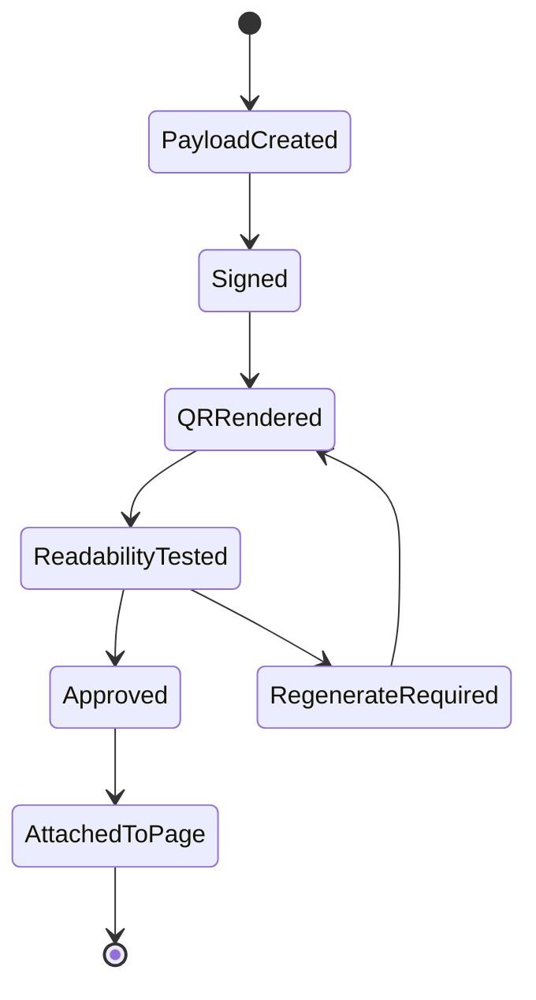

### QR Validation Rules

- QR payload must include a schema version.
- QR payload must be signed or checksummed.
- QR code must be readable at expected print resolution.
- QR must not contain plain sensitive student data if avoidable.
- QR decode failures must have fallback workflows.

## Workflow 5: Paper Printing

### Objective

Ensure generated papers are printed with enough quality and layout fidelity for reliable scanning and answer extraction.

### Paper Printing Sequence

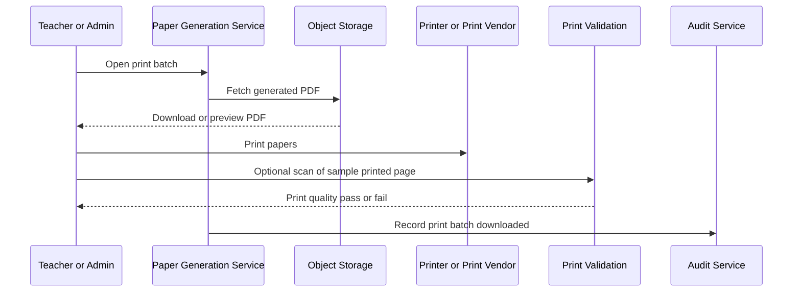

### Paper Printing Flow Chart

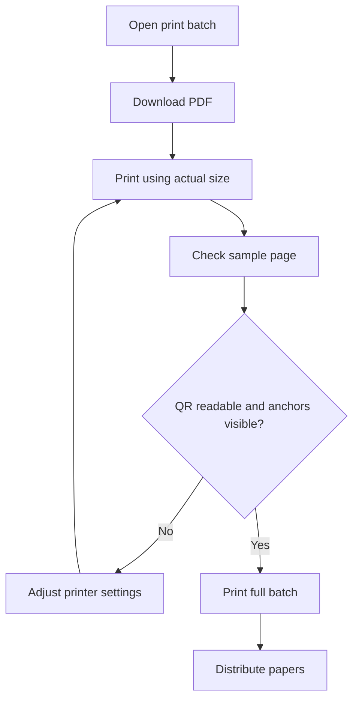

### Print Batch State Diagram

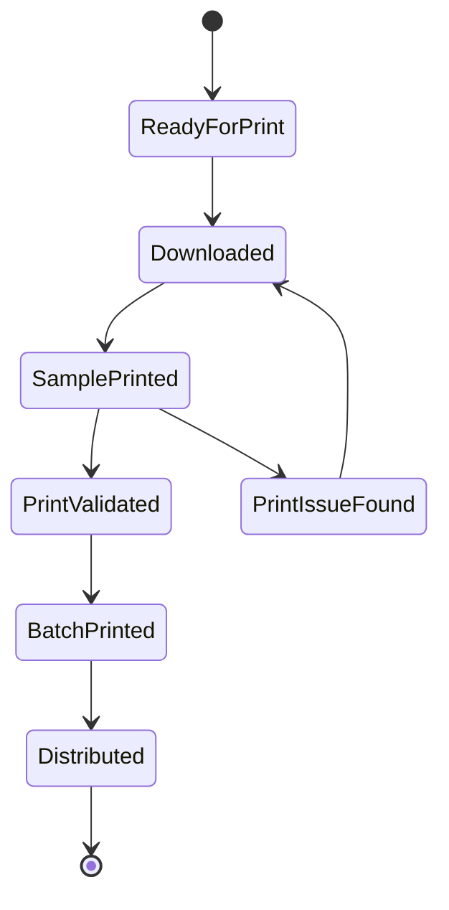

### Printing Quality Rules

- Papers should be printed at actual size.
- Scaling, cropping, or rotation should be avoided.
- QR and page anchors must not be cut off.
- Answer boxes should remain clear and large enough for young learners.
- If print quality is poor, the batch should be reprinted before assessment.

## Workflow 6: Paper Scanning

### Objective

Allow teachers to scan student papers quickly using a mobile phone while capturing enough image quality for AI processing.

### Scanning Preconditions

- Teacher is logged in.
- Assessment is assigned to teacher.
- Papers have been distributed and completed.
- Mobile app has camera permission.

### Paper Scanning Sequence

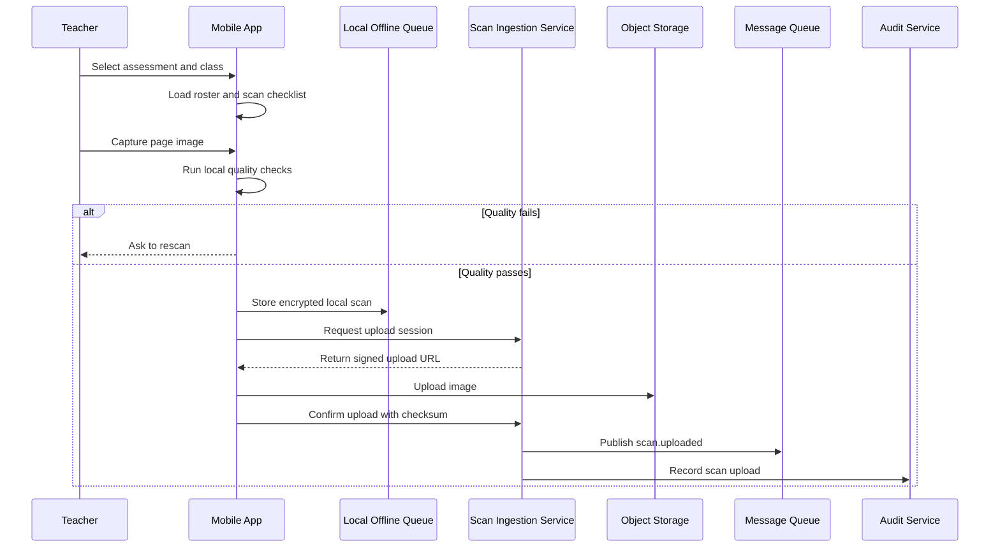

### Paper Scanning Flow Chart

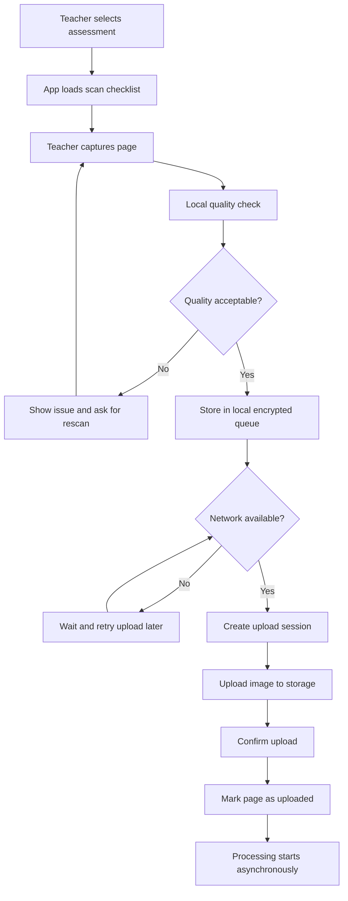

### Scanning State Diagram

```mermaid
stateDiagram-v2
    [*] --> NotScanned
    NotScanned --> Capturing
    Capturing --> QualityFailed
    QualityFailed --> Capturing
    Capturing --> QueuedLocally
    QueuedLocally --> Uploading
    Uploading --> Uploaded
    Uploading --> UploadFailed
    UploadFailed --> QueuedLocally
    Uploaded --> ProcessingQueued
    ProcessingQueued --> [*]
```

### Scanning Failure Handling

| Failure | Handling |
| --- | --- |
| Camera permission denied | Ask teacher to enable permission |
| Blur detected | Ask for rescan |
| Page outside frame | Ask for rescan |
| Offline device | Store in local queue |
| Upload failure | Retry with resumable upload |
| Duplicate page | Warn and allow replace or ignore |
| Wrong assessment selected | Detect by QR and route to correction |

## Workflow 7: Image Processing

### Objective

Convert raw mobile photos into standardized, aligned page images suitable for answer extraction and recognition.

### Image Processing Sequence

```mermaid
sequenceDiagram
    participant Queue as Message Queue
    participant Worker as Image Worker
    participant Storage as Object Storage
    participant Quality as Quality Service
    participant QR as QR Detection Service
    participant Rectify as Rectification Service
    participant Template as Template Alignment Service
    participant DB as Database
    participant Audit as Audit Service

    Queue->>Worker: scan.uploaded
    Worker->>Storage: Fetch original image
    Worker->>Quality: Validate image quality
    Quality-->>Worker: Quality score and issues
    Worker->>QR: Detect and decode QR
    QR-->>Worker: Page metadata or failure
    Worker->>Rectify: Detect paper boundary and correct perspective
    Rectify-->>Worker: Rectified page and transform
    Worker->>Template: Align rectified page to template
    Template-->>Worker: Alignment result and confidence
    Worker->>Storage: Store processed page image
    Worker->>DB: Save processing stage outputs
    Worker->>Audit: Record processing result
```

### Image Processing Flow Chart

```mermaid
flowchart TD
    A["scan.uploaded event"] --> B["Fetch original image"]
    B --> C["Validate file and checksum"]
    C --> D["Assess image quality"]
    D --> E{"Quality sufficient?"}
    E -->|No| F["Mark rescan recommended or required"]
    E -->|Yes| G["Detect QR and page anchors"]
    G --> H["Detect page boundary"]
    H --> I{"Boundary confident?"}
    I -->|No| J["Try fallback boundary detection"]
    J --> K{"Fallback successful?"}
    K -->|No| F
    K -->|Yes| L["Rectify page"]
    I -->|Yes| L
    L --> M["Normalize lighting and contrast"]
    M --> N["Align to template"]
    N --> O{"Alignment confident?"}
    O -->|No| P["Route to manual resolution or rescan"]
    O -->|Yes| Q["Store processed page and diagnostics"]
    Q --> R["Publish page.aligned"]
```

### Image Processing State Diagram

```mermaid
stateDiagram-v2
    [*] --> Uploaded
    Uploaded --> QualityChecking
    QualityChecking --> QualityFailed
    QualityChecking --> QRDetection
    QRDetection --> BoundaryDetection
    BoundaryDetection --> Rectification
    Rectification --> Normalization
    Normalization --> TemplateAlignment
    TemplateAlignment --> Aligned
    TemplateAlignment --> AlignmentFailed
    BoundaryDetection --> BoundaryFailed
    QualityFailed --> RescanRequired
    BoundaryFailed --> RescanRequired
    AlignmentFailed --> ManualResolutionRequired
    Aligned --> [*]
```

### Image Processing Outputs

- quality score
- quality failure reasons
- QR detection result
- page corner coordinates
- perspective transform matrix
- rectified page image
- normalized page image
- template alignment score
- processed image artifact id
- processing version

## Workflow 8: OCR and Handwriting Recognition

### Objective

Recognize printed and handwritten content from answer crops and convert it into structured candidate answers with confidence scores.

### OCR Scope

SmartFLN may use OCR for:

- printed template validation
- printed question text verification
- student name fallback if printed on page
- handwritten short answers
- handwritten numeric responses
- spelling responses
- constrained phrase recognition

For young learners, the more accurate term is often HTR, meaning handwritten text recognition. This document uses OCR broadly but separates printed OCR and handwriting recognition internally.

### OCR and Recognition Sequence

```mermaid
sequenceDiagram
    participant Queue as Message Queue
    participant Worker as Recognition Worker
    participant Storage as Object Storage
    participant Router as Question Type Router
    participant OCR as Printed OCR Service
    participant HTR as Handwriting Recognition Service
    participant MCQ as MCQ Detector
    participant Match as Matching Detector
    participant DB as Database
    participant Eval as Evaluation Service

    Queue->>Worker: answer.crop_created
    Worker->>Storage: Fetch answer crop
    Worker->>Router: Load question type and recognition strategy
    alt Printed OCR needed
        Router->>OCR: Recognize printed or template text
        OCR-->>Worker: Text and confidence
    else Handwriting needed
        Router->>HTR: Recognize handwritten response
        HTR-->>Worker: Candidate answers and confidence
    else MCQ
        Router->>MCQ: Detect selected option
        MCQ-->>Worker: Selected options and confidence
    else Matching
        Router->>Match: Detect line pairs
        Match-->>Worker: Pairing candidates and confidence
    end
    Worker->>DB: Store recognition result
    Worker->>Eval: Notify answer recognized
```

### OCR Flow Chart

```mermaid
flowchart TD
    A["Answer crop ready"] --> B["Load question metadata"]
    B --> C["Select recognition strategy"]
    C --> D{"Question type"}
    D -->|MCQ| E["Run mark detection"]
    D -->|Matching| F["Run line and endpoint detection"]
    D -->|Numeric| G["Run digit recognition"]
    D -->|Short text| H["Run handwriting recognition"]
    D -->|Printed fallback| I["Run printed OCR"]
    D -->|Unsupported| J["Create review-only recognition result"]
    E --> K["Normalize recognized answer"]
    F --> K
    G --> K
    H --> K
    I --> K
    J --> L["Route to teacher review"]
    K --> M["Calculate recognition confidence"]
    M --> N["Store candidates and alternatives"]
    N --> O["Publish answer.recognized"]
```

### Recognition State Diagram

```mermaid
stateDiagram-v2
    [*] --> CropReady
    CropReady --> StrategySelected
    StrategySelected --> Recognizing
    Recognizing --> Recognized
    Recognizing --> RecognitionFailed
    Recognized --> ConfidenceCalculated
    ConfidenceCalculated --> Stored
    RecognitionFailed --> ReviewOnly
    ReviewOnly --> Stored
    Stored --> [*]
```

### Recognition Result Requirements

Each recognition result must include:

- answer crop id
- question id
- recognition strategy
- recognized answer
- normalized answer
- candidate alternatives
- confidence score
- model or algorithm version
- input image artifact id
- processing timestamp
- review recommendation

## Workflow 9: Answer Extraction

### Objective

Extract each answer region from the processed page using the approved template and alignment transform.

### Answer Extraction Sequence

```mermaid
sequenceDiagram
    participant Queue as Message Queue
    participant Worker as Answer Extraction Worker
    participant Template as Template Service
    participant Storage as Object Storage
    participant DB as Database
    participant Quality as Crop Quality Validator
    participant Next as Recognition Queue

    Queue->>Worker: page.aligned
    Worker->>Template: Load answer regions for template version
    Template-->>Worker: Page regions and question mapping
    Worker->>Storage: Fetch processed page image
    Worker->>Worker: Apply transform and crop each answer region
    Worker->>Quality: Validate crop completeness
    Quality-->>Worker: Crop quality score
    Worker->>Storage: Store answer crop artifacts
    Worker->>DB: Create answer crop records
    Worker->>Next: Publish answer.crop_created
```

### Answer Extraction Flow Chart

```mermaid
flowchart TD
    A["Page aligned"] --> B["Load page template"]
    B --> C["Load answer region definitions"]
    C --> D["Fetch processed page image"]
    D --> E["Apply alignment transform"]
    E --> F["Crop answer region"]
    F --> G["Validate crop"]
    G --> H{"Crop acceptable?"}
    H -->|No| I["Flag crop for review or rescan"]
    H -->|Yes| J["Store crop artifact"]
    J --> K{"More regions?"}
    K -->|Yes| F
    K -->|No| L["Publish answer crops"]
    I --> K
```

### Answer Extraction State Diagram

```mermaid
stateDiagram-v2
    [*] --> PageAligned
    PageAligned --> LoadingRegions
    LoadingRegions --> Cropping
    Cropping --> CropValidated
    CropValidated --> CropStored
    CropValidated --> CropIssue
    CropIssue --> ReviewRequired
    CropStored --> AllCropsGenerated
    ReviewRequired --> AllCropsGenerated
    AllCropsGenerated --> [*]
```

### Extraction Rules

- Answer crop records must reference question id, student id, page id, and template version.
- Crop coordinates must be stored.
- Crop artifacts must be immutable once used for scoring.
- If a crop is missing or incomplete, the question cannot be auto-scored.
- Overflow outside expected answer regions should be flagged where detectable.

## Workflow 10: Evaluation

### Objective

Convert recognized answers into marks using answer keys, rubrics, deterministic rules, AI-assisted scoring, and confidence policies.

### Evaluation Sequence

```mermaid
sequenceDiagram
    participant Queue as Message Queue
    participant Eval as Evaluation Service
    participant Assess as Assessment Service
    participant DB as Database
    participant Confidence as Confidence Engine
    participant Review as Teacher Review Service
    participant Result as Result Service
    participant Audit as Audit Service

    Queue->>Eval: answer.recognized
    Eval->>Assess: Load answer key, rubric, concept, marks
    Assess-->>Eval: Scoring configuration
    Eval->>Eval: Apply scoring rule
    Eval->>Confidence: Calculate final confidence
    Confidence-->>Eval: Confidence score and decision
    alt High confidence
        Eval->>DB: Store auto-score
        Eval->>Result: Update provisional result
    else Low or ambiguous confidence
        Eval->>Review: Create review task
    end
    Eval->>Audit: Record scoring event
```

### Evaluation Flow Chart

```mermaid
flowchart TD
    A["Answer recognized"] --> B["Load question scoring config"]
    B --> C{"Question type"}
    C -->|MCQ| D["Compare selected option to answer key"]
    C -->|True or false| E["Compare selected value"]
    C -->|Numeric| F["Apply numeric tolerance"]
    C -->|Short text| G["Apply exact, normalized, phonetic, or semantic rule"]
    C -->|Matching| H["Compare detected pairs"]
    C -->|Rubric| I["Prepare teacher review rubric"]
    C -->|Unsupported| J["Review required"]
    D --> K["Calculate raw marks"]
    E --> K
    F --> K
    G --> K
    H --> K
    I --> J
    K --> L["Calculate confidence"]
    L --> M{"Auto-score allowed?"}
    M -->|Yes| N["Store auto-score"]
    M -->|No| O["Create teacher review task"]
    J --> O
    N --> P["Update result summary"]
    O --> Q["Wait for teacher review"]
```

### Evaluation State Diagram

```mermaid
stateDiagram-v2
    [*] --> RecognitionReady
    RecognitionReady --> ScoringConfigLoaded
    ScoringConfigLoaded --> RuleApplied
    RuleApplied --> ConfidenceEvaluated
    ConfidenceEvaluated --> AutoScored
    ConfidenceEvaluated --> ReviewRequired
    ReviewRequired --> Reviewed
    Reviewed --> FinalScoreRecorded
    AutoScored --> FinalScoreRecorded
    FinalScoreRecorded --> [*]
```

### Scoring Rule Examples

| Question Type | Scoring Method | Review Trigger |
| --- | --- | --- |
| MCQ | Exact option match | Multiple marks, faint mark, unclear option |
| True/False | Exact value match | Ambiguous mark |
| Numeric | Exact or tolerance-based match | Low digit confidence, overwritten answer |
| Short word | Exact, normalized, or accepted variant | Low handwriting confidence |
| Spelling | Exact or phonetic policy | Multiple likely candidates |
| Matching | Pair comparison with partial marks | Unclear line endpoints |
| Drawing | Teacher rubric | Always or mostly review |
| Long text | Teacher rubric or assisted review | Always review in early versions |

## Workflow 11: Confidence Calculation

### Objective

Combine signals from image quality, identity, alignment, crop quality, recognition, and scoring into a decision: auto-score, teacher review, rescan, or manual resolution.

### Confidence Inputs

| Signal | Source |
| --- | --- |
| Image quality | Mobile app and image processing service |
| QR confidence | QR detection service |
| Page alignment confidence | Template alignment service |
| Crop confidence | Answer extraction service |
| Recognition confidence | OCR/HTR and recognition services |
| Scoring confidence | Evaluation service |
| Question risk level | Assessment configuration |
| Mark impact | Evaluation service |
| Historical model reliability | Model monitoring |

### Confidence Calculation Sequence

```mermaid
sequenceDiagram
    participant Eval as Evaluation Service
    participant Conf as Confidence Engine
    participant Vision as Vision Metadata Store
    participant Rec as Recognition Result Store
    participant Policy as Confidence Policy Store
    participant Review as Teacher Review Service
    participant Audit as Audit Service

    Eval->>Conf: Request confidence decision
    Conf->>Vision: Load image, QR, alignment, crop scores
    Conf->>Rec: Load recognition scores and alternatives
    Conf->>Policy: Load tenant and question-type thresholds
    Conf->>Conf: Combine signals and apply policy
    alt Auto-score allowed
        Conf-->>Eval: AUTO_ACCEPT with confidence
    else Teacher review required
        Conf-->>Eval: REVIEW_REQUIRED with reasons
        Eval->>Review: Create review task
    else Rescan required
        Conf-->>Eval: RESCAN_REQUIRED with reasons
    end
    Conf->>Audit: Record confidence decision
```

### Confidence Flow Chart

```mermaid
flowchart TD
    A["Start confidence calculation"] --> B["Load page quality score"]
    B --> C{"Page quality sufficient?"}
    C -->|No| D["Rescan or review required"]
    C -->|Yes| E["Load QR and identity confidence"]
    E --> F{"Identity resolved?"}
    F -->|No| G["Manual identity resolution required"]
    F -->|Yes| H["Load alignment and crop confidence"]
    H --> I{"Crop reliable?"}
    I -->|No| D
    I -->|Yes| J["Load recognition confidence"]
    J --> K["Load scoring confidence"]
    K --> L["Apply question-type threshold"]
    L --> M{"Meets auto-score threshold?"}
    M -->|Yes| N["Auto-score"]
    M -->|No| O["Teacher review"]
```

### Confidence Decision State Diagram

```mermaid
stateDiagram-v2
    [*] --> SignalsLoaded
    SignalsLoaded --> PolicyApplied
    PolicyApplied --> AutoAccept
    PolicyApplied --> TeacherReview
    PolicyApplied --> RescanRequired
    PolicyApplied --> ManualResolution
    AutoAccept --> [*]
    TeacherReview --> [*]
    RescanRequired --> [*]
    ManualResolution --> [*]
```

### Confidence Decision Rules

- Auto-score requires all critical stages to pass minimum thresholds.
- High recognition confidence cannot override poor identity confidence.
- High scoring confidence cannot override bad crop quality.
- Question types with high academic risk should have stricter thresholds.
- Early model versions should run in conservative mode.
- Final marks must show whether they were auto-scored or teacher-reviewed.

## Workflow 12: Teacher Review

### Objective

Allow teachers to quickly resolve uncertain, low-confidence, unsupported, or high-risk answers while seeing full evidence.

### Review Task Creation Rules

Create a review task when:

- confidence is below threshold
- answer is blank but crop suggests marks
- MCQ has multiple marks
- matching line endpoints are unclear
- handwriting has multiple plausible candidates
- question type is unsupported for auto-scoring
- image crop is incomplete
- QR or page identity required manual resolution
- scoring rule cannot safely decide

### Teacher Review Sequence

```mermaid
sequenceDiagram
    participant Teacher
    participant Web as Teacher Dashboard
    participant Review as Teacher Review Service
    participant Storage as Object Storage
    participant Eval as Evaluation Service
    participant Result as Result Service
    participant Analytics as Analytics Service
    participant Audit as Audit Service

    Teacher->>Web: Open review queue
    Web->>Review: Request pending tasks
    Review-->>Web: Return task list
    Web->>Storage: Fetch signed answer crop image
    Storage-->>Web: Display crop
    Web-->>Teacher: Show crop, recognized answer, expected answer, confidence, suggested mark
    Teacher->>Web: Accept, edit, override, mark blank, or escalate
    Web->>Review: Submit review action
    Review->>Eval: Recalculate score if needed
    Eval->>Result: Update final answer score
    Result->>Analytics: Refresh affected aggregates
    Review->>Audit: Record teacher action
```

### Teacher Review Flow Chart

```mermaid
flowchart TD
    A["Teacher opens review queue"] --> B["Load pending tasks"]
    B --> C["Show answer crop and AI suggestion"]
    C --> D{"Teacher decision"}
    D -->|Accept| E["Use suggested score"]
    D -->|Edit answer| F["Update recognized answer"]
    D -->|Override marks| G["Set teacher mark"]
    D -->|Mark blank| H["Set blank response"]
    D -->|Escalate| I["Assign to coordinator or admin"]
    E --> J["Save review action"]
    F --> K["Recalculate score"]
    G --> J
    H --> J
    I --> L["Create escalated task"]
    K --> J
    J --> M["Update result"]
    M --> N{"More review tasks?"}
    N -->|Yes| C
    N -->|No| O["Assessment ready for finalization"]
```

### Teacher Review State Diagram

```mermaid
stateDiagram-v2
    [*] --> Pending
    Pending --> Viewed
    Viewed --> Accepted
    Viewed --> Edited
    Viewed --> Overridden
    Viewed --> MarkedBlank
    Viewed --> Escalated
    Escalated --> CoordinatorReviewed
    Accepted --> Resolved
    Edited --> Resolved
    Overridden --> Resolved
    MarkedBlank --> Resolved
    CoordinatorReviewed --> Resolved
    Resolved --> Locked
    Locked --> [*]
```

### Review Evidence Requirements

Teacher must see:

- student name or anonymized review id based on policy
- class and section
- question number
- concept
- answer crop image
- recognized answer
- candidate alternatives where relevant
- expected answer or rubric
- suggested marks
- confidence score
- reason review was required
- previous review actions if any

### Review Audit Requirements

Each review action must record:

- reviewer id
- role
- timestamp
- original recognized answer
- final answer if changed
- suggested mark
- final mark
- action type
- reason if override is required by policy
- source crop id
- model version

## Workflow 13: Analytics

### Objective

Convert final or provisional scoring data into actionable learning insights for teachers, schools, and program teams.

### Analytics Levels

- student result
- question result
- concept result
- class summary
- section summary
- school summary
- assessment summary
- program summary
- longitudinal trend

### Analytics Sequence

```mermaid
sequenceDiagram
    participant Result as Result Service
    participant Queue as Message Queue
    participant Analytics as Analytics Service
    participant DB as Transactional Database
    participant Warehouse as Analytics Warehouse
    participant Dashboard as Dashboard
    participant Notify as Notification Service

    Result->>Queue: Publish result.updated
    Queue->>Analytics: Consume result update
    Analytics->>DB: Load final marks, concepts, question metadata
    Analytics->>Analytics: Recalculate affected aggregates
    Analytics->>DB: Store summary tables
    Analytics->>Warehouse: Append analytics event
    Analytics->>Notify: Notify dashboard or teacher if ready
    Dashboard->>Analytics: Request concept report
    Analytics-->>Dashboard: Return report data
```

### Analytics Flow Chart

```mermaid
flowchart TD
    A["Answer score updated"] --> B["Identify affected student and assessment"]
    B --> C["Load question to concept mapping"]
    C --> D["Update question-level summary"]
    D --> E["Update concept-level result"]
    E --> F["Update student total"]
    F --> G["Update class aggregate"]
    G --> H["Update school aggregate"]
    H --> I["Write analytics event"]
    I --> J["Refresh dashboard cache"]
    J --> K["Analytics ready"]
```

### Analytics State Diagram

```mermaid
stateDiagram-v2
    [*] --> Pending
    Pending --> Recalculating
    Recalculating --> Partial
    Recalculating --> Complete
    Partial --> WaitingForReviews
    WaitingForReviews --> Recalculating
    Complete --> Published
    Published --> Stale
    Stale --> Recalculating
    Published --> [*]
```

### Analytics Data Rules

- Provisional analytics must be labeled as provisional.
- Final analytics must be based on finalized marks.
- Concept analytics must use the assessment's locked question-concept mapping.
- Aggregates must be rebuildable from source results.
- Analytics must track reviewed versus auto-scored proportions.
- Teacher dashboards should prioritize actionable weak concepts.

## Workflow 14: Result Generation

### Objective

Generate complete student, class, and assessment results after auto-scoring and teacher review are complete.

### Result Generation Sequence

```mermaid
sequenceDiagram
    participant Eval as Evaluation Service
    participant Review as Teacher Review Service
    participant Result as Result Service
    participant Assess as Assessment Service
    participant Analytics as Analytics Service
    participant Audit as Audit Service
    participant Teacher

    Eval->>Result: Submit auto-scored answer result
    Review->>Result: Submit reviewed answer result
    Result->>Assess: Load assessment scoring structure
    Result->>Result: Calculate student totals and question marks
    Result->>Result: Validate required reviews complete
    alt All required reviews complete
        Teacher->>Result: Finalize assessment
        Result->>Analytics: Publish final result event
        Result->>Audit: Record finalization
    else Reviews pending
        Result-->>Teacher: Block finalization with pending task count
    end
```

### Result Generation Flow Chart

```mermaid
flowchart TD
    A["Scores available"] --> B["Group scores by student"]
    B --> C["Calculate question-wise marks"]
    C --> D["Calculate total marks"]
    D --> E["Calculate concept marks"]
    E --> F["Check pending review tasks"]
    F --> G{"Any required review pending?"}
    G -->|Yes| H["Keep result provisional"]
    G -->|No| I["Mark result ready"]
    I --> J["Teacher reviews summary"]
    J --> K{"Teacher finalizes?"}
    K -->|No| L["Result remains ready but unlocked"]
    K -->|Yes| M["Lock final marks"]
    M --> N["Publish final result event"]
```

### Result State Diagram

```mermaid
stateDiagram-v2
    [*] --> NoResult
    NoResult --> Provisional
    Provisional --> ReviewPending
    ReviewPending --> Provisional
    Provisional --> ReadyToFinalize
    ReadyToFinalize --> Finalized
    Finalized --> ExportReady
    ExportReady --> [*]
```

### Result Generation Rules

- Finalization is blocked if required review tasks are unresolved.
- Finalized marks are locked.
- Any post-finalization correction must create an audit event and correction version.
- Results must distinguish absent, blank, invalid, and zero-score answers.
- Results must include auto-scored versus teacher-reviewed status.

## Workflow 15: Export PDF

### Objective

Generate official PDF reports for students, teachers, school admins, or program teams from finalized or clearly labeled provisional results.

### Export Types

- student report PDF
- class summary PDF
- concept-wise analytics PDF
- assessment completion report
- teacher review audit report
- school dashboard export
- program-level report

### Export PDF Sequence

```mermaid
sequenceDiagram
    participant Teacher as Teacher or Admin
    participant Dashboard as Dashboard
    participant Export as Export Service
    participant Result as Result Service
    participant Analytics as Analytics Service
    participant Worker as Export Worker
    participant Storage as Object Storage
    participant Audit as Audit Service

    Teacher->>Dashboard: Click export PDF
    Dashboard->>Export: Request PDF export
    Export->>Result: Validate result access and finalization status
    Export->>Analytics: Load report data
    Export->>Worker: Queue export job
    Worker->>Worker: Render PDF report
    Worker->>Storage: Store PDF export
    Worker->>Export: Mark export ready
    Export->>Audit: Record export creation
    Dashboard->>Export: Poll or receive ready status
    Export-->>Dashboard: Return signed PDF download link
```

### Export PDF Flow Chart

```mermaid
flowchart TD
    A["User requests PDF export"] --> B["Validate permissions"]
    B --> C{"Allowed?"}
    C -->|No| D["Reject request"]
    C -->|Yes| E["Validate result status"]
    E --> F{"Final or provisional export allowed?"}
    F -->|No| G["Block export and show pending reviews"]
    F -->|Yes| H["Create export job"]
    H --> I["Load report data"]
    I --> J["Render PDF"]
    J --> K["Validate PDF generated"]
    K --> L{"PDF valid?"}
    L -->|No| M["Mark export failed and allow retry"]
    L -->|Yes| N["Store PDF"]
    N --> O["Create signed download link"]
    O --> P["Record audit event"]
```

### Export State Diagram

```mermaid
stateDiagram-v2
    [*] --> Requested
    Requested --> PermissionChecked
    PermissionChecked --> Queued
    PermissionChecked --> Rejected
    Queued --> Rendering
    Rendering --> Validating
    Validating --> Ready
    Validating --> Failed
    Failed --> Retrying
    Retrying --> Rendering
    Ready --> Downloaded
    Downloaded --> Expired
    Rejected --> [*]
    Expired --> [*]
```

### Export Security Rules

- Exports require authorization.
- Export links must expire.
- Export downloads must be audited.
- Student-level reports must not be visible across tenant or school boundaries.
- Provisional exports must be watermarked or clearly labeled.
- Export files should be automatically deleted after retention period.

## Workflow 16: End-to-End OCR to Evaluation Flow

### Objective

Show how answer crops move through OCR, recognition, confidence calculation, scoring, review, and final marks.

```mermaid
flowchart TD
    A["Answer crop"] --> B["Question metadata loaded"]
    B --> C["Recognition strategy selected"]
    C --> D["OCR or HTR runs"]
    D --> E["Candidates generated"]
    E --> F["Answer normalized"]
    F --> G["Recognition confidence calculated"]
    G --> H["Scoring rule applied"]
    H --> I["Scoring confidence calculated"]
    I --> J["Combined confidence policy"]
    J --> K{"Decision"}
    K -->|Auto-score| L["Store auto score"]
    K -->|Review| M["Create teacher review task"]
    K -->|Rescan| N["Request rescan"]
    M --> O["Teacher resolves"]
    O --> P["Store final score"]
    L --> P
    P --> Q["Update result and analytics"]
```

```mermaid
sequenceDiagram
    participant Crop as Answer Crop
    participant Router as Recognition Router
    participant OCR as OCR/HTR Service
    participant Eval as Evaluation Service
    participant Conf as Confidence Engine
    participant Review as Teacher Review
    participant Result as Result Service

    Crop->>Router: Load crop and question metadata
    Router->>OCR: Run selected recognizer
    OCR-->>Router: Candidate answer list
    Router->>Eval: Submit normalized answer
    Eval->>Conf: Request confidence decision
    Conf-->>Eval: Auto-score or review decision
    alt Auto-score
        Eval->>Result: Store score
    else Review
        Eval->>Review: Create review task
        Review->>Result: Store teacher-resolved score
    end
```

## Workflow 17: Missing Page Handling

### Objective

Detect when a student's expected page is not scanned and guide the teacher to complete the batch.

```mermaid
flowchart TD
    A["Scan batch updated"] --> B["Load expected paper pages"]
    B --> C["Compare scanned pages"]
    C --> D{"Any page missing?"}
    D -->|No| E["Batch complete"]
    D -->|Yes| F["Show missing page list"]
    F --> G["Teacher scans missing page"]
    G --> H["Upload and process"]
    H --> C
```

```mermaid
stateDiagram-v2
    [*] --> Expected
    Expected --> Missing
    Missing --> TeacherNotified
    TeacherNotified --> Scanned
    Scanned --> Processed
    Processed --> Complete
    Complete --> [*]
```

## Workflow 18: Duplicate Scan Handling

### Objective

Prevent duplicate page uploads from creating duplicate answers or marks.

```mermaid
sequenceDiagram
    participant App as Mobile App
    participant Scan as Scan Service
    participant DB as Database
    participant Teacher
    participant Audit as Audit Service

    App->>Scan: Confirm uploaded page
    Scan->>DB: Check checksum and page identity
    alt Duplicate detected
        Scan-->>App: Duplicate warning
        App-->>Teacher: Replace existing, keep existing, or mark as duplicate
        Teacher->>App: Select action
        App->>Scan: Submit duplicate resolution
        Scan->>Audit: Record duplicate resolution
    else New page
        Scan->>DB: Create scanned page
    end
```

```mermaid
flowchart TD
    A["Upload confirmed"] --> B["Compute checksum"]
    B --> C["Decode page identity"]
    C --> D{"Same checksum exists?"}
    D -->|Yes| E["Exact duplicate"]
    D -->|No| F{"Same student and page exists?"}
    F -->|Yes| G["Possible replacement"]
    F -->|No| H["Create new page record"]
    E --> I["Ignore or link duplicate"]
    G --> J["Ask teacher to keep or replace"]
    J --> K["Apply selected action"]
```

## Workflow 19: Rescan Workflow

### Objective

Handle cases where image quality, page detection, QR decoding, or crop extraction fails badly enough that a new scan is required.

```mermaid
flowchart TD
    A["Processing failure detected"] --> B["Classify failure"]
    B --> C{"Rescan required?"}
    C -->|No| D["Route to manual review"]
    C -->|Yes| E["Create rescan request"]
    E --> F["Notify teacher"]
    F --> G["Teacher opens rescan list"]
    G --> H["Teacher captures replacement scan"]
    H --> I["Upload replacement"]
    I --> J["Reprocess page"]
```

```mermaid
stateDiagram-v2
    [*] --> ProcessingFailed
    ProcessingFailed --> RescanRequested
    RescanRequested --> TeacherNotified
    TeacherNotified --> ReplacementCaptured
    ReplacementCaptured --> ReplacementUploaded
    ReplacementUploaded --> Reprocessing
    Reprocessing --> Resolved
    Resolved --> [*]
```

## Workflow 20: Manual Identity Resolution

### Objective

Allow teacher or admin to resolve pages when QR or automated identity matching cannot confidently identify the student or page.

```mermaid
sequenceDiagram
    participant System as Processing System
    participant Review as Resolution Service
    participant Teacher
    participant Roster as Roster Service
    participant Audit as Audit Service

    System->>Review: Create identity resolution task
    Teacher->>Review: Open unresolved page
    Review->>Roster: Load possible students and pages
    Roster-->>Review: Candidate matches
    Review-->>Teacher: Show page image and candidates
    Teacher->>Review: Select correct student and page
    Review->>Audit: Record manual resolution
    Review-->>System: Identity resolved
```

```mermaid
flowchart TD
    A["QR identity failed"] --> B["Create resolution task"]
    B --> C["Load candidate students and pages"]
    C --> D["Teacher views page image"]
    D --> E{"Teacher can identify?"}
    E -->|Yes| F["Teacher selects student and page"]
    E -->|No| G["Escalate to admin"]
    F --> H["Bind page to paper instance"]
    G --> I["Admin resolves or marks invalid"]
    I --> H
    H --> J["Resume processing"]
```

## Workflow 21: Assessment Finalization

### Objective

Lock final marks after all required scans, reviews, and validations are complete.

```mermaid
sequenceDiagram
    participant Teacher
    participant Dashboard
    participant Result as Result Service
    participant Review as Review Service
    participant Scan as Scan Service
    participant Analytics as Analytics Service
    participant Audit as Audit Service

    Teacher->>Dashboard: Click finalize
    Dashboard->>Result: Request finalization
    Result->>Scan: Check missing or failed pages
    Result->>Review: Check pending required reviews
    alt Issues remain
        Result-->>Dashboard: Return blocking issues
    else Ready
        Result->>Result: Lock final marks
        Result->>Analytics: Publish finalized results
        Result->>Audit: Record finalization
        Result-->>Dashboard: Finalized
    end
```

```mermaid
flowchart TD
    A["Teacher requests finalization"] --> B["Check missing scans"]
    B --> C{"Missing required scans?"}
    C -->|Yes| D["Block finalization"]
    C -->|No| E["Check failed processing pages"]
    E --> F{"Unresolved failures?"}
    F -->|Yes| D
    F -->|No| G["Check pending reviews"]
    G --> H{"Required reviews pending?"}
    H -->|Yes| D
    H -->|No| I["Lock marks"]
    I --> J["Publish final analytics"]
    J --> K["Enable exports"]
```

```mermaid
stateDiagram-v2
    [*] --> Provisional
    Provisional --> FinalizationRequested
    FinalizationRequested --> Blocked
    Blocked --> Provisional
    FinalizationRequested --> Finalized
    Finalized --> CorrectionRequested
    CorrectionRequested --> CorrectionApproved
    CorrectionApproved --> FinalizedWithCorrection
    Finalized --> [*]
    FinalizedWithCorrection --> [*]
```

## Workflow 22: Notification Flow

### Objective

Notify teachers and admins when scan processing, review, analytics, or exports require attention.

```mermaid
sequenceDiagram
    participant Source as Source Service
    participant Queue as Message Queue
    participant Notify as Notification Service
    participant Pref as Preference Store
    participant Gateway as Email/SMS/Push Gateway
    participant User as Teacher or Admin

    Source->>Queue: Publish notification event
    Queue->>Notify: Consume event
    Notify->>Pref: Load user preferences and channel rules
    Notify->>Notify: Render message
    Notify->>Gateway: Send notification
    Gateway-->>Notify: Delivery status
    Notify-->>Source: Store notification result
    Gateway-->>User: Deliver message
```

```mermaid
flowchart TD
    A["Event occurs"] --> B["Check notification policy"]
    B --> C{"Notification required?"}
    C -->|No| D["Do nothing"]
    C -->|Yes| E["Load recipient and channel"]
    E --> F["Render message"]
    F --> G["Send notification"]
    G --> H{"Delivery success?"}
    H -->|Yes| I["Store delivered status"]
    H -->|No| J["Retry or use fallback channel"]
```

## Workflow 23: Audit Flow

### Objective

Maintain an immutable record of sensitive actions, academic decisions, and operational changes.

```mermaid
sequenceDiagram
    participant Service as Any Service
    participant Audit as Audit Service
    participant Store as Audit Store
    participant Admin as Authorized Admin

    Service->>Audit: Submit audit event
    Audit->>Audit: Validate schema and required fields
    Audit->>Store: Append immutable event
    Admin->>Audit: Request audit trail
    Audit->>Store: Query by entity or actor
    Store-->>Audit: Matching events
    Audit-->>Admin: Return audit report
```

```mermaid
flowchart TD
    A["Sensitive action occurs"] --> B["Create audit event"]
    B --> C["Attach actor, tenant, entity, timestamp"]
    C --> D["Validate audit schema"]
    D --> E{"Valid?"}
    E -->|No| F["Reject or quarantine event"]
    E -->|Yes| G["Append to audit store"]
    G --> H["Make searchable for authorized users"]
```

## Workflow 24: Reprocessing Flow

### Objective

Allow safe reprocessing of scans when models, templates, or processing logic improve, without silently changing finalized marks.

```mermaid
sequenceDiagram
    participant Admin
    participant Reprocess as Reprocessing Service
    participant Storage as Object Storage
    participant Queue as Message Queue
    participant Vision as Vision Services
    participant Eval as Evaluation Service
    participant Result as Result Service
    participant Audit as Audit Service

    Admin->>Reprocess: Request reprocess scope
    Reprocess->>Result: Check finalization status
    Reprocess->>Storage: Verify original artifacts exist
    Reprocess->>Queue: Publish reprocessing jobs
    Queue->>Vision: Re-run image and recognition pipeline
    Vision->>Eval: Generate new candidate scores
    Eval->>Result: Store comparison results
    Reprocess->>Audit: Record reprocessing event
```

```mermaid
flowchart TD
    A["Reprocess requested"] --> B["Validate permission"]
    B --> C["Define scope"]
    C --> D{"Assessment finalized?"}
    D -->|No| E["Reprocess and update provisional outputs"]
    D -->|Yes| F["Run comparison mode"]
    F --> G["Do not change final marks automatically"]
    E --> H["Store new processing results"]
    G --> H
    H --> I["Record audit trail"]
```

## Workflow 25: Support and Escalation Flow

### Objective

Support unresolved teacher issues while protecting student data and maintaining auditability.

```mermaid
flowchart TD
    A["Teacher reports issue"] --> B["Support ticket created"]
    B --> C["Classify issue"]
    C --> D{"Needs student data access?"}
    D -->|No| E["Resolve using logs and metadata"]
    D -->|Yes| F["Request just-in-time access"]
    F --> G["Access approved and time-limited"]
    G --> H["Support reviews relevant artifact"]
    H --> I["Resolve issue or escalate to engineering"]
    E --> J["Close ticket"]
    I --> J
    J --> K["Audit support actions"]
```

```mermaid
stateDiagram-v2
    [*] --> Open
    Open --> Triaged
    Triaged --> WaitingForTeacher
    Triaged --> InSupport
    Triaged --> EngineeringEscalation
    WaitingForTeacher --> InSupport
    InSupport --> Resolved
    EngineeringEscalation --> Resolved
    Resolved --> Closed
    Closed --> [*]
```

## Workflow-Level Data Traceability

### Traceability Chain

```mermaid
flowchart LR
    A["Generated paper"] --> B["Paper instance"]
    B --> C["Scanned page"]
    C --> D["Original image"]
    D --> E["Processed page"]
    E --> F["Answer crop"]
    F --> G["Recognition result"]
    G --> H["Score result"]
    H --> I["Review action if any"]
    I --> J["Final mark"]
    J --> K["Analytics"]
    K --> L["Exported report"]
```

### Required Identifiers

Every workflow event should carry:

- tenant id
- school id
- assessment id
- paper instance id where applicable
- student id where applicable
- scanned page id where applicable
- answer crop id where applicable
- question id where applicable
- correlation id
- event id
- actor id if user initiated
- service version

## Workflow-Level Error Categories

| Category | Examples | Default Handling |
| --- | --- | --- |
| User input error | Wrong login, wrong assessment selected | Clear message and retry |
| Capture error | Blur, missing corners, glare | Rescan request |
| Identity error | QR unreadable, student mismatch | Fallback or manual resolution |
| Processing error | Boundary or alignment failure | Retry, fallback, or rescan |
| Recognition error | Low OCR confidence | Teacher review |
| Scoring error | Ambiguous rule match | Teacher review |
| System error | Queue timeout, service unavailable | Retry and alert |
| Data error | Missing roster or template | Admin correction |
| Security error | Unauthorized access | Block and audit |

## Workflow Completion Criteria

### Assessment Complete

An assessment is complete when:

- all required pages are scanned or marked absent/invalid
- all required processing stages are complete
- all required teacher review tasks are resolved
- student results are generated
- concept analytics are updated
- teacher finalizes results

### Result Complete

A student result is complete when:

- all expected questions have a score, blank status, absent status, invalid status, or review decision
- total marks are calculated
- concept scores are calculated
- review status is resolved
- finalization status is recorded

### Export Complete

An export is complete when:

- user permission is validated
- report data is loaded from final or clearly labeled provisional source
- PDF is rendered
- PDF is stored securely
- signed download link is generated
- audit event is recorded

## Operational Workflow Dashboard Requirements

The system should expose workflow dashboards for operations and support:

- login failures by tenant
- scan upload failures
- scan processing backlog
- image quality failure rate
- QR decode failure rate
- template alignment failure rate
- answer crop failure rate
- OCR confidence distribution
- teacher review queue size
- teacher override rate
- analytics refresh failures
- export job failures
- dead-letter queue messages
- finalization blockers

## Final Workflow Principle

SmartFLN must treat every assessment as a controlled lifecycle, not a loose collection of scans. Each workflow must move data forward with identity, confidence, auditability, and human review whenever uncertainty appears.
