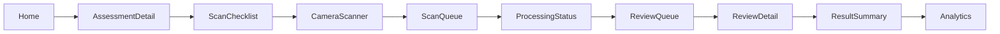
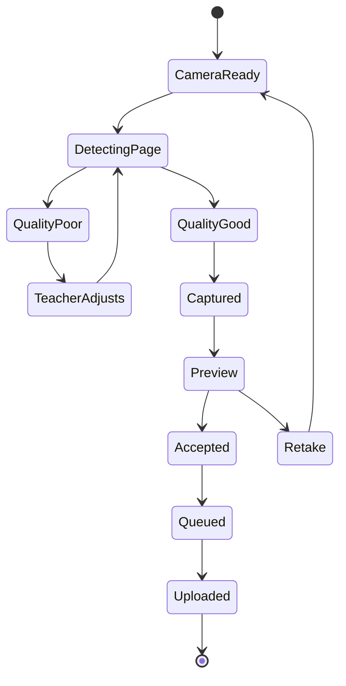
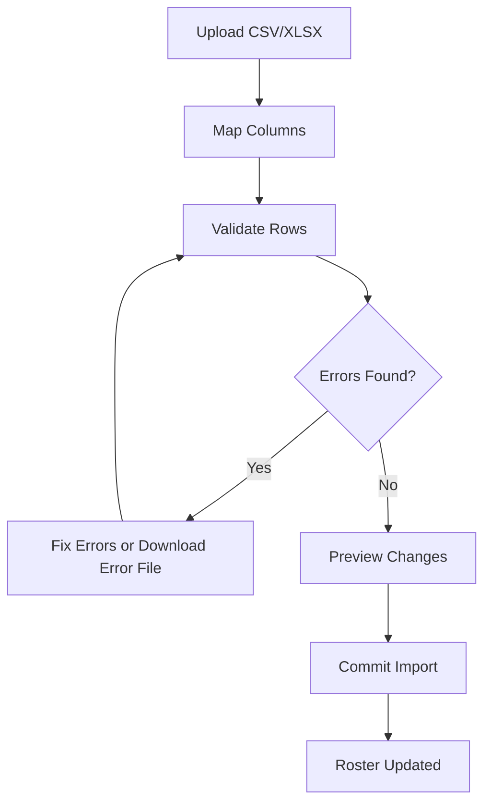
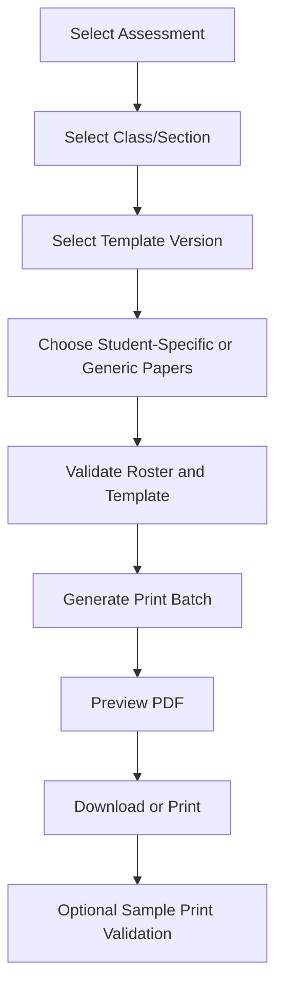
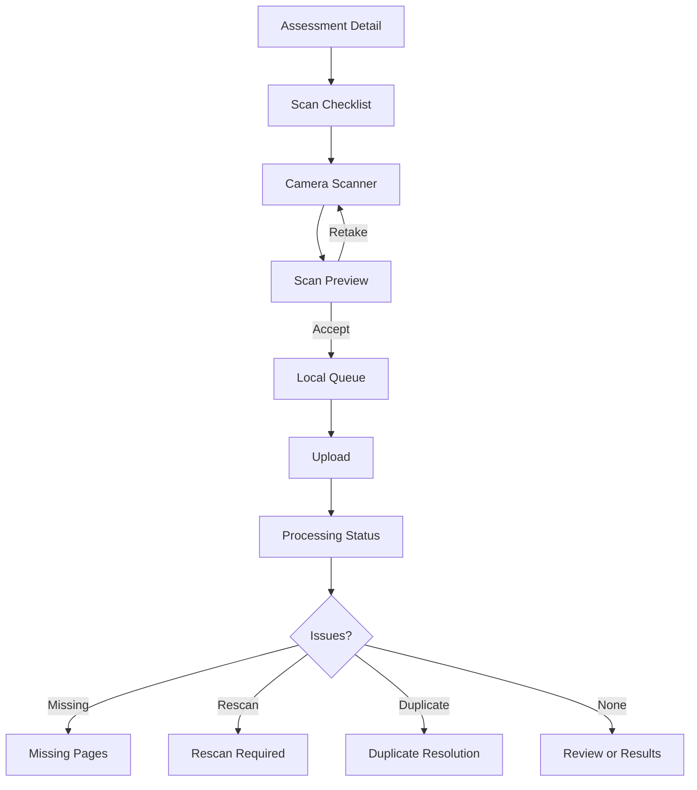
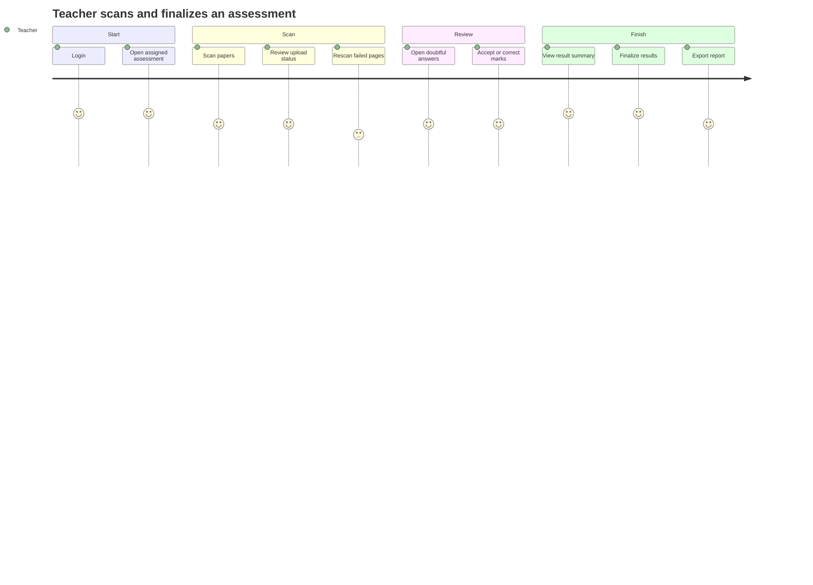
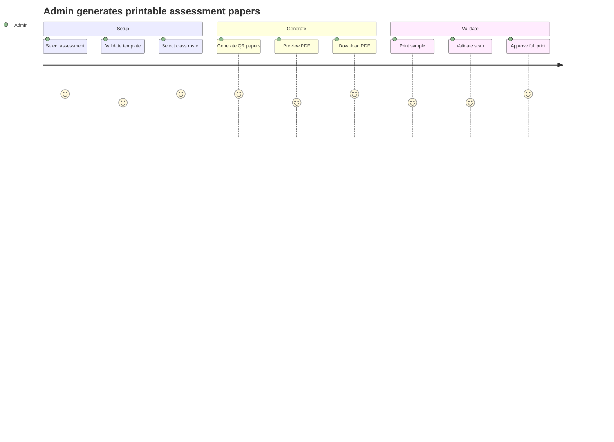

# SmartFLN UI/UX Specification

AI Powered QR Enabled Assessment System

## Purpose

This document defines the SmartFLN user experience across the teacher web app, admin web panel, dashboards, paper generator, paper scanner, result screens, analytics, review workflows, navigation, wireframes, UX decisions, and accessibility requirements.

This is a UI/UX design document only. It does not contain implementation code.

## Product Experience Goal

SmartFLN should feel simple to teachers and operationally powerful for administrators.

For teachers, the core experience is:

Print or receive papers, conduct assessment, scan papers, review only doubtful answers, finalize results, and understand learning gaps.

For admins, the core experience is:

Set up schools and rosters, create assessments, generate papers, monitor scanning and review completion, analyze results, export reports, and maintain data quality.

## UX Principles

### Paper-First, Digital-Second

The product must not make paper feel like a workaround. Paper is the native student interface.

### Teacher Time Is Sacred

Teacher workflows must minimize typing, repeated selection, unnecessary confirmations, and hidden processing states.

### Review Only What Matters

The product should not ask teachers to check every answer. It should clearly surface uncertain answers and explain why they need review.

### Trust Through Evidence

Every suggested mark should be backed by the answer crop, recognized answer, expected answer, confidence level, and review reason.

### Operational Clarity

Admins need to see what is complete, what is blocked, what failed, and who needs support.

### Low-Connectivity Friendly

The teacher web app must make offline and upload state obvious and should never make teachers wonder whether scans are lost.

### Accessible by Default

The UI should work for users with different languages, devices, lighting conditions, vision levels, motor comfort, and technology confidence.

## Target Devices

### Teacher Web App

Primary:

- desktop browsers
- laptop browsers
- tablet browsers
- phone browsers with camera support
- 5.5 inch to 6.8 inch screens
- intermittent connectivity

Future:

- richer PWA installation support if pilot usage requires it

### Admin Panel

Primary:

- laptop and desktop browsers
- school office computers
- tablets for coordinators

Minimum responsive support:

- desktop: 1280px and above
- tablet: 768px and above
- mobile web: read-only or limited admin support where practical

## Product Areas

| Area | Primary Users | Platform |
| --- | --- | --- |
| Teacher App | Teachers | Mobile |
| Paper Scanner | Teachers | Mobile |
| Teacher Review | Teachers, coordinators | Mobile and web |
| Teacher Dashboard | Teachers | Mobile and web |
| Admin Panel | School admins, program admins | Web |
| Paper Generator | Teachers, admins | Web |
| Assessment Builder | Teachers, academic teams, admins | Web |
| Analytics | Teachers, admins, program teams | Web |
| Reports and Exports | Teachers, admins | Web |
| Support Operations | Support, platform admins | Web |

## Information Architecture

```mermaid
flowchart TD
    A["SmartFLN"] --> B["Teacher App"]
    A --> C["Admin Web"]

    B --> B1["Home"]
    B --> B2["Assessments"]
    B --> B3["Scanner"]
    B --> B4["Review"]
    B --> B5["Results"]
    B --> B6["Notifications"]
    B --> B7["Profile and Settings"]

    C --> C1["Dashboard"]
    C --> C2["Schools and Classes"]
    C --> C3["Students and Roster"]
    C --> C4["Teachers and Users"]
    C --> C5["Curriculum"]
    C --> C6["Assessments"]
    C --> C7["Paper Generator"]
    C --> C8["Scan Monitor"]
    C --> C9["Review Monitor"]
    C --> C10["Results"]
    C --> C11["Analytics"]
    C --> C12["Exports"]
    C --> C13["Audit Logs"]
    C --> C14["Settings"]
```



## Global Navigation Model

### Teacher Web Navigation

Primary bottom navigation:

- Home
- Scan
- Review
- Results
- More

Secondary screens open from assessment context.



### Admin Web Navigation

Use a persistent left sidebar with top-level modules:

- Dashboard
- Schools
- Classes
- Students
- Teachers
- Curriculum
- Assessments
- Papers
- Scans
- Reviews
- Results
- Analytics
- Exports
- Audit
- Settings

Admin pages should use dense, table-driven operational layouts rather than marketing-style pages.

## Role-Based Navigation

| Role | Visible Navigation |
| --- | --- |
| Teacher | Home, Assessments, Scanner, Review, Results, Class Analytics, Notifications, Profile |
| School Coordinator | Teacher views plus Review Monitor, Class Analytics, Escalations |
| School Admin | School dashboard, users, roster, assessments, papers, scans, results, exports |
| Program Admin | Multi-school dashboard, school comparison, program analytics, data quality |
| Support Operator | Support tickets, processing diagnostics, audit-limited artifact access |
| Platform Admin | Tenant management, system health, integrations, operations |

## Teacher App Screen Catalog

| Screen | Purpose |
| --- | --- |
| Splash and App Check | Start app, check version, load secure session |
| Login | Authenticate teacher by OTP or password |
| Tenant/School Selector | Choose school when teacher has multiple scopes |
| Home | Show today's assessment tasks and urgent actions |
| Assessment List | List assigned assessments |
| Assessment Detail | Show assessment status, class, pages, reviews, results |
| Scan Checklist | Show expected students and pages |
| Paper Scanner | Capture pages with quality guidance |
| Scan Preview | Confirm or retake captured page |
| Offline Queue | Show local scans waiting to upload |
| Upload/Sync Status | Show upload progress and failures |
| Processing Status | Show server-side processing progress |
| Missing Pages | Show students/pages still missing |
| Rescan Required | Show pages needing replacement scan |
| Duplicate Resolution | Resolve duplicate scans |
| Identity Resolution | Resolve pages where QR failed |
| Review Queue | List doubtful answers |
| Review Detail | Accept, edit, override, blank, invalid, escalate |
| Finalization Checklist | Show blockers before finalizing |
| Result Summary | Show class and student marks |
| Student Result | Show one student's question and concept performance |
| Concept Analytics | Show weak concepts and remediation groups |
| Notifications | Show processing, review, result, and export alerts |
| Profile | Teacher profile, school, app version |
| Settings | Language, sync, help, logout |
| Help and Support | Scan tips, FAQs, contact support |

## Admin Web Screen Catalog

| Screen | Purpose |
| --- | --- |
| Login | Admin authentication |
| Organization Selector | Choose tenant/school/program scope |
| Admin Dashboard | Operational overview |
| School List | Manage schools |
| School Detail | School profile, classes, users, usage |
| Academic Year | Manage academic years |
| Class and Section List | Manage grade sections |
| Class Detail | Students, teachers, assessments, results |
| Student List | Search and manage students |
| Student Detail | Profile, enrollments, assessment history |
| Roster Import | Upload, validate, fix, and commit student data |
| Teacher/User List | Manage accounts and roles |
| User Detail | Assign roles, schools, classes |
| Subjects | Manage subjects |
| Concepts | Manage concept hierarchy |
| Assessment List | Create and manage assessments |
| Assessment Builder | Configure questions, marks, answer keys, concepts |
| Question Editor | Edit question metadata and scoring |
| Template Builder | Define pages, QR, anchors, answer regions |
| Template Validation | Validate machine-readability |
| Paper Generator | Generate printable paper batches |
| Print Batch Detail | Download PDF, track paper instances |
| Sample Print Validation | Validate print quality with sample scan |
| Scan Monitor | Track scanning across classes |
| Processing Diagnostics | View failures, retries, scan quality |
| Review Monitor | Track pending reviews and escalations |
| Review Detail | Resolve escalated review items |
| Result Dashboard | View finalized and provisional marks |
| Student Result | Detailed student report |
| Class Result | Class result table |
| Concept Analytics | Concept-wise performance |
| Question Analytics | Question difficulty and error patterns |
| School Analytics | School performance and completion |
| Program Analytics | Multi-school comparison |
| Export Center | Generate and download PDF/CSV/Excel |
| Audit Logs | Search sensitive actions |
| Notifications | Admin alerts |
| Integration Settings | SIS/LMS/API integrations |
| Tenant Settings | Policies, confidence thresholds, retention |
| Support Access | Approve or review support access |

## Teacher App: Home Screen

### Purpose

Give the teacher one clear place to see what needs action today.

### Primary Content

- active assessment cards
- scan pending count
- processing status
- review pending count
- ready to finalize status
- recent notifications

### Mobile Wireframe

```text
+--------------------------------+
| SmartFLN              Bell Icon |
| Good morning, Anita            |
+--------------------------------+
| Today                          |
| [Math Baseline - Class 3A]     |
| Scan: 18/32 pages              |
| Review: 6 answers pending      |
| [Continue]                     |
+--------------------------------+
| Ready To Finalize              |
| English Check - Class 2B       |
| [View Results]                 |
+--------------------------------+
| Quick Actions                  |
| [Scan] [Review] [Results]      |
+--------------------------------+
| Home | Scan | Review | Results |
+--------------------------------+
```

### UX Decisions

- Use task-first ordering, not module-first ordering.
- Show counts that help teachers act immediately.
- Avoid dense analytics on mobile home.
- Make the primary action continue the most urgent incomplete workflow.

## Teacher App: Assessment List

### Purpose

Let teachers find assigned assessments by class, subject, and status.

### Filters

- class
- subject
- status
- date

### Status Labels

- Not started
- Scanning
- Processing
- Review pending
- Ready to finalize
- Finalized

### Wireframe

```text
+--------------------------------+
| Assessments             Search |
+--------------------------------+
| Filter: Class 3A | All Status  |
+--------------------------------+
| Math Baseline                  |
| Class 3A | 32 students         |
| Status: Review pending         |
| Scan 64/64 | Review 6          |
+--------------------------------+
| English Reading Check          |
| Class 2B | 28 students         |
| Status: Finalized              |
| Avg: 71%                       |
+--------------------------------+
```

## Teacher App: Assessment Detail

### Purpose

Show the full workflow state for one assessment.

### Sections

- assessment summary
- scan progress
- processing progress
- review progress
- result status
- actions

### Wireframe

```text
+--------------------------------+
| Back | Math Baseline           |
+--------------------------------+
| Class 3A | 32 students | 2 pg  |
| Status: Review pending         |
+--------------------------------+
| Progress                       |
| Scanned      64 / 64           |
| Processed    62 / 64           |
| Review        6 pending        |
+--------------------------------+
| Actions                        |
| [Scan More]                    |
| [Review Doubts]                |
| [View Results]                 |
+--------------------------------+
| Issues                         |
| 2 pages need rescan            |
+--------------------------------+
```

## Teacher App: Scan Checklist

### Purpose

Help teachers know which students and pages are scanned, missing, duplicate, or failed.

### Layout

- student list
- page count indicators
- status chips
- search and filter

### Wireframe

```text
+--------------------------------+
| Scan Checklist      Class 3A   |
+--------------------------------+
| Search student                 |
| Filter: Missing pages          |
+--------------------------------+
| Riya Patel       Pg 1 ok Pg 2 ok |
| Aarav Singh      Pg 1 ok Pg 2 -- |
| Meera Nair       Rescan needed  |
| Kabir Rao        Duplicate      |
+--------------------------------+
| [Open Scanner]                  |
+--------------------------------+
```

### UX Decisions

- Use student names and page status together.
- Allow scanning without choosing a student first because QR identifies the page.
- Show missing pages after scans sync.

## Teacher App: Paper Scanner

### Purpose

Capture clear page images with minimal teacher effort.

### Scanner Controls

- camera preview
- page boundary overlay
- QR visibility indicator
- quality indicator
- capture button
- flash toggle
- auto-capture toggle
- retake
- batch count

### Scanner Wireframe

```text
+--------------------------------+
| Back        Scan Math 3A       |
+--------------------------------+
| QR visible       Focus good    |
|                                |
|   +------------------------+   |
|   |                        |   |
|   |      Paper Overlay     |   |
|   |                        |   |
|   +------------------------+   |
|                                |
| Move closer: all corners visible|
+--------------------------------+
| Flash | Capture | Auto         |
+--------------------------------+
| Uploaded 18 | Queued 3         |
+--------------------------------+
```

### Capture States



### Scanner UX Decisions

- Use live quality messages such as "Move closer", "Too dark", "Hold steady", "QR not visible".
- Prefer one-tap capture and batch continuation.
- Never discard a captured image until upload is confirmed.
- Show offline queue clearly.
- Allow retake before upload.
- Use vibration/audio feedback only if not disruptive and configurable.

## Teacher App: Scan Preview

### Purpose

Let the teacher quickly confirm the captured page is usable.

### Wireframe

```text
+--------------------------------+
| Preview                        |
+--------------------------------+
|                                |
|        Captured Page           |
|                                |
+--------------------------------+
| Quality: Good                  |
| QR: Detected                   |
| Corners: Visible               |
+--------------------------------+
| [Retake]              [Accept] |
+--------------------------------+
```

## Teacher App: Offline Queue and Sync

### Purpose

Make upload state trustworthy in low-connectivity environments.

### Wireframe

```text
+--------------------------------+
| Sync Status                    |
+--------------------------------+
| Offline mode                   |
| 12 scans safe on this device   |
| Upload will resume automatically|
+--------------------------------+
| Queued                         |
| Page image 1     Waiting       |
| Page image 2     Waiting       |
| Page image 3     Upload failed |
+--------------------------------+
| [Retry Now]                    |
+--------------------------------+
```

### UX Decisions

- "Safe on this device" should be shown when local encrypted storage succeeds.
- Failed upload should not sound catastrophic if retry is possible.
- Do not require teachers to keep the screen open if background sync is available.

## Teacher App: Processing Status

### Purpose

Show what the system is doing after upload.

### Wireframe

```text
+--------------------------------+
| Processing                     |
+--------------------------------+
| Uploaded      64 / 64          |
| Identified    64 / 64          |
| Cropped       62 / 64          |
| Scored        51 / 64          |
| Review        6 pending        |
+--------------------------------+
| Issues                         |
| 2 pages need rescan            |
+--------------------------------+
| [Review Doubts] [Rescan Pages] |
+--------------------------------+
```

### UX Decisions

- Show stage names in teacher-friendly language.
- Avoid technical model terms on teacher screens.
- Show actions for blockers.

## Teacher App: Review Queue

### Purpose

Let teachers resolve only doubtful answers quickly.

### Queue Fields

- student
- question number
- reason
- suggested mark
- confidence level
- priority

### Wireframe

```text
+--------------------------------+
| Review Doubts       6 pending  |
+--------------------------------+
| Filter: All reasons            |
+--------------------------------+
| Riya Patel | Q5 | Low confidence|
| Suggested: 1/2                 |
+--------------------------------+
| Aarav Singh | Q8 | Multiple mark |
| Suggested: Review             |
+--------------------------------+
| Meera Nair | Q2 | Faint writing |
| Suggested: 0/1                 |
+--------------------------------+
```

## Teacher App: Review Detail

### Purpose

Show complete evidence and let teacher make the final decision.

### Wireframe

```text
+--------------------------------+
| Q5 Review            1 of 6    |
+--------------------------------+
| Student: Riya Patel            |
| Concept: Two-digit addition    |
+--------------------------------+
| Answer Image                   |
| +----------------------------+ |
| |          42                | |
| +----------------------------+ |
+--------------------------------+
| AI read: 42                    |
| Expected: 42                   |
| Suggested: 2 / 2               |
| Confidence: Medium             |
| Reason: faint pencil stroke    |
+--------------------------------+
| [0] [1] [2]                    |
| [Accept] [Edit] [Escalate]     |
+--------------------------------+
```

### Review UX Decisions

- Put answer image above AI suggestion.
- Make marks selectable with large tap targets.
- Show reason for review in plain language.
- Accept should be one tap.
- Override should require reason only if policy requires it.
- Keep next item navigation fast.

## Teacher App: Identity Resolution

### Purpose

Resolve scans where QR is damaged or not readable.

### Wireframe

```text
+--------------------------------+
| Identify Page                  |
+--------------------------------+
| Page image preview             |
+--------------------------------+
| Suggested matches              |
| 1. Riya Patel - Page 2         |
| 2. Meera Nair - Page 2         |
+--------------------------------+
| Search student                 |
| Select page: [1] [2]           |
+--------------------------------+
| [Mark Invalid]      [Confirm]  |
+--------------------------------+
```

## Teacher App: Rescan Required

### Purpose

Guide teacher to replace failed scans.

### Wireframe

```text
+--------------------------------+
| Rescan Needed        2 pages   |
+--------------------------------+
| Aarav Singh | Page 2           |
| Reason: missing corner         |
| [Rescan]                       |
+--------------------------------+
| Meera Nair | Page 1            |
| Reason: too blurry             |
| [Rescan]                       |
+--------------------------------+
```

## Teacher App: Finalization Checklist

### Purpose

Show whether the assessment is ready to lock.

### Wireframe

```text
+--------------------------------+
| Finalize Results               |
+--------------------------------+
| Checks                         |
| Scans complete          Yes    |
| Processing complete     Yes    |
| Reviews complete        No     |
| Missing pages           0      |
+--------------------------------+
| Blockers                       |
| 3 review tasks pending         |
+--------------------------------+
| [Review Now]                   |
| [Finalize] disabled            |
+--------------------------------+
```

## Teacher App: Result Summary

### Purpose

Show class-level outcome after scoring and review.

### Wireframe

```text
+--------------------------------+
| Results - Math Baseline        |
+--------------------------------+
| Class average: 68%             |
| Finalized: No                  |
| Review completed: 100%         |
+--------------------------------+
| Students                       |
| Riya Patel       18 / 20       |
| Aarav Singh      14 / 20       |
| Meera Nair       11 / 20       |
+--------------------------------+
| [Finalize] [Export PDF]        |
+--------------------------------+
```

## Teacher App: Student Result

### Purpose

Show one student's marks, concepts, and question evidence.

### Wireframe

```text
+--------------------------------+
| Riya Patel                     |
+--------------------------------+
| Total: 18 / 20                 |
| Auto-scored: 14 questions      |
| Reviewed: 2 questions          |
+--------------------------------+
| Concepts                       |
| Addition        Strong         |
| Place Value     Needs support  |
+--------------------------------+
| Questions                      |
| Q1  1/1  Auto                  |
| Q2  0/1  Reviewed              |
| Q3  2/2  Auto                  |
+--------------------------------+
```

## Teacher App: Concept Analytics

### Purpose

Help teachers plan remediation.

### Wireframe

```text
+--------------------------------+
| Concept Analytics              |
+--------------------------------+
| Needs Support                  |
| Place Value       12 students  |
| Subtraction       8 students   |
+--------------------------------+
| Remediation Groups             |
| Group A: Place Value           |
| 12 students                    |
| [View Students]                |
+--------------------------------+
```

## Admin Panel: Dashboard

### Purpose

Give school or program admins an operational command center.

### Desktop Wireframe

```text
+------------------------------------------------------------------+
| Sidebar              | Dashboard                       User Menu  |
|----------------------|-------------------------------------------|
| Dashboard            | Assessments Today                         |
| Schools              | +------------+ +------------+ +----------+ |
| Classes              | | Scanning   | | Review     | | Finalized| |
| Students             | | 14 active  | | 92 pending | | 8        | |
| Teachers             | +------------+ +------------+ +----------+ |
| Assessments          |                                           |
| Papers               | Processing Health                         |
| Scans                | Queue normal | Failures 3 | Rescans 11   |
| Reviews              |                                           |
| Results              | School Completion                         |
| Analytics            | Table: school, class, scan %, review %    |
| Exports              |                                           |
+------------------------------------------------------------------+
```

### UX Decisions

- Lead with operational status, not vanity charts.
- Use tables for school/class monitoring.
- Show failures and blockers clearly.
- Provide direct drill-down to scans, reviews, and results.

## Admin Panel: School Management

### Screens

- school list
- school detail
- academic year setup
- class/section list
- class detail

### School List Wireframe

```text
+------------------------------------------------------------------+
| Schools                                      [Add School] Search  |
+------------------------------------------------------------------+
| Name              Code      Status    Classes  Students  Actions |
| Sunrise Public    SUN001    Active    12       482       View    |
| Green Valley      GRN002    Active    10       391       View    |
+------------------------------------------------------------------+
```

## Admin Panel: Student and Roster

### Screens

- student list
- student detail
- enrollment history
- roster import
- import validation
- duplicate resolution

### Roster Import Flow



### Roster Import Wireframe

```text
+------------------------------------------------------------------+
| Roster Import                                      Step 2 of 4    |
+------------------------------------------------------------------+
| File: class_3a_students.xlsx                                      |
| Map Columns                                                       |
| Student Name  -> displayName                                      |
| Roll No       -> rollNumber                                       |
| Admission No  -> admissionNumber                                  |
+------------------------------------------------------------------+
| Validation Summary                                                |
| 31 valid | 2 warnings | 1 error                                   |
+------------------------------------------------------------------+
| [Back] [Download Errors] [Continue]                               |
+------------------------------------------------------------------+
```

## Admin Panel: Assessment Builder

### Purpose

Create structured, scorable assessments with concept mapping and answer keys.

### Screens

- assessment list
- assessment setup
- question list
- question editor
- answer key editor
- rubric editor
- concept mapping
- publish review

### Assessment Builder Wireframe

```text
+------------------------------------------------------------------+
| Assessment Builder: Grade 3 Math Baseline          [Preview]      |
+------------------------------------------------------------------+
| Setup | Questions | Concepts | Template | Publish                 |
+------------------------------------------------------------------+
| Questions                                                        |
| Q1  MCQ        1 mark     Place Value       Auto                 |
| Q2  Numeric    2 marks    Addition          Auto                 |
| Q3  Matching   4 marks    Number Names      Assisted             |
| Q4  Short Text 2 marks    Vocabulary        Review if unsure      |
+------------------------------------------------------------------+
| [Add Question]                                      [Continue]    |
+------------------------------------------------------------------+
```

### Question Editor Wireframe

```text
+------------------------------------------------------------------+
| Question Editor                                                   |
+------------------------------------------------------------------+
| Question Number: Q2                                               |
| Type: Numeric                                                     |
| Max Marks: 2                                                      |
| Scoring Mode: Auto with review threshold                          |
| Expected Answer: 42                                               |
| Numeric Tolerance: exact                                          |
| Concepts: Two-digit addition                                      |
+------------------------------------------------------------------+
| [Save Draft] [Validate]                                           |
+------------------------------------------------------------------+
```

## Admin Panel: Template Builder

### Purpose

Define machine-readable page layout, QR placement, anchors, and answer regions.

### Wireframe

```text
+------------------------------------------------------------------+
| Template Builder: Page 1                         [Validate]       |
+------------------------------------------------------------------+
| Tools: Select | QR | Anchor | Answer Region | Bubble Group        |
+------------------------------------------------------------------+
| +---------------------- Page Canvas ----------------------------+ |
| | QR         Q1 [bubble group]                                  | |
| |            Q2 [answer box]                                    | |
| |            Q3 [matching area]                                 | |
| |                                                               | |
| +---------------------------------------------------------------+ |
+------------------------------------------------------------------+
| Right Panel                                                      |
| Selected: Q2 Answer Region                                       |
| Question: Q2                                                     |
| Type: Numeric                                                    |
| Coordinates: x 120 y 320 w 400 h 90                              |
+------------------------------------------------------------------+
```

### Template UX Decisions

- Use a constrained editor, not a freeform drawing tool.
- Require every answer region to map to a question.
- Validate QR, anchors, margins, and answer regions before publishing.
- Warn if answer boxes are too small for young children.

## Paper Generator

### Purpose

Generate printable QR-enabled assessment papers.

### Screens

- paper generation setup
- roster selection
- template selection
- generation progress
- PDF preview
- print batch detail
- sample print validation

### Paper Generator Flow



### Paper Generator Wireframe

```text
+------------------------------------------------------------------+
| Generate Papers                                                   |
+------------------------------------------------------------------+
| Assessment      Grade 3 Math Baseline                             |
| Class/Section   Class 3A                                          |
| Template        Version 2 - Published                             |
| Paper Mode      Student-specific QR                               |
+------------------------------------------------------------------+
| Checks                                                           |
| Roster complete        Yes                                        |
| Template validated     Yes                                        |
| QR regions valid       Yes                                        |
+------------------------------------------------------------------+
| [Generate PDF]                                                    |
+------------------------------------------------------------------+
```

### Print Batch Detail Wireframe

```text
+------------------------------------------------------------------+
| Print Batch PB-1029                                               |
+------------------------------------------------------------------+
| Status: Ready                                                     |
| Students: 32 | Pages: 64 | Generated by: Anita                    |
+------------------------------------------------------------------+
| [Preview PDF] [Download PDF] [Validate Sample Print]              |
+------------------------------------------------------------------+
| Paper Instances                                                   |
| Riya Patel      2 pages     QR ready                              |
| Aarav Singh     2 pages     QR ready                              |
+------------------------------------------------------------------+
```

## Paper Scanner Experience

### Scanner Navigation



### Scanner UX Requirements

- one-handed operation
- large capture button
- clear quality indicators
- offline-safe queue
- batch progress visible
- no manual student selection required for normal QR scans
- quick retake
- duplicate warning
- rescan guidance

## Result Screens

### Result Screen Types

- class result summary
- student result detail
- question result detail
- concept result
- finalization checklist
- correction workflow

### Class Result Web Wireframe

```text
+------------------------------------------------------------------+
| Results: Grade 3 Math Baseline                     [Export]       |
+------------------------------------------------------------------+
| Status: Ready to finalize | Students: 32 | Avg: 68%               |
| Auto-scored: 82% | Reviewed: 18%                                  |
+------------------------------------------------------------------+
| Student          Total     Status       Weak Concepts      View   |
| Riya Patel       18/20     Ready        Place Value        View   |
| Aarav Singh      14/20     Ready        Subtraction        View   |
| Meera Nair       11/20     Ready        Place Value        View   |
+------------------------------------------------------------------+
| [Finalize Results]                                                |
+------------------------------------------------------------------+
```

### Student Result Web Wireframe

```text
+------------------------------------------------------------------+
| Student Result: Riya Patel                                        |
+------------------------------------------------------------------+
| Total 18/20 | Percentage 90% | Finalized                          |
+------------------------------------------------------------------+
| Concept Performance                                               |
| Addition              95%      Strong                             |
| Place Value           60%      Needs support                      |
+------------------------------------------------------------------+
| Question Breakdown                                                |
| Q1  MCQ        1/1   Auto       View evidence                     |
| Q2  Numeric    2/2   Auto       View evidence                     |
| Q3  Matching   3/4   Reviewed   View evidence                     |
+------------------------------------------------------------------+
```

### Question Evidence Panel

```text
+------------------------------------------+
| Evidence: Q3                              |
+------------------------------------------+
| Answer crop                               |
| +--------------------------------------+ |
| | student answer image                 | |
| +--------------------------------------+ |
| AI recognized: A-2, B-1, C-3             |
| Expected: A-2, B-1, C-4                  |
| Final: 3/4                               |
| Source: Teacher reviewed                 |
+------------------------------------------+
```

## Analytics Screens

### Teacher Analytics

Focus:

- weak concepts
- students needing support
- question-level difficulty
- remediation groups

### Admin Analytics

Focus:

- completion rates
- class comparisons
- concept performance
- scan quality
- review load
- teacher progress

### Program Analytics

Focus:

- school comparison
- district/cluster trends
- FLN competency progress
- data quality
- assessment reliability

### Teacher Concept Analytics Wireframe

```text
+------------------------------------------------------------------+
| Concept Analytics: Class 3A Math                                  |
+------------------------------------------------------------------+
| Concept             Avg     Needs Support     Students            |
| Place Value         54%     12                View                |
| Subtraction         61%     8                 View                |
| Addition            82%     3                 View                |
+------------------------------------------------------------------+
| Remediation Groups                                                |
| Group 1: Place Value | 12 students | [Export Practice List]       |
+------------------------------------------------------------------+
```

### Program Analytics Wireframe

```text
+------------------------------------------------------------------+
| Program Analytics                                                 |
+------------------------------------------------------------------+
| Schools: 128 | Students assessed: 42,310 | Completion: 91%        |
+------------------------------------------------------------------+
| School            Completion   Avg Score   Review Load   Issues   |
| Sunrise Public    96%          72%         14%           2         |
| Green Valley      89%          68%         21%           9         |
+------------------------------------------------------------------+
| Weakest Concepts                                                  |
| Number Sense      46% average                                     |
| Reading Fluency   51% average                                     |
+------------------------------------------------------------------+
```

## Admin Scan Monitor

### Purpose

Track scanning and processing progress across schools/classes.

### Wireframe

```text
+------------------------------------------------------------------+
| Scan Monitor                                    Filters           |
+------------------------------------------------------------------+
| School     Class   Assessment   Uploaded   Processed   Issues    |
| Sunrise    3A      Math Base    64/64      62/64       2 rescan  |
| Sunrise    2B      English      56/56      56/56       0         |
| Green V.   4A      Math Base    71/80      60/80       9 missing |
+------------------------------------------------------------------+
| [View Processing Diagnostics]                                     |
+------------------------------------------------------------------+
```

## Admin Review Monitor

### Purpose

Track teacher review completion and escalations.

### Wireframe

```text
+------------------------------------------------------------------+
| Review Monitor                                                    |
+------------------------------------------------------------------+
| Assessment       Class   Pending   Escalated   Avg Age   Owner   |
| Math Baseline    3A      6         1           12 min    Anita   |
| English Check    2B      0         0           --        Ravi    |
+------------------------------------------------------------------+
| [Open Escalations] [Notify Teachers]                              |
+------------------------------------------------------------------+
```

## Export Center

### Purpose

Generate and access PDF, CSV, and Excel reports.

### Wireframe

```text
+------------------------------------------------------------------+
| Export Center                                      [New Export]   |
+------------------------------------------------------------------+
| Type             Scope             Status      Created            |
| Class PDF        Grade 3A Math     Ready       Today 10:42        |
| Concept CSV      School            Rendering   Today 10:45        |
| Audit PDF        Assessment        Failed      Yesterday          |
+------------------------------------------------------------------+
```

## Notifications

### Notification Types

- scan processing complete
- review pending
- rescan required
- finalization ready
- export ready
- admin issue detected
- support access approved/revoked

### Notification UX

- Group repetitive notifications.
- Use direct action links.
- Avoid noisy alerts during active scanning.
- Show failed operations with recovery action.

## Settings and Configuration Screens

### Teacher Settings

- language
- camera preferences
- sync status
- offline storage status
- notification preferences
- help
- logout

### Admin Settings

- tenant profile
- confidence thresholds
- review policies
- data retention
- roles and permissions
- integrations
- export settings
- audit policy

## Design System Direction

### Visual Style

SmartFLN should feel like a reliable school operations tool:

- calm
- clear
- dense but not cluttered
- readable in classrooms
- focused on status and action
- restrained color usage

Avoid:

- marketing-style hero sections
- decorative gradients
- playful visuals that reduce seriousness around marks
- oversized empty cards
- low-contrast status colors

### Color Usage

Use color semantically:

- green: complete or successful
- amber: review, warning, pending
- red: blocked, failed, rescan required
- blue: informational or active process
- gray: neutral or inactive

Do not rely on color alone. Pair with text labels and icons.

### Typography

Requirements:

- high readability
- no viewport-width scaling
- comfortable line height
- clear hierarchy
- compact table text for admin
- larger tap-friendly labels for mobile

### Components

Core components:

- app shell
- bottom navigation
- sidebar navigation
- status chips
- progress indicators
- tables
- filters
- search
- segmented controls
- scan quality indicators
- review evidence panel
- mark selector
- signed image viewer
- confirmation dialog
- empty state
- error state
- offline banner
- notification tray

### Icons

Use familiar icons for:

- scan/camera
- review/check
- warning
- download
- upload
- retry
- search
- filter
- settings
- notifications
- user/profile
- lock/security

Buttons should use icon-only controls only when the icon is familiar and has a tooltip or accessible label.

## Interaction States

Every major screen must support:

- loading
- empty
- partial data
- success
- warning
- failure
- offline
- retrying
- permission denied
- blocked by pending action

### Example: Review Queue Empty State

```text
+--------------------------------+
| Review Doubts                  |
+--------------------------------+
| No doubtful answers pending.   |
| This assessment is ready for   |
| finalization when processing   |
| is complete.                   |
+--------------------------------+
| [View Results]                 |
+--------------------------------+
```

### Example: Scan Failure State

```text
+--------------------------------+
| Scan could not be processed    |
+--------------------------------+
| Reason: page corner missing    |
| What to do: rescan the page    |
| with all four corners visible. |
+--------------------------------+
| [Open Scanner]                 |
+--------------------------------+
```

## Accessibility

### Accessibility Goals

SmartFLN must be usable by teachers and admins with different visual, motor, language, and technology comfort levels.

### Mobile Accessibility

Requirements:

- large tap targets
- clear camera guidance text
- high contrast scanner overlays
- screen-reader labels for buttons
- no color-only status meaning
- offline and sync status announced clearly
- support system font scaling within layout limits
- avoid time-limited actions without pause or retry

### Web Accessibility

Requirements:

- keyboard navigable tables and forms
- visible focus states
- semantic headings
- labeled form controls
- accessible dialogs
- ARIA labels for icon buttons
- table headers and row associations
- skip navigation for admin panel
- sufficient contrast for status chips

### Review Accessibility

Requirements:

- answer crop zoom
- rotate image
- high contrast crop view
- keyboard shortcuts for marks where available
- screen-reader fallback text for AI confidence and review reason
- avoid tiny mark controls

### Color and Contrast

- Minimum WCAG AA contrast for text.
- Status chips must include text and icon, not color alone.
- Scanner overlay should remain visible against white paper and dark desks.

### Language and Localization

Plan for:

- English first if required by pilot
- local-language UI strings
- local date/time formats
- local class/grade labels
- right-to-left support only if required by future languages

### Accessibility Testing

Test with:

- keyboard-only navigation
- screen readers
- Android TalkBack
- browser zoom
- high contrast mode
- large font settings
- low-end device screen sizes

## UX Decisions and Rationale

### QR Scanning Should Not Require Student Selection

Reason:

QR identifies student and page. Manual student selection would slow scanning and introduce human error.

### Scanner Uses Live Guidance Instead of Post-Failure Only

Reason:

It is easier for teachers to fix blur, lighting, and page corners during capture than after upload.

### Teacher Review Is Evidence-First

Reason:

Trust depends on seeing the actual answer before the AI suggestion.

### Admin Dashboard Is Operational, Not Decorative

Reason:

Admins need to monitor completion, failures, and learning gaps quickly.

### Template Builder Is Constrained

Reason:

Freeform page design can break machine readability. Templates must protect QR, anchors, and answer regions.

### Provisional Results Are Clearly Labeled

Reason:

Teachers and admins must not confuse incomplete AI outputs with final marks.

### Exports Are Job-Based

Reason:

Large PDFs and reports can take time. Async jobs prevent blocked UI and failed browser requests.

## Critical User Journeys

### Teacher Conducts Assessment



### Admin Generates Papers



## Responsive Behavior

### Mobile

- single-column layout
- bottom navigation
- sticky primary action where useful
- full-screen scanner
- review actions fixed at bottom

### Tablet

- two-pane review possible
- scan checklist and preview can share screen
- dashboard summaries with compact charts

### Desktop

- sidebar navigation
- data tables
- split panes for review and evidence
- filters in left or top panels
- charts plus tables for analytics

## Performance UX

### Perceived Performance

- show immediate local scan saved state
- show upload progress
- show processing stages
- show incremental results
- avoid blank loading screens
- use skeleton loading for tables

### Long-Running Jobs

Used for:

- paper generation
- scan processing
- reprocessing
- analytics rebuild
- exports
- roster imports

UX rules:

- show queued/running/done/failed states
- allow leaving the page
- notify when complete
- allow retry on failure

## Data Privacy UX

### Sensitive Data Handling

- Do not expose student data outside authorized scope.
- Blur or hide sensitive details in support views unless access is approved.
- Show export warnings when reports include student-level data.
- Log and show support access history to admins.

### Export Confirmation

Exports containing student-level data should require confirmation:

```text
This export includes student names and marks.
Only share it with authorized people.

[Cancel] [Generate Export]
```

## Empty States

### No Assessments

Message:

No assessments assigned yet.

Action:

Contact your school admin or refresh assignments.

### No Review Tasks

Message:

No doubtful answers pending.

Action:

View results or continue scanning.

### No Analytics

Message:

Analytics will appear after results are processed.

Action:

Check scan and review status.

## Error States

### Authentication Error

Use plain language:

Your login could not be verified. Check the code and try again.

### Permission Error

Use plain language:

You do not have access to this class or assessment.

### Upload Error

Use plain language:

Upload failed. The scan is still safe on this device.

### Processing Error

Use plain language:

This page could not be processed. Please rescan it with all four corners visible.

## Content Style

### Voice

- clear
- calm
- direct
- respectful of teacher workload

### Avoid

- technical jargon on teacher screens
- blaming the user
- vague errors such as "Something went wrong" without next action
- overexplaining AI internals

### Preferred Phrases

- "Review needed"
- "Rescan required"
- "Scan saved on this device"
- "Ready to finalize"
- "3 answers need your review"
- "AI was not confident enough"

## UX Metrics

### Teacher App Metrics

- time to complete login
- scans per minute
- scan retake rate
- upload failure rate
- review decisions per minute
- time from scan complete to finalization
- teacher drop-off points

### Admin Metrics

- assessment setup completion time
- paper generation success rate
- roster import error rate
- review backlog age
- export completion time
- dashboard task completion rate

### Trust Metrics

- teacher override rate
- teacher acceptance rate
- rescan rate
- support tickets per assessment
- finalization delay causes

## UI Readiness Checklist

Before design handoff:

- every screen has owner role and purpose
- mobile and desktop navigation are defined
- scanning states are documented
- review evidence layout is approved
- finalization blockers are defined
- analytics hierarchy is approved
- error and empty states are written
- accessibility requirements are included

Before implementation:

- component inventory is finalized
- API dependencies are mapped
- status values match backend states
- wireframes are converted to detailed designs
- mobile device constraints are tested
- offline and sync UX is prototyped

Before production:

- teacher usability testing completed
- admin usability testing completed
- scanning in real classroom lighting tested
- accessibility checks completed
- localization review completed if needed
- performance states tested on low-end devices

## Final UX Principle

SmartFLN should make teachers feel that the system is quietly doing the heavy work while they remain in control. The interface should be practical, trustworthy, and fast, because the product succeeds only when it fits naturally into a real school day.
